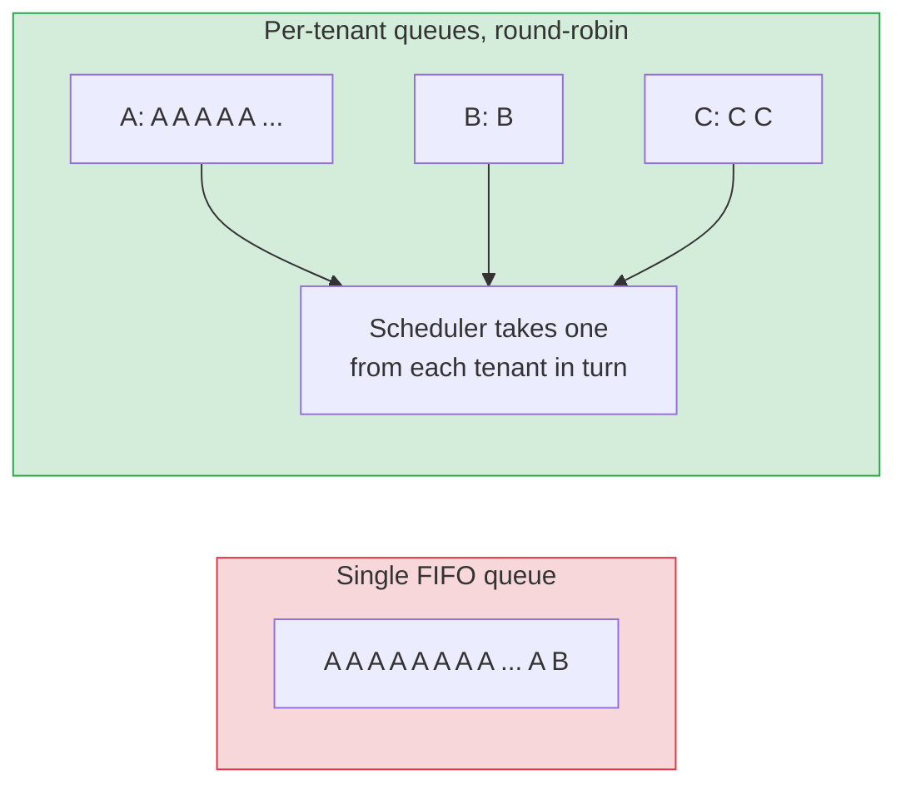
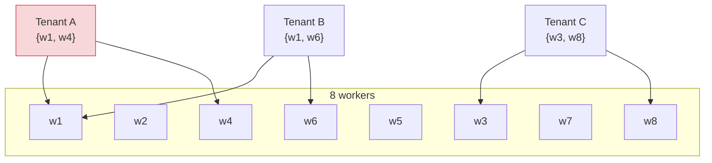
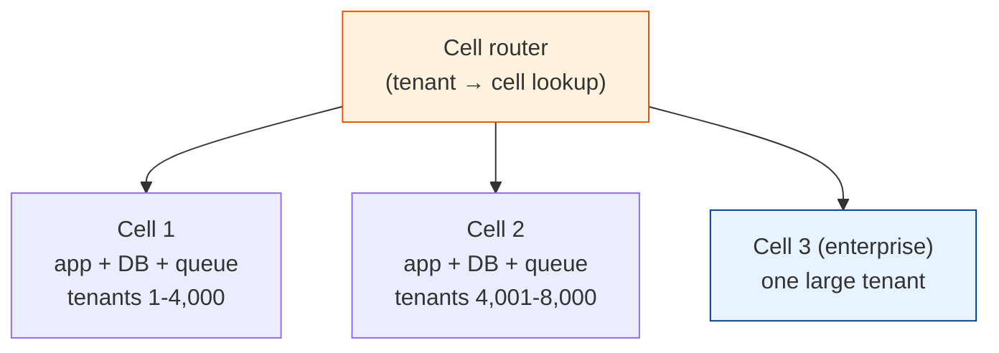

# Noisy Neighbors: Quotas, Fair Queuing, Shuffle Sharding & Cells

[< Back](./data-isolation.md) | [Index](./README.md) | [Next: Operating Multi-Tenant Systems >](./operating-multi-tenant-systems.md)

---

Sharing infrastructure means sharing its limits. When one tenant imports 40 million rows,
runs a report that scans three years of data, or gets hit by a bot, everyone on the same
database, queue, and worker pool feels it. Support tickets say "the app is slow" from customers
who did nothing different that day.

Data leaks are the worst multi-tenant failure. Noisy neighbours are the most frequent. This
chapter covers how to stop one tenant from using everyone's capacity, and how to limit the
damage when it happens anyway.

## Where noise comes from

| Shared resource | How one tenant saturates it |
|-----------------|-----------------------------|
| API servers | Integration loop calling the API 2,000 times a second |
| Database | Unindexed report query, huge bulk import, one table with 100x the rows of the median tenant |
| Job queue | 500,000 export jobs enqueued at once, ahead of everyone else's work |
| Cache | One tenant's working set evicts everyone else's |
| Third-party quotas | Shared email or SMS sending quota used up by one tenant's campaign |
| Search cluster | Expensive aggregations, huge shards |

The shape of the problem is always the same. Tenant usage follows a power law: a handful of
tenants generate most of the load, and they're the ones who'll hit a limit you didn't know
existed.

## Measure per tenant first

You can't limit what you can't see. Before building any quota system, make every metric
answer "which tenant?":

- **Tag requests, queries, and jobs with `tenant_id`.** In traces and logs it's free. In
  metrics, watch cardinality: a `tenant_id` label on a Prometheus histogram with 50,000 tenants
  will hurt. Use it on a few key counters, or record the top N tenants and an "other" bucket.
- **Track the top consumers.** Requests per second, database time, job runtime, and storage per
  tenant. A daily "top 20 tenants by DB time" report finds most problems before they page
  anyone.
- **Use `pg_stat_statements` with tenant context.** Add the tenant as a SQL comment
  (`/* tenant=acme */`) so slow-query logs show who's responsible.

The [observability module](../observability-and-reliability/three-pillars.md) covers the
tooling; the multi-tenant part is making `tenant_id` a first-class dimension everywhere.

## Per-tenant rate limits and quotas

The first defence is to cap what one tenant can ask for. Rate limits cap requests per second;
quotas cap totals (storage, seats, jobs per day). Both should come from the tenant's plan.

```python
PLAN_LIMITS = {
    "free":       {"rps": 10,   "burst": 20,   "concurrent_jobs": 2},
    "business":   {"rps": 100,  "burst": 200,  "concurrent_jobs": 20},
    "enterprise": {"rps": 1000, "burst": 2000, "concurrent_jobs": 200},
}

def check_rate_limit(tenant):
    limits = PLAN_LIMITS[tenant.plan]
    allowed = token_bucket.take(key=f"rl:{tenant.id}", rate=limits["rps"], burst=limits["burst"])
    if not allowed:
        raise TooManyRequests(retry_after=1)     # HTTP 429 with Retry-After
```

Good limits:

- **Keyed by tenant, not just by IP or user.** A tenant with 500 users behind one NAT, or an
  attacker spreading across 500 IPs, should both be judged as one tenant.
- **Return 429 with `Retry-After`,** and document it, so well-behaved integrations back off.
- **Separate limits per expensive operation.** Reads, writes, exports, and search each get
  their own bucket. A limit on "requests" lets a tenant spend its whole budget on the most
  expensive endpoint.
- **Global limits too.** Per-tenant limits don't help when ten thousand tenants all do their
  month-end close at 09:00 on the 1st.

The [infrastructure module](../infrastructure/rate-limiting.md) covers token bucket and sliding window
algorithms in depth.

## Fair queuing for background work

A single FIFO queue is the classic noisy-neighbour trap. Tenant A enqueues 500,000 jobs, and
tenant B's one urgent job waits behind all of them.



Ways to get fairness without building a scheduler from scratch:

- **Per-tenant concurrency caps.** Each tenant can have at most N jobs running at once (from
  their plan). Workers skip jobs from tenants at their cap. Simple and effective.
- **Round-robin across tenant queues.** Workers pull from the tenant that was served least
  recently. Weighted versions give enterprise tenants a bigger share.
- **Separate lanes for big work.** Bulk imports and exports go to a dedicated pool, so they
  can't starve interactive jobs no matter which tenant sends them.

If your scheduler stores jobs in Postgres (as in
[distributed-job-schedular](../distributed-job-schedular/README.md)), a per-tenant
concurrency check in the claim query is often enough.

## Limiting the blast radius: shuffle sharding

Rate limits stop a tenant using too much. They don't help when one tenant's traffic is toxic:
a request that crashes the worker, a query pattern that locks a table. If every tenant shares
every worker, one bad tenant takes everyone down.

Plain sharding helps: split tenants across 4 groups of workers and a bad tenant only hurts its
group, a quarter of customers. Shuffle sharding, popularised by AWS for Route 53, does much
better. Each tenant gets a random combination of workers instead of a fixed group.



With 8 workers and 2 per tenant there are 28 possible pairs. If tenant A's traffic kills w1 and
w4, tenant B loses w1 but still has w6. Only a tenant with exactly the pair {w1, w4} loses all
its capacity, and that's 1 in 28 of them. With 100 workers and 5 per tenant there are about 75
million combinations, and a single bad tenant almost never fully overlaps with anyone else.

Shuffle sharding needs clients (or a router) that retry on another worker in their shard when
one fails. Combine it with the [retries and circuit breakers](../distributed-systems/failure-handling.md)
you already have.

## Cells: isolation at the infrastructure level

A cell is a complete, independent copy of the application stack (load balancer, app servers,
database, queues) serving a subset of tenants. A thin routing layer maps each tenant to a cell.



What cells buy you:

- **Bounded blast radius.** A bad deploy, a database failure, or a runaway tenant affects one
  cell. Roll deployments out cell by cell, the way you'd run a canary.
- **Known maximum size.** Each cell is load-tested up to a fixed number of tenants. Growth means
  adding cells, not discovering new limits in one huge database.
- **A natural silo.** A cell with one tenant is the enterprise silo from
  [chapter 1](./tenancy-fundamentals.md#the-three-deployment-models), built from the same
  templates as every other cell.

What they cost: more infrastructure to operate, a routing layer that must be highly available,
cross-cell features (global search, admin views) that need extra work, and moving tenants
between cells ([chapter 4](./operating-multi-tenant-systems.md#tiering-and-moving-tenants)).
Most companies adopt cells after the single shared stack has caused one too many company-wide
outages.

## Handling the whale

Eventually one tenant gets so big that it dominates its database or cell. Options, in order:

1. **Talk to them.** Big tenants are often doing something by accident: a sync loop, a
   misconfigured integration. A call fixes more than code does.
2. **Throttle by plan,** and offer a higher plan with higher limits.
3. **Move them to a dedicated database or cell.** Their load stops affecting others, and the
   cost is visible and billable.
4. **Shard inside the tenant.** Only the very largest tenants need this, and it's a serious
   project. Until then, `tenant_id` as the shard key works.

## The takeaways

1. **Measure per tenant before you limit.** Tag traces, logs, and slow queries with the tenant;
   watch metric cardinality.
2. **Rate-limit and cap concurrency per tenant, per operation, from the plan.** Return 429
   with `Retry-After`.
3. **Never run background work through one FIFO queue.** Per-tenant concurrency caps and a
   separate lane for bulk jobs.
4. **Shuffle sharding limits one bad tenant to a tiny overlap** with any other tenant.
5. **Cells bound the blast radius of everything,** including deploys. Adopt them when one shared
   stack becomes too big to fail.

---

[< Back](./data-isolation.md) | [Index](./README.md) | [Next: Operating Multi-Tenant Systems >](./operating-multi-tenant-systems.md)
