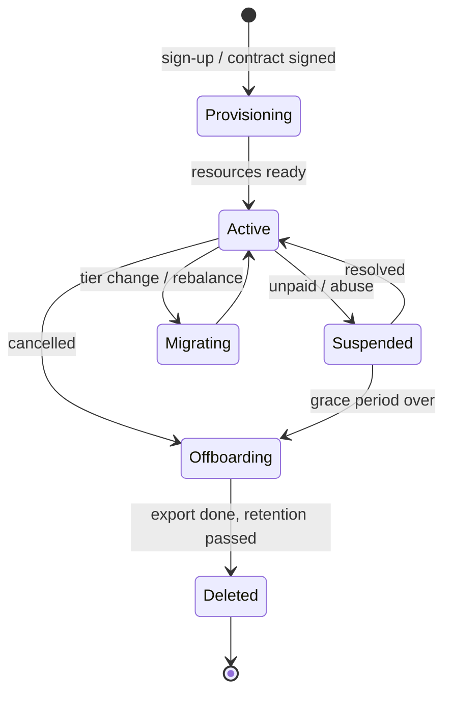
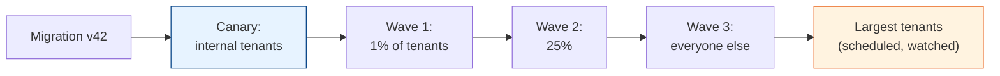
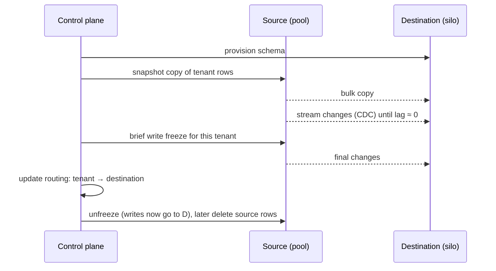

# Operating Multi-Tenant Systems: Lifecycle, Tiering, Cost & Pitfalls

[< Back](./noisy-neighbors.md) | [Index](./README.md)

---

The first three chapters were about design. This one is about running the thing for years:
onboarding and offboarding tenants, migrating schemas across thousands of them, moving a
tenant from the pool to its own database, working out what each tenant actually costs, and
meeting data-residency rules. It ends with the mistakes that show up most often.

## The tenant lifecycle

Each state transition should be an automated, idempotent workflow owned by the control plane,
not a runbook:

| Stage | What has to happen | Common gap |
|-------|--------------------|------------|
| Provisioning | Insert tenant record, pick cell or shard, create schema/database if siloed, seed defaults, create admin user, set plan limits | Half-provisioned tenants after a failure in step 4 of 7. Make each step idempotent and resumable |
| Suspension | Block logins and API calls; keep data | Background jobs keep running for suspended tenants |
| Tier change | Update limits; maybe move data | Limits cached for hours after an upgrade |
| Offboarding | Export data for the customer, revoke access, delete data everywhere after the retention window | Data left in caches, search indexes, backups, logs, analytics, and object storage |
| Deletion | Verifiable removal | No way to prove it happened |

Offboarding deserves the most care. Keep a registry of every store that holds tenant data
(the table in [chapter 2](./data-isolation.md#beyond-the-main-database) is a starting point),
and make the deletion workflow walk all of it. For backups, the practical answer is usually
"backups expire within N days" plus per-tenant encryption keys you can destroy.

## Schema migrations across many tenants

In the pool model a migration runs once. In the silo and bridge models it runs once per
tenant, and some of those runs will fail.

Rules that keep this survivable:

- **Expand/contract only.** Every migration must work with both the old and new application
  version, because tenants will be on different schema versions for hours or days. Add the
  column, deploy code that writes both, backfill, switch reads, then drop the old column in a
  later release. See
  [cicd-and-devops/deployment-strategies.md](../cicd-and-devops/deployment-strategies.md#the-database-migration-problem).
- **Track schema version per tenant** in the control plane, and have a dashboard of tenants
  stuck on old versions.
- **Run in waves,** with automatic pause if the failure rate rises.
- **Handle the largest tenants separately.** An `ALTER TABLE` that takes 200ms for a median
  tenant can lock the biggest one for 20 minutes.

## Tiering and moving tenants

Tenants change size. A free-tier startup becomes an enterprise customer and wants its own
database in Frankfurt. That means moving a live tenant between pools, shards, cells, or regions.

This is easier when the earlier chapters were followed: `tenant_id` on every row makes the copy
a `WHERE tenant_id = ?`, and a routing lookup in the control plane means the application never
hard-coded where a tenant lives. Rehearse the move with internal tenants before you need it for
a customer with a deadline.

## Cost per tenant

Pricing depends on knowing what each tenant costs to serve, and shared infrastructure hides
that.

| Cost | How to attribute it |
|------|---------------------|
| Siloed resources | Tag cloud resources with `tenant_id`; the bill splits itself |
| Shared compute | Share of request time or CPU time, from per-tenant traces or metrics |
| Shared database | Share of query time (`pg_stat_statements` with tenant comments) plus storage per tenant |
| Storage | Bytes per tenant in DB, object storage, and search |
| Third-party usage | Emails, SMS, LLM tokens counted per tenant at call time |

You don't need precision to the cent. A monthly report showing that 2% of free-tier tenants
use 40% of database time is enough to change a pricing page or add a limit. The
[deployment & cost chapter](../architecture-patterns/deployment-and-cost.md) covers the broader FinOps side.

## Data residency and compliance

Customers increasingly require their data to stay in a region (EU, India, Australia).
Multi-tenancy makes this a placement decision:

- **Store the tenant's home region in the control plane,** and route all of that tenant's
  traffic and data there. A cell per region is a natural fit.
- **Keep the control plane minimal** so it can be global without holding regulated data: tenant
  ID, region, plan, cell. Not names, not emails.
- **Check the side channels.** Logs, traces, analytics, support tools, and backups all need to
  respect residency, and they're the usual violations.
- **Per-tenant audit logs** answer "who accessed our data?" Enterprise customers will ask, and
  frameworks like SOC 2 expect you to be able to answer.

## Common pitfalls

| Pitfall | What happens | Fix |
|---------|--------------|-----|
| Tenant ID from the request body | Any user can read another tenant by changing a field | Resolve tenant from the signed token only |
| Admin tools that bypass all scoping | One support account compromised means every tenant exposed | Scoped admin access, just-in-time elevation, audited and time-limited |
| Global unique constraints | "Email already taken" leaks that another tenant has that user | Uniqueness per tenant |
| Background jobs without context | Job runs with the previous job's tenant context | Tenant in every payload; set and clear context per job |
| Hard-coded tenant location | Can't move a tenant without a code change | One routing lookup in the control plane |
| Per-tenant code forks | `if tenant == "acme"` scattered through the code | Feature flags and configuration per tenant, never branching on tenant IDs |
| No per-tenant metrics | "The app is slow" with no idea who's causing it | `tenant_id` on traces, logs, and key metrics |
| Starting with a silo per customer | Hundreds of deployments to upgrade by hand | Start pooled; silo only the tiers that pay for it |

The per-tenant code fork is worth one more sentence. Every `if tenant == ...` is a promise you
made to one customer, hidden where nobody can find it. Put customer-specific behaviour behind
named flags or configuration, so it's listed, reviewable, and testable.

## The takeaways

1. **Automate the whole lifecycle,** and make every step idempotent. Offboarding has to reach
   every store that holds tenant data.
2. **Migrate in waves, expand/contract only,** and track schema version per tenant.
3. **Tenants move.** Keep location in a routing lookup and practise pool-to-silo moves early.
4. **Attribute cost per tenant** roughly but regularly; it drives pricing and limits.
5. **Residency is placement.** Pin tenants to regions and audit the side channels.

---

[< Back](./noisy-neighbors.md) | [Index](./README.md)
