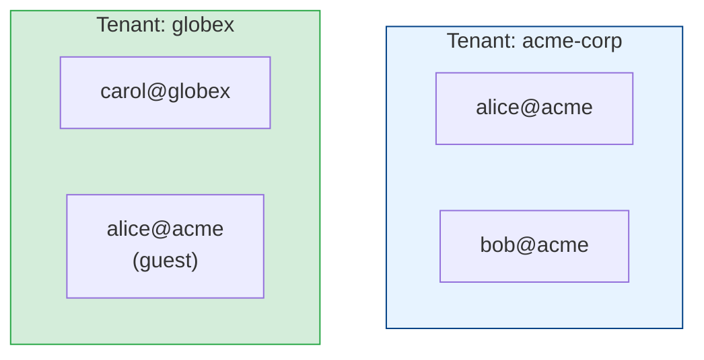
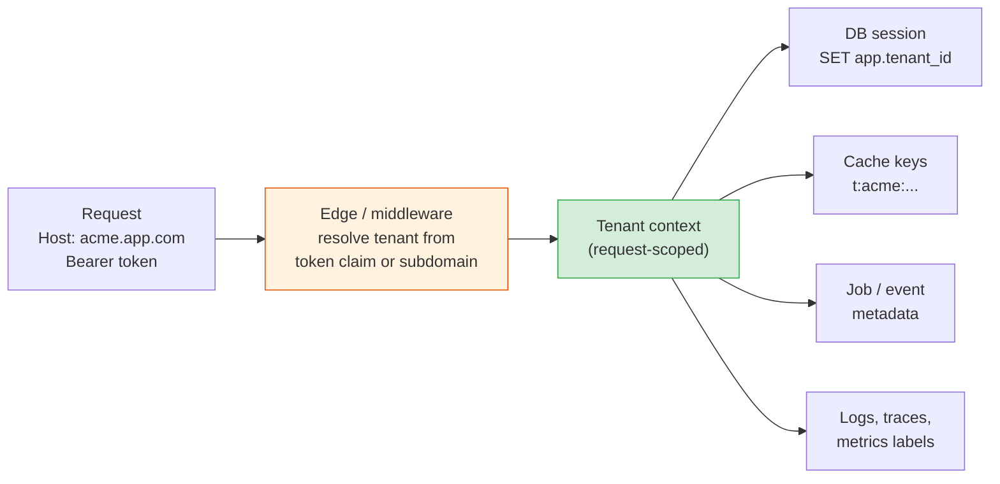
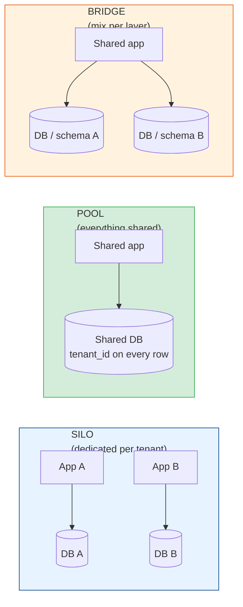

# Tenancy Fundamentals: Tenants, Context & the Silo/Pool/Bridge Models

[Index](./README.md) | [Next: Data Isolation >](./data-isolation.md)

---

A multi-tenant system serves many customers from one deployment. Slack workspaces, Shopify
stores, Jira sites, and Salesforce orgs are all tenants: separate customers whose data must
never mix, running on infrastructure they share. Sharing is what makes SaaS cheap to run. One
upgrade fixes every customer, and a thousand small customers don't need a thousand servers.
The cost is that every line of code now has a new way to fail. It can show one customer's data
to another.

This chapter covers the vocabulary and the big architectural choice: how much to share.

## Tenant, user, and why they're different

A **tenant** is the unit of isolation and billing: a company, a workspace, an organisation. A
**user** is a person who logs in. One tenant has many users, and one person can belong to
several tenants (think of a consultant in five Slack workspaces).



Getting this wrong early is expensive. If the schema hangs everything off `user_id` and there's
no `tenant_id`, adding tenancy later means touching every table, query, cache key, and job.
Even a product that starts with "one user, one account" should model a tenant from the first
migration. It costs one column.

## Tenant context: the value that has to go everywhere

Every request, job, event, and log line runs on behalf of exactly one tenant. That tenant ID
is the tenant context, and the most important rule in multi-tenant engineering is that it gets
set once, at the edge, from something the caller can't forge, and then travels automatically.



Where the tenant comes from:

| Source | Example | Notes |
|--------|---------|-------|
| Token claim | `"tid": "acme"` in a signed JWT | Best default. Signed, so the client can't change it |
| Subdomain | `acme.app.com` | Good for routing and branding; still check the user belongs to that tenant |
| Path | `/t/acme/invoices` | Fine, same membership check needed |
| Request header or body field | `X-Tenant-ID: acme` | Only from trusted internal callers. From a browser it's an open invitation |

```python
@app.middleware("http")
async def tenant_context(request, call_next):
    claims = verify_jwt(request.headers["authorization"])
    tenant_id = claims["tid"]
    if request.subdomain and request.subdomain != tenant_id:
        raise Forbidden("token tenant does not match host")
    token = current_tenant.set(tenant_id)          # contextvars.ContextVar
    try:
        return await call_next(request)
    finally:
        current_tenant.reset(token)
```

After that point, application code should never take a `tenant_id` parameter from a request
body. Repositories, cache helpers, and job enqueuers read it from the context. Background jobs
put it in the job payload and restore it before doing any work. The goal is that forgetting to
filter by tenant is hard, because the plumbing does it for you.

## The three deployment models

The big decision is what tenants share. The AWS SaaS guidance popularised three names for the
answer:



| | Silo | Pool | Bridge |
|---|------|------|--------|
| What's shared | Nothing, or only the control plane | Compute, database, tables | Compute shared; storage separate (or the reverse) |
| Isolation | Strongest: separate infrastructure | Logical only: a missing `WHERE` leaks data | Strong for data, shared for compute |
| Cost per tenant | Highest; idle tenants still cost money | Lowest; tenants share idle capacity | Middle |
| Noisy neighbours | None between tenants | The main operational problem | Possible in the shared layer |
| Onboarding | Provision infrastructure (minutes to hours) | Insert a row (milliseconds) | Create a schema or database |
| Upgrades & migrations | N deployments, N migrations | One deployment, one migration | One deployment, N migrations |
| Per-tenant customisation | Easy | Hard | Medium |
| Good for | Large enterprise and regulated customers | Self-serve, many small tenants | Mid-market, data-residency needs |

Most products end up as a mix, and the mix usually follows the pricing page:

- **Free and starter tiers** live in the pool. Thousands of tenants, most of them idle.
- **Business tiers** share compute but might get their own schema or database.
- **Enterprise tiers** get a silo, sometimes in a region they choose, sometimes with their own
  encryption keys.

The trick is to build one codebase that can run in all three modes. The application shouldn't
know or care whether `acme`'s data is in a shared table or its own database; a routing layer
looks that up. [Chapter 4](./operating-multi-tenant-systems.md#tiering-and-moving-tenants)
covers moving tenants between modes as they grow.

## Control plane and application plane

Every multi-tenant system has two halves, whether or not anyone names them:

| | Control plane | Application plane |
|---|---------------|-------------------|
| What it does | Manages tenants: sign-up, provisioning, plans, billing, placement, offboarding | Runs the product for each tenant |
| Tenancy | Global, sees all tenants | Scoped to one tenant per request |
| Example data | `tenants (id, plan, region, cell, db_shard, status)` | `invoices`, `projects`, `messages` |
| Who calls it | Sign-up flow, billing, internal admin tools | End users |

The `tenants` table in the control plane is the catalogue that the rest of the system reads:
which database holds this tenant, which region, which plan limits apply. Keep it small, cache
it heavily, and protect it well. An admin tool that can see across tenants is the most
dangerous code in the system.

## Isolation is more than data

Data leaking between tenants is the failure everyone fears, but tenants can affect each other
in other ways too:

| Isolation type | Failure when it's missing |
|----------------|---------------------------|
| Data | Tenant A sees tenant B's invoices ([chapter 2](./data-isolation.md)) |
| Performance | Tenant A's bulk import makes the app slow for everyone ([chapter 3](./noisy-neighbors.md)) |
| Fault | A poison message from tenant A crashes the worker serving all tenants |
| Security | One tenant's compromised admin account can reach shared infrastructure |
| Operational | A migration that's slow for one huge tenant blocks the release for all of them |

Each of the remaining chapters takes one or two of these rows.

## The takeaways

1. **A tenant isn't a user.** Model tenants from the first migration, even if every tenant has
   one user today.
2. **Resolve tenant context once, at the edge, from a signed source,** then let the plumbing
   carry it to the database, cache, jobs, and logs.
3. **Silo, pool, and bridge are a spectrum.** Silo buys isolation with money; pool buys
   efficiency with engineering discipline.
4. **Most real systems mix models by tier.** Build one codebase that doesn't care where a
   tenant's data lives.
5. **Isolation covers data, performance, faults, security, and operations.** Leaks are the
   scariest; noisy neighbours are the most common.

---

[Index](./README.md) | [Next: Data Isolation >](./data-isolation.md)
