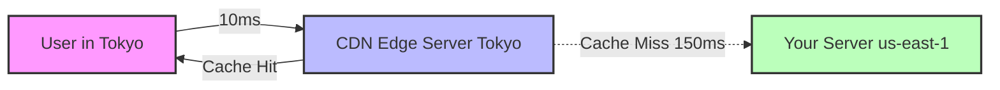
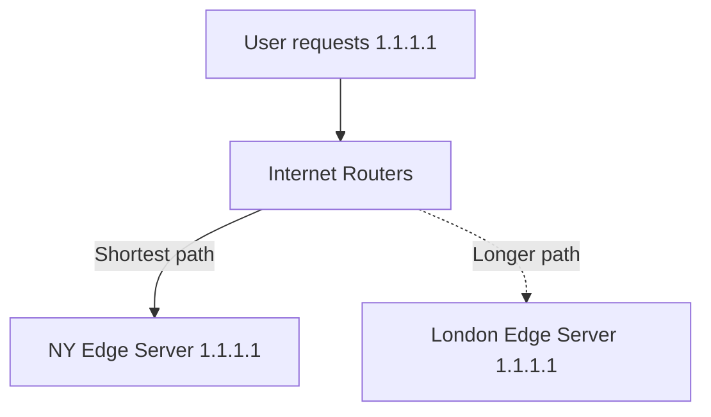

# CDNs and the Edge

[< Back](./dns-deep-dive.md) | [Index](./README.md) | [Next: Module Index >](./README.md)

---

Physics is annoying. Light only travels so fast. If your server is in Virginia and your user is in Tokyo, it will take at least 150ms just to say "hello." That's why we use CDNs (Content Delivery Networks).

## What a CDN Does

A CDN puts a caching server physically closer to the user. Instead of the user crossing the ocean to talk to your server (the **Origin**), they talk to a CDN server in their city (the **Edge**).



## How Caching Works

When the Edge receives a request, it checks its cache (using the URL and headers as the **Cache Key**).
If it's a hit, it returns it instantly.
If it's a miss, it fetches it from your Origin, caches it, and then returns it.

How long does it cache? You tell it, via HTTP headers:
```http
Cache-Control: public, max-age=3600
```

> **Invalidation**: Caching is easy. Cache invalidation is hard. If you update an image, the Edge still has the old one. You either need to explicitly tell the CDN to purge that file (slow), or better yet, use **cache-busting URLs** (e.g., `app.js?v=2.1`).

## Anycast Routing

How does the CDN know to send the Tokyo user to the Tokyo server, and the NY user to the NY server? **Anycast**.

Unlike normal IP addresses (Unicast, where 1 IP = 1 machine), Anycast means multiple servers around the world broadcast that they own the *exact same IP address*. The internet's routers (using BGP - Border Gateway Protocol) automatically route the user's packet to the geographically closest server broadcasting that IP.



## Static vs. Dynamic Content

Historically, CDNs only cached static assets (images, CSS, JS). Today, CDNs proxy *everything*. Even if a request is dynamic (like a `POST` to `/login`), routing it through the CDN is faster. Why? Because the CDN maintains persistent, optimized, warmed-up TCP/TLS connections from the Edge back to your Origin.

## Edge Computing

We realized that if we have servers 10ms away from users, why just cache images? Let's run code.

**Cloudflare Workers** or **Lambda@Edge** let you run Javascript/Wasm directly on the Edge nodes.
Use cases:
- A/B testing (modify the response before the user sees it)
- Custom authentication/authorization checks
- Geo-redirects
- Modifying HTTP headers

## DDoS Protection and Security

Because CDNs sit in front of your Origin, they are your shield.
If a massive DDoS attack hits you, it hits the CDN's massive network first. They absorb the traffic, filter out the garbage (Scrubbing), and rate-limit abusive IPs. A WAF (Web Application Firewall) at the Edge can also block SQL injection payloads before they ever reach your app.

## Takeaways

* CDNs beat the speed of light by putting data closer to users.
* Use `Cache-Control` headers and cache-busting URLs to manage stale content.
* Anycast routing magically sends users to the closest edge server using the same IP.
* Run dynamic traffic through a CDN too (for connection pooling and WAF/DDoS protection).
* Edge compute lets you run lightweight code in hundreds of global datacenters instantly.

---

[< Back](./dns-deep-dive.md) | [Index](./README.md) | [Next: Module Index >](./README.md)
