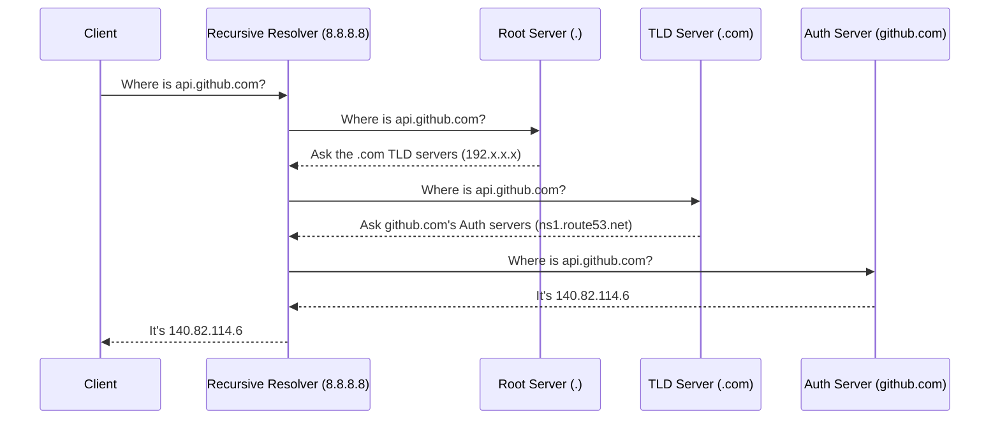

# DNS Deep Dive

[< Back](./how-the-internet-works.md) | [Index](./README.md) | [Next: CDNs and the Edge >](./cdns-and-edge.md)

---

DNS is the phone book of the internet. It maps human-readable names (`github.com`) to machine-routable IP addresses (`140.82.114.6`). Almost every mysterious "it's not connecting" issue is secretly a DNS issue.

## The Resolution Flow

When you ask for `api.github.com`, your browser doesn't just magically know who to ask. It's a recursive process.



> **Authoritative vs. Recursive**: 
> A **recursive resolver** (like Google's `8.8.8.8` or your ISP's router) goes out and hunts down the answer for you.
> An **authoritative nameserver** (like AWS Route53 or Cloudflare) actually holds the final, source-of-truth records for a specific domain.

## Record Types You Need to Know

| Type | What it does | When to use it |
|---|---|---|
| **A** | Maps a name to an IPv4 address. | `api.myapp.com -> 1.2.3.4` |
| **AAAA** | Maps a name to an IPv6 address. | `api.myapp.com -> 2001:db8::1` |
| **CNAME** | Maps a name to *another name* (Alias). | `www.myapp.com -> myapp.com`. (Cannot be used at the root `@` domain!) |
| **MX** | Mail Exchange. Where to send emails. | To receive mail via GSuite/Office365. |
| **TXT** | Arbitrary text. | Proving domain ownership, SPF/DKIM for email security. |
| **NS** | Name Server. Who holds the records for this domain/subdomain. | Delegating a subdomain to another AWS account. |
| **SRV** | Service record (port + target). | Finding specific services (like old SIP or Kubernetes internal DNS). |

## Caching and TTL

DNS would break the internet if it wasn't heavily cached. 
Caching happens at the:
1. Browser level
2. OS level (`/etc/hosts` and system resolver)
3. Recursive resolver level (your ISP)

Every DNS record has a **TTL (Time to Live)** in seconds. If the TTL is 300, resolvers will cache it for 5 minutes.
> **Pro-Tip**: When migrating a database or changing a server IP, drop the TTL to 60 seconds a day in advance. Otherwise, some users will be stuck hitting the old IP for hours.

*"DNS propagation takes 48 hours"* is mostly a myth from the 90s. If you didn't have an old cached record with a 48-hour TTL, a new record resolves almost instantly globally.

## Load Balancing with DNS

You don't always want to return a single IP.
- **Round-Robin**: Return multiple A records. The client picks one. If it dies, the client *might* try the other.
- **Geo-DNS**: Return a European IP to users in France, and a US IP to users in NY.
- **Weighted**: Return the new API server IP 10% of the time to do a canary release.

## DNSSEC (Briefly)
DNS was built without security. Attackers could spoof responses (DNS poisoning). DNSSEC adds cryptographic signatures to DNS records, proving they came from the real authoritative server. It's notoriously hard to get right, so let Cloudflare or Route53 handle it.

## Debugging DNS

Stop pinging domains to test DNS. Use `dig` or `nslookup`.

```bash
# Get the A records
dig github.com

# Ask a specific resolver (like Google's 8.8.8.8) to bypass your local cache
dig @8.8.8.8 github.com

# Check where the MX records are pointing
dig MX github.com

# Trace the entire recursive path
dig +trace github.com
```

## Takeaways

* DNS translates names to IPs. It is highly distributed and cached.
* Understand the difference between a Recursive Resolver (who you ask) and an Authoritative Server (who holds the truth).
* Lower your TTLs *before* you make a major infrastructure change.
* Use `dig` to debug DNS, not `ping`.
* Know your record types (A, CNAME, TXT, MX) like the back of your hand.

---

[< Back](./how-the-internet-works.md) | [Index](./README.md) | [Next: CDNs and the Edge >](./cdns-and-edge.md)
