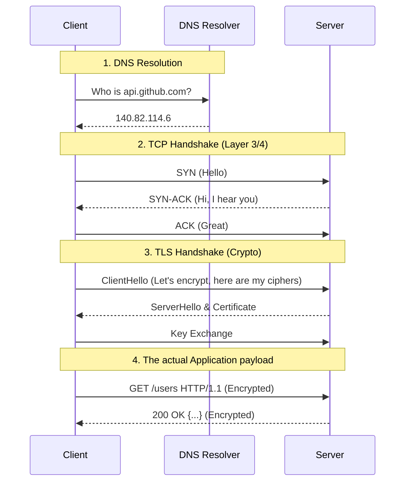

# How the Internet Actually Works

[< Back](./README.md) | [Index](./README.md) | [Next: DNS Deep Dive >](./dns-deep-dive.md)

---

Forget the 7-layer OSI model you memorized for some exam. In the real world, we care about the 4-layer TCP/IP model. When a bug happens, you need to know exactly which layer is lying to you.

## The Practical Network Model

We only really care about four layers. 

1. **Link Layer**: Physical cables, MAC addresses, ARP. If this is broken, someone tripped over a cable.
2. **Network Layer (IP)**: Moving packets from IP A to IP B across the internet. Routers live here.
3. **Transport Layer (TCP/UDP)**: Ports and reliability. TCP gives us ordered, reliable streams. UDP gives us fire-and-forget datagrams. 
4. **Application Layer (HTTP/TLS/DNS)**: Where we spend 99% of our time as backend engineers.

> **Rule of thumb**: Always debug from the bottom up. Don't waste an hour reading application logs if the server doesn't even have a network route to the database.

## IP Addressing & NAT

Every device needs an IP. IPv4 is the classic `192.168.1.1` format (32-bit). We ran out of them years ago. IPv6 is the `2001:0db8:...` format (128-bit) that we're supposedly migrating to.

### Private vs. Public & NAT
Your laptop doesn't have a real, routable internet IP. It has a **private IP** (usually `10.x.x.x` or `192.168.x.x`). 

So how do you browse the web? **Network Address Translation (NAT)**. 
Your home router has a public IP. When your laptop talks to Google, the router rewrites the source IP of your packets to its own public IP, keeps track of the connection in a NAT table, and routes the response back to your local IP. This is why you can't just host a server on your home laptop without configuring port forwarding.

### Subnets and CIDR
You'll see IP ranges written like `10.0.0.0/24`. This is **CIDR notation**.
The `/24` means the first 24 bits are fixed (the network), and the remaining 8 bits are for hosts. 
Since $2^8 = 256$, a `/24` gives you 256 IPs (minus 2 reserved ones, so 254 usable).
A `/16` gives you ~65k IPs. 

## The Life of an HTTP Request

When you type `https://api.github.com/users` into a client, magic happens. It's not just "one connection".



Look at that overhead! Before a single byte of HTTP data is sent, we did a DNS lookup, a 3-way TCP handshake, and a complex TLS negotiation. This is why connection pooling in your database and backend services is essential.

## Routing: How Packets Move

The internet is just a bunch of routers playing "hot potato" with your packets. When you send a packet to `140.82.114.6`:
1. Your machine looks at its routing table. "Is this in my local subnet? No? Send it to the default gateway (router)."
2. The router looks at *its* routing table. "I don't know this IP, send it upstream to the ISP."
3. ISPs use BGP (Border Gateway Protocol) to share maps of the internet. They route the packet closer to its destination, hop by hop.

### Practical Tools

Don't guess. Measure.

**Ping**: Uses ICMP (not TCP/UDP) to check if a host is alive. Often blocked by firewalls, so a failed ping doesn't mean the server is down.
```bash
ping 8.8.8.8
```

**Traceroute**: Shows the exact router hops your packet takes to reach the destination. Crucial for finding where a connection is dropping.
```bash
traceroute github.com
# or 'mtr github.com' for a live updating view
```

**nc (Netcat) / Telnet**: Check if a specific TCP port is open.
```bash
# Check if port 443 is open and listening on google.com
nc -vz google.com 443
```

## Takeaways

* Learn the 4-layer TCP/IP model. Always debug bottom-up.
* Understand CIDR notation (`/24`, `/16`) — you'll need it every time you touch AWS VPCs or firewalls.
* NAT is why your local services aren't reachable from the outside world.
* An HTTPS request has massive overhead (DNS + TCP + TLS). Use keep-alive and connection pools.
* Use `traceroute` and `nc` before assuming the application is broken.

---

[< Back](./README.md) | [Index](./README.md) | [Next: DNS Deep Dive >](./dns-deep-dive.md)
