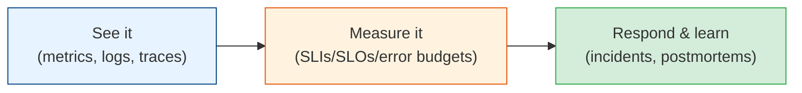

# Observability & Reliability

You can't fix what you can't see, and you can't promise reliability you don't measure. This is
the module that separates "we wrote some services" from "we run a production system." It covers
how to *see* into your system (observability) and how to *keep it up* (reliability engineering)
— including the operational wisdom that only comes from being paged at 3 a.m.

## Contents

| # | Topic | File | Level |
|---|-------|------|-------|
| 0 | The map (this file) | *(here)* | L3 · Intermediate |
| 1 | The three pillars: metrics, logs, traces | [three-pillars.md](./three-pillars.md) | L3 · Intermediate |
| 2 | SLIs, SLOs, SLAs & error budgets | [slos-and-error-budgets.md](./slos-and-error-budgets.md) | L4 · Advanced |
| 3 | Incidents, on-call & postmortems | [incidents-and-postmortems.md](./incidents-and-postmortems.md) | L4 · Advanced |

---

## How to read this module

- **Chapter 1** is the foundation: the instrumentation every service needs. Read it before you
  ship anything to production.
- **Chapter 2** is how you define and defend reliability as a *number* — the language of SRE and
  the bridge between engineering and the business.
- **Chapter 3** is the human side: what to do when it breaks, and how to make sure it breaks
  less next time. This is where senior engineers and managers live.

## The one truth

> **Reliability is not the absence of failure — it's the presence of fast detection, graceful
> handling, and quick recovery.** Everything fails. Mature teams just notice faster, contain
> the blast radius, and learn from every incident.

Start with [three-pillars.md](./three-pillars.md). **Next >**
