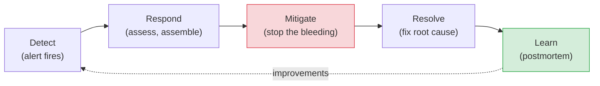

# Incidents, On-Call & Postmortems

[< Back](./slos-and-error-budgets.md) | [Index](./README.md)

---

Everything fails eventually. The mark of a mature team isn't avoiding incidents — it's handling
them calmly and *learning* from every one. This chapter is the operational and cultural wisdom
that turns outages from disasters into (survivable) lessons.

## The incident lifecycle



**The order matters:** **mitigate before you diagnose.** When users are hurting, restore
service *first* (roll back, failover, disable the feature, scale up) — then find the root cause
in the calm afterward. Debugging a live outage while users suffer is a rookie mistake. Stop the
bleeding, *then* investigate.

## Incident roles (so chaos has structure)

When a real incident hits, assign roles — even informally:

- **Incident Commander (IC)** — runs the response, makes decisions, keeps everyone coordinated.
  *Not* necessarily the person fixing it — their job is coordination, not keyboard work.
- **Ops/Responders** — the hands actually investigating and mitigating.
- **Communications** — keeps stakeholders and status pages updated so the IC isn't interrupted.
- **Scribe** — records the timeline as it happens (invaluable for the postmortem later).

> One person trying to fix, communicate, and coordinate simultaneously is how a 10-minute
> incident becomes a 2-hour one. Split the roles.

## Key incident metrics

| Metric | Meaning | Goal |
|--------|---------|------|
| **MTTD** (Mean Time To Detect) | How long until you *notice* | Low — good monitoring |
| **MTTA** (Mean Time To Acknowledge) | How long until someone responds | Low — good on-call |
| **MTTR** (Mean Time To Recover) | How long until service is restored | **The big one** |

> **Optimize for low MTTR over zero incidents.** You will have incidents; being able to recover
> *fast* matters more than the fantasy of never failing. Fast rollback, good runbooks, and
> practiced responders shrink MTTR.

## On-call: doing it humanely

On-call is necessary and can be brutal if run badly. The healthy version:

- **Sustainable rotation** — enough people that no one is perpetually on call. One week in
  6–8 is humane; one week in 2 is burnout.
- **Actionable alerts only** — if it pages, there must be something to do. Ruthlessly delete
  noisy alerts; alert fatigue causes missed real incidents.
- **Runbooks** — every alert links to "here's what this means and what to do." Don't make a
  half-asleep engineer reverse-engineer the system at 3 a.m.
- **Compensate on-call** — time off, pay, or both. It's real work outside hours.
- **Follow-the-sun** where possible — teams in different time zones so nobody works nights.
- **Track on-call load** — if one team drowns in pages, that's a signal to fix the *system*, not
  to push harder.

## Postmortems: the blameless learning engine

After any significant incident, write a **postmortem**. Its entire purpose is **learning**, not
punishment.

### Blameless culture (non-negotiable)

> **Blameless postmortems** assume everyone acted reasonably with the information they had. You
> attack the **system and process**, never the person. "Alice deployed the bug" is useless and
> toxic. "A config change reached prod with no staging validation, and no alert caught it for 20
> minutes" is actionable.

Why blameless? Because blame makes people **hide** problems. If naming a mistake gets you
punished, you stop reporting near-misses, and the org goes blind. Psychological safety is what
makes incident data flow. This is a cultural investment leadership must protect.

### What a good postmortem contains

1. **Summary** — what happened, impact (users affected, duration, revenue).
2. **Timeline** — detection → response → mitigation → resolution, with timestamps.
3. **Root cause** — the *real* cause. Use the **5 Whys** to get past symptoms.
4. **What went well / what went poorly** — honestly.
5. **Action items** — concrete, *owned*, with due dates. This is the whole point.

### The 5 Whys (getting to the real cause)

```
The site went down.
  Why? The database ran out of connections.
    Why? A deploy leaked connections.
      Why? The new code didn't close connections on error paths.
        Why? No connection-leak test, no pool-usage alert.
          Why? We lack a standard DB client wrapper + alerting.  <- REAL root cause
```

The first answer is a symptom. The root cause is almost always a **systemic gap**, not a single
typo. Fix the system so this *class* of problem can't recur.

## The blast-radius mindset (design so incidents stay small)

The best incident is a small one. Design to contain damage *before* it happens:

- **Feature flags** — turn off a broken feature instantly without a deploy.
- **Gradual rollouts / canaries** — expose new code to 1% first; catch problems before 100%.
- **Fast rollback** — the single most valuable incident capability. Practice it.
- **Bulkheads & circuit breakers** — one failure doesn't cascade (see
  [failure handling](../distributed-systems/failure-handling.md)).
- **Graceful degradation** — lose a feature, not the whole product.

## The takeaways

1. **Mitigate first, diagnose second.** Stop the bleeding before finding the root cause.
2. **Assign incident roles** — a commander who coordinates, not everyone typing at once.
3. **Optimize MTTR.** Fast recovery beats the fantasy of never failing.
4. **Run on-call humanely** — sustainable rotations, actionable alerts, runbooks, compensation.
5. **Postmortems are blameless and action-oriented.** Attack the system, not the person; every
   incident yields owned, dated improvements.
6. **Design for small blast radius** — flags, canaries, fast rollback. The cheapest incident is
   the one you contained to 1% of users.

> Reliability is a *culture*, not a checklist. Teams that treat incidents as learning
> opportunities get more reliable every quarter. Teams that hunt scapegoats get quieter,
> blinder, and eventually a much bigger outage.

---

[< Back](./slos-and-error-budgets.md) | [Index](./README.md)
