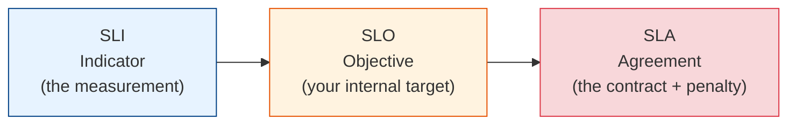
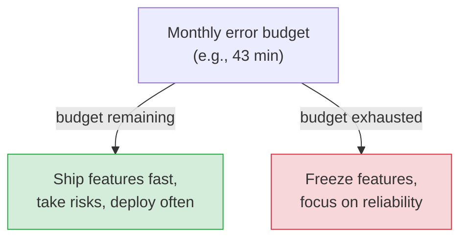

# SLIs, SLOs, SLAs & Error Budgets

[< Back](./three-pillars.md) | [Index](./README.md) | [Next: Incidents & Postmortems >](./incidents-and-postmortems.md)

---

"Is our system reliable enough?" is a business question that engineers must answer with a
*number*. This is the vocabulary of Site Reliability Engineering (SRE) — the framework Google
built to make reliability a measurable, negotiable, budgeted thing instead of a vibe.

## The three acronyms (get them straight)



| Term | What it is | Example |
|------|-----------|---------|
| **SLI** (Indicator) | A *measurement* of some aspect of service | "% of requests served < 300 ms" = 99.5% |
| **SLO** (Objective) | Your *internal target* for an SLI | "99.9% of requests < 300 ms over 30 days" |
| **SLA** (Agreement) | A *contract* with customers + consequences if breached | "99.9% uptime or you get a refund" |

**The relationship:** SLIs are what you measure. SLOs are the targets you set for them. SLAs are
promises to customers (with penalties). **Always set your SLO stricter than your SLA** — the gap
is your safety margin. If you promise 99.9% (SLA), target 99.95% (SLO) internally so you have
warning before you breach the contract.

## Good SLIs

An SLI should measure what **users actually experience**, expressed as a ratio of good events
to total events:

```
SLI = good events / valid events

Availability SLI = successful requests / total requests
Latency SLI      = requests faster than threshold / total requests
```

Pick SLIs from the user's perspective: availability, latency, correctness, freshness. "CPU
usage" is a *metric*, not a good SLI — users don't feel CPU, they feel slowness and errors.

## Error budgets: the killer idea

If your SLO is 99.9%, then **0.1% is your error budget** — the amount of unreliability you're
*allowed* to spend. This reframes reliability from "never fail" (impossible, infinitely
expensive) to "fail within budget" (achievable, negotiable).

```
99.9% SLO over 30 days → error budget ≈ 43.2 minutes of downtime/month
99.99% SLO             → error budget ≈ 4.3 minutes/month
```



**Why it's brilliant:** the error budget turns the eternal dev-vs-ops fight into math.
- **Budget left?** Ship features aggressively, deploy often, take risks. Reliability is fine.
- **Budget blown?** Stop shipping features; the team pivots to reliability work until you're
  back in budget.

It aligns everyone: developers want to ship, SREs want stability, and the error budget is the
shared, objective referee. No more arguing about "how safe is safe enough" — you agreed on a
number.

## The most important lesson: 100% is the wrong target

> **100% reliability is the wrong goal for almost everything.** It's impossibly expensive, and
> your users can't even tell the difference — their own network, phone, and ISP are less
> reliable than four nines anyway. Chasing 100% means never shipping and burning infinite money
> for zero perceived benefit.

Each extra nine costs roughly **10× more** (multi-region, automated failover, no human in the
loop). Set the SLO where the *cost of more reliability* exceeds the *value to users*. For an
internal batch job, 99% might be plenty. For a payment system, you pay for four or five nines.
**Match the target to the actual need.**

## Choosing an SLO (the practical process)

1. **Identify the critical user journeys** (login, checkout, search) — you SLO those, not
   everything.
2. **Pick SLIs** that reflect each journey's health (availability + latency usually).
3. **Set a target** based on user expectations and cost — start from current performance, don't
   pull a number from the sky.
4. **Measure over a rolling window** (e.g., 28–30 days) so one bad hour doesn't nuke you and one
   good week doesn't hide chronic pain.
5. **Review and adjust.** SLOs are living targets; revisit as the system and users evolve.

## The takeaways

1. **SLI = measurement, SLO = your target, SLA = the customer contract.** Keep SLO stricter
   than SLA.
2. **Error budgets turn reliability into a shared, objective decision** — spend it on features
   when you have it, on stability when you don't.
3. **100% is the wrong goal.** Reliability has a cost curve; buy only the nines your users
   actually need.
4. **SLO the critical user journeys, from the user's perspective** — not internal metrics like
   CPU.
5. **This is the language that connects engineering to the business.** Learning to speak in
   SLOs and error budgets is a senior-and-above skill.

---

[< Back](./three-pillars.md) | [Index](./README.md) | [Next: Incidents & Postmortems >](./incidents-and-postmortems.md)
