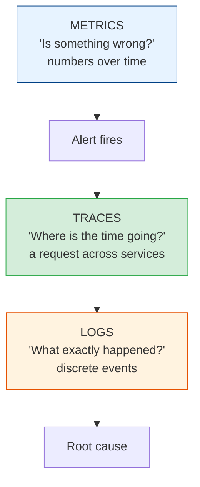

# The Three Pillars: Metrics, Logs & Traces

[Index](./README.md) | [Next: SLOs & Error Budgets >](./slos-and-error-budgets.md)

---

**Observability** is the ability to understand what's happening *inside* your system from the
outside — especially to answer questions you *didn't* anticipate. It rests on three pillars,
each answering a different question.

The typical debugging flow: **a metric alerts you** something's wrong → **a trace** shows you
*which service/step* is slow or failing → **logs** tell you *exactly what* went wrong there.

## 1. Metrics — "is something wrong?"

Numeric measurements aggregated over time: request rate, error rate, latency, CPU, queue depth.
Cheap to store, fast to query, perfect for **dashboards and alerts**. They tell you *that*
something is wrong, rarely *why*.

**The metrics that matter — the four golden signals (Google SRE):**

| Signal | Question | Example |
|--------|----------|---------|
| **Latency** | How slow? | p50/p95/p99 response time |
| **Traffic** | How much demand? | requests/sec |
| **Errors** | How often failing? | 5xx rate, error % |
| **Saturation** | How full? | CPU, memory, queue depth, connection pool |

> **Always look at percentiles, never just averages.** An average latency of 100 ms can hide a
> p99 of 5 seconds — meaning 1% of users (often your biggest/most-active) have an awful
> experience. **Averages lie; tails tell the truth.** Watch p95 and p99.

## 2. Logs — "what exactly happened?"

Timestamped records of discrete events. Rich detail, invaluable for root-cause analysis — but
expensive at volume and noisy if undisciplined.

**Do logging right:**

- **Structured logging (JSON), not string soup.** `{"level":"error","user_id":42,"err":"..."}`
  is queryable; `"Error for user 42: ..."` is not. Structured logs are the difference between
  grep-and-pray and actual analysis.
- **Include correlation/trace IDs** in every log line so you can stitch together one request's
  journey across services.
- **Use log levels deliberately** (DEBUG/INFO/WARN/ERROR) and make them tunable at runtime.
- **Never log secrets or PII** — passwords, tokens, card numbers, SSNs. This is a security *and*
  compliance issue, and it's shockingly common. (See the repo's PII rules.)
- **Sample high-volume logs** — you don't need every one of a million identical lines.

## 3. Traces — "where is the time going?"

A **distributed trace** follows a single request across every service it touches, showing the
timing of each hop as a tree of **spans**. Indispensable in microservices, where one user click
might touch ten services and the slow one is invisible from any single service's logs.

```mermaid
gantt
    title A single request trace (spans)
    dateFormat X
    axisFormat %L ms
    section Gateway
    handle request     :0, 250
    section Auth
    verify token       :10, 40
    section Orders
    fetch order        :55, 90
    section Inventory
    check stock (SLOW) :100, 230
    section DB
    query              :180, 220
```

- Each **span** = one operation (a service call, a DB query) with a start, duration, and
  metadata.
- A **trace ID** ties all spans of one request together.
- **OpenTelemetry** is the vendor-neutral standard for generating traces/metrics/logs — learn
  it; it's where the industry converged.

> Traces are how you answer "the checkout is slow" in a microservices world. Without them,
> you're guessing which of ten services is the culprit. With them, you *see* the 130 ms
> inventory call and go fix it.

## The fourth (unofficial) pillar: alerting

Observability data is useless if a human has to stare at dashboards. **Alerts** turn signals
into action.

- **Alert on symptoms, not causes.** Page on "users are seeing errors" (an SLO breach), not on
  "CPU is 80%" (which may be totally fine). CPU high with happy users? Not an incident.
- **Every page must be actionable.** If an alert fires and there's nothing to do, it's noise —
  delete it. Alert fatigue gets real incidents ignored.
- **Tier your alerts:** page (wake someone) vs ticket (look tomorrow) vs FYI. Reserve paging for
  "a human must act now."

## The takeaways

1. **Instrument from day one.** Observability isn't a phase-2 feature; it's part of the design.
   You can't add it during the outage.
2. **Metrics to detect, traces to localize, logs to root-cause.** Three tools, three jobs.
3. **Percentiles (p95/p99), not averages.** The tail is where your users suffer.
4. **Structured logs + correlation IDs**, and **never** log secrets/PII.
5. **Alert on user-facing symptoms, and make every alert actionable.** Noise kills
   responsiveness.
6. **Standardize on OpenTelemetry** so you're not locked to one vendor.

---

[Index](./README.md) | [Next: SLOs & Error Budgets >](./slos-and-error-budgets.md)
