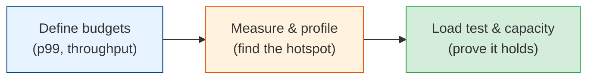

# Performance Engineering

Fast systems are rarely accidents. Latency budgets, profiling, capacity planning, and load
testing are how you go from "it works on my laptop" to "p99 is 80ms at Black Friday traffic."
This module is the practical toolkit for making software fast — and keeping it that way.

## Contents

| # | Chapter | Level | What you'll learn |
|---|---------|-------|-------------------|
| 1 | [Latency, Throughput & Budgets](./latency-and-budgets.md) | Basic → Intermediate | Percentiles, SLOs vs averages, latency budgets, Amdahl's law |
| 2 | [Profiling & Bottleneck Hunting](./profiling-and-bottlenecks.md) | Intermediate | CPU/memory/IO profiles, flame graphs, common backend killers |
| 3 | [Load Testing & Capacity](./load-testing-and-capacity.md) | Intermediate → Advanced | Load vs stress vs soak, capacity models, scaling decisions |

## How to read this module

- **Chapter 1** gives you the vocabulary: stop arguing about averages; start owning percentiles.
- **Chapter 2** is the debugging craft: find the real bottleneck before you "optimize."
- **Chapter 3** is how you prove the system will survive the traffic you claim it can.

## Related modules

Pairs with [observability-and-reliability](../observability-and-reliability/README.md) (metrics,
SLOs), [system-design-fundamentals](../system-design-fundamentals/README.md) (estimation,
scaling), and [concurrency](../concurrency/README.md) (when "more threads" makes things worse).

## The one truth

> **You can't optimize what you haven't measured — and averages lie.** A system with 50ms average
> latency and a 2-second p99 is a system users hate. Fix the tail, not the mean.

Start with [latency-and-budgets.md](./latency-and-budgets.md). **Next >**
