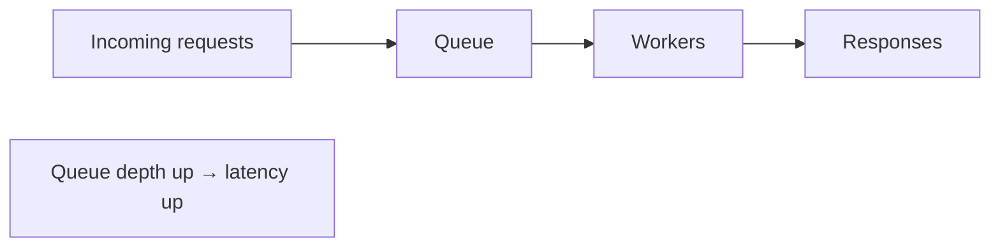

# Latency, Throughput & Budgets

[< Back](./README.md) | [Index](./README.md) | [Next: Profiling & Bottleneck Hunting >](./profiling-and-bottlenecks.md)

---

Performance conversations collapse without shared definitions. Latency is not throughput.
Average is not what users feel. A budget without owners is a wish.

## Latency vs Throughput

| Term | Meaning | Units |
|------|---------|-------|
| **Latency** | Time for one request to complete | ms, µs |
| **Throughput** | Work completed per unit time | req/s, MB/s |
| **Bandwidth** | Max data rate of a link/pipe | Gbps |
| **Utilization** | How full a resource is | % |

You can have high throughput and terrible latency (giant batch jobs). You can have low latency
and low throughput (a single fast request). Systems usually trade one against the other under
load — queues absorb throughput spikes by adding latency.



**Little's Law:** `concurrency ≈ throughput × latency`. If you sustain 1,000 req/s at 100ms
average latency, you have ~100 requests in flight. Useful for sizing thread pools and connection
limits.

## Why Averages Lie

```
Nine requests: 10ms each
One request:   910ms
Average:       100ms   ← looks "fine"
p50:           10ms
p99:           910ms   ← what the unlucky user feels
```

Always report **percentiles**: p50 (typical), p95, p99 (tail), sometimes p999. Tail latency is
where GC pauses, lock contention, cold caches, and noisy neighbors show up.

## Latency Budgets

A page or API that must feel snappy needs an explicit budget broken into parts:

| Segment | Example budget |
|---------|----------------|
| Client network + TLS | 30ms |
| Edge / CDN / gateway | 10ms |
| Service compute | 20ms |
| Database / cache | 25ms |
| Downstream dependencies | 30ms |
| **Total p99 budget** | **~115ms** |

When something blows the budget, you know *which layer* to attack. Without a budget, every team
optimizes locally and the product is still slow.

## SLOs vs "It Feels Fast"

Tie performance to reliability language:
- **SLI:** p99 latency of `POST /checkout` over 5 minutes
- **SLO:** p99 < 200ms for 99.9% of months
- **Error budget:** how much time you can miss the SLO before freezing features

See [observability SLOs](../observability-and-reliability/slos-and-error-budgets.md) for the
full process. Performance without an SLO is vibes; an SLO without percentiles is theater.

## Amdahl's Law (Why Parallelism Has Limits)

If 90% of a request is parallelizable and 10% is serial (e.g., auth + coordination), infinite
parallelism still leaves you with that 10%. Profile the serial path before buying more cores.

Same idea for microservices: if one dependency is always on the critical path, sharding the
others won't help that request's latency.

## Back-of-Envelope Speed Checks

Useful orders of magnitude (ballpark, not gospel):

| Operation | Order of magnitude |
|-----------|--------------------|
| L1/L2 cache | ~1–10 ns |
| Main memory | ~100 ns |
| SSD random read | ~100 µs |
| Same-AZ network RTT | ~0.5–1 ms |
| Cross-region RTT | ~50–150 ms |
| Disk / cold object store | ms–seconds |

If your p99 budget is 100ms and you do three sequential cross-region calls, you've already lost.

## Takeaways

- **Latency** ≠ **throughput**; queues turn throughput spikes into latency.
- Report **p50/p95/p99**, not averages — users live in the tail.
- Write a **latency budget** with owners per layer.
- Use Little's Law and Amdahl's Law before throwing hardware at the problem.

---

[< Back](./README.md) | [Index](./README.md) | [Next: Profiling & Bottleneck Hunting >](./profiling-and-bottlenecks.md)
