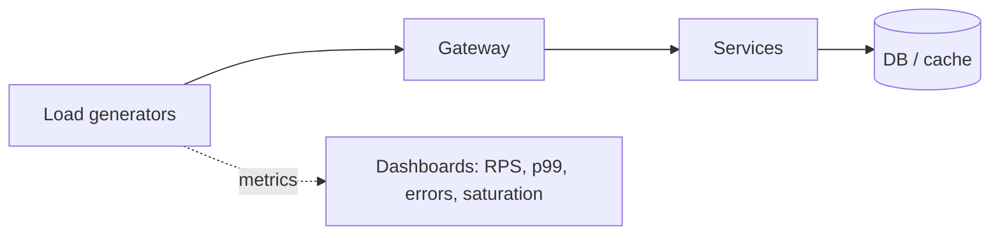

# Load Testing & Capacity

[< Back](./profiling-and-bottlenecks.md) | [Index](./README.md) | [Next: None >](./README.md)

---

Profiling finds hotspots in a single process. Load testing answers a different question: **does
the whole system hold under the traffic you promised?** Capacity planning turns those results
into hardware, autoscaling, and launch decisions.

## Kinds of Tests (Don't Mix Them Up)

| Type | Goal | Pattern |
|------|------|---------|
| **Load test** | Validate expected peak | Ramp to target RPS, hold, watch SLOs |
| **Stress test** | Find the breaking point | Keep increasing until errors/latency explode |
| **Soak / endurance** | Find leaks and degradation | Moderate load for hours/days |
| **Spike test** | Sudden bursts | Jump to peak, see queueing and recovery |
| **Chaos** | Failure under load | Kill nodes, add latency while traffic runs |

If you only ever "hammer until it dies," you learn the ceiling but not whether Black Friday is
safe. Prefer **SLO-shaped load tests**: "Can we sustain N RPS with p99 < X and error rate < Y?"



## Generating Realistic Load

Bad load tests teach false confidence.

- **Traffic shape** — real users have think time, bursts, and skewed endpoints. Not a flat
  `while true: hit /health`.
- **Data shape** — empty tables and tiny payloads don't match production cardinality or cache
  behavior.
- **Auth & cache warmth** — cold caches and token minting can dominate unless you model them.
- **Client saturation** — the load generator itself can become the bottleneck (open files, CPU,
  network). Monitor the attackers too.

Tools: k6, Gatling, Locust, vegeta, wrk — pick one, invest in scenarios, not tool debates.

## What to Watch During a Test

| Signal | Why |
|--------|-----|
| RPS achieved vs attempted | Are you actually applying the load you think? |
| Latency p50/p95/p99 | SLO compliance under load |
| Error rate / timeouts | Soft failures hide in averages |
| CPU, memory, IO, sat. | Resource ceiling |
| Queue depth / pool wait | Backpressure forming |
| Dependency latency | The real bottleneck may be downstream |

Stop the test when SLOs break — that point *is* the capacity answer, not a reason to ignore data.

## Capacity Modeling

Rough capacity from Little's Law and measured latency:

```
needed_replicas ≈ (target_RPS × p99_latency_seconds) / safe_in_flight_per_replica
```

Then add headroom (often 30–50%) for spikes, deploys, and one-AZ loss.

| Input | Source |
|-------|--------|
| Target RPS | Product / forecast / last year's peak × growth |
| Safe per-instance RPS | Load test at SLO boundary |
| Failure domain | Can you lose an AZ and still hold peak? |
| Headroom | Deploys, GC, thundering herds |

Autoscaling needs the same thinking: scale on **saturation signals** (CPU, queue depth, p99),
not vanity metrics. Set min replicas for cold-start-sensitive paths.

## Coordination With Releases

- Run load tests against **release candidates**, not only main on Monday
- Compare flame graphs / profiles between versions when latency regresses
- Gate high-risk launches on a pass/fail SLO checklist, not "feels fine in staging"

## Takeaways

- **Load** (prove the target), **stress** (find the cliff), **soak** (find the leak) — different tests.
- Realistic traffic and data matter more than which load-gen tool you pick.
- Capacity = measured safe RPS × replicas × headroom × failure assumptions.
- Tie tests to **SLOs**; the breaking point is information, not shame.

---

[< Back](./profiling-and-bottlenecks.md) | [Index](./README.md) | [Next: None >](./README.md)
