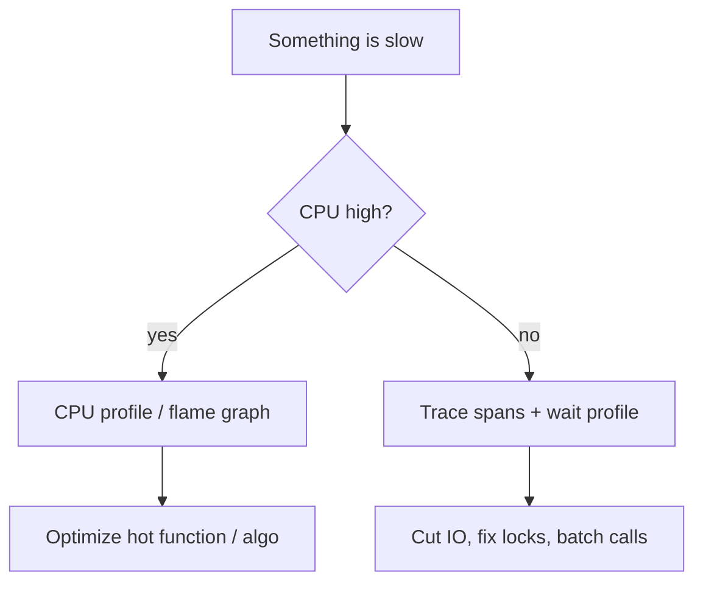

# Profiling & Bottleneck Hunting

[< Back](./latency-and-budgets.md) | [Index](./README.md) | [Next: Load Testing & Capacity >](./load-testing-and-capacity.md)

---

Guessing is not a performance strategy. Before you rewrite hot paths, add caches, or "just use
Go," **measure where time and resources actually go**. Profiling turns arguments into flame
graphs.

## The Golden Rule

> **Make it correct, then make it fast — and only optimize the proven hotspot.**

Premature optimization invents complexity. Missing the real bottleneck wastes weeks. The loop:

1. Reproduce under realistic load (or production-like traffic)
2. Measure (metrics → traces → profiles)
3. Change one thing
4. Re-measure

## What Kind of Slow?

| Symptom | Likely resource | First tools |
|---------|-----------------|-------------|
| High CPU, low latency variance | Compute-bound | CPU profiler, flame graph |
| Low CPU, high latency | Waiting (IO, locks, network) | Traces, off-CPU / wall profiles |
| Growing memory / GC thrash | Allocations, leaks | Heap profile, GC logs |
| Good locally, bad in prod | Data size, N+1, cold cache, noisy neighbors | Prod traces + DB `EXPLAIN` |

## Flame Graphs

A **flame graph** shows stacked samples of where CPU (or wall time) is spent:
- **X axis** — proportion of samples (wider = hotter)
- **Y axis** — call stack depth
- Look for wide plateaus you own (not just "the runtime")

Sampling profilers (pprof, async-profiler, py-spy, Linux `perf`) have low overhead and are safe
enough for production with care. Instrumentation profilers are finer but heavier.

## Distributed Traces Beat Local Guesses

In microservice worlds, the hotspot is often **another service** or **the database**.
- Trace a slow request end-to-end
- Find the critical path (longest sequential chain)
- Check for **N+1** chatty calls, sequential fan-out that should be parallel, and retries amplifying load

One span that says `db.query 180ms` beats three meetings about "maybe Redis."

## Classic Backend Killers

| Killer | What it looks like | Fix direction |
|--------|--------------------|---------------|
| **N+1 queries** | Thousands of tiny DB calls per request | Join, batch, dataloader |
| **Missing index** | Seq scans, DB CPU pegged | `EXPLAIN ANALYZE`, add the right index |
| **Chatty RPCs** | Many sequential downstream calls | Batch APIs, parallelize, cache |
| **Unbounded work** | Loading huge lists into memory | Pagination, streaming, limits |
| **Lock contention** | Low CPU, threads blocked | Finer locks, lock-free structures, shard |
| **GC / allocations** | Latency spikes on intervals | Reduce allocs, tune GC, object pools sparingly |
| **Sync over-chatty logging** | IO wait under load | Async logging, sample, drop debug in prod |
| **Connection pool exhaustion** | Timeouts while CPU idle | Size pools to DB limits; don't multiply pools per pod blindly |

## Cache: The Double-Edged Sword

Caching fixes read-heavy hotspots and creates new ones (invalidation, stampede, stale reads).
Profile **before** caching so you know the miss path cost and the hit-rate you need. A cache
with 20% hit rate and complex invalidation is often a net loss.

## Takeaways

- Classify the bottleneck: **CPU vs wait vs memory** — tools differ for each.
- Use **flame graphs** for CPU; **traces** for distributed wait time.
- Fix **N+1**, missing indexes, and chatty RPCs before heroic rewrites.
- Change one variable at a time and re-measure — otherwise you learn nothing.

---

[< Back](./latency-and-budgets.md) | [Index](./README.md) | [Next: Load Testing & Capacity >](./load-testing-and-capacity.md)
