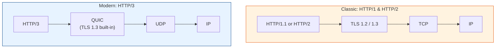

# QUIC & HTTP/3 Tech Docs

How the internet's transport layer evolved, split into focused topics with code examples.

## Contents

| # | Topic | File | Level |
|---|-------|------|-------|
| 0 | The networking stack (big picture) | *(this file)* | L1 · Beginner |
| 1 | TCP vs UDP | [tcp-vs-udp.md](./tcp-vs-udp.md) | L1 · Beginner |
| 2 | TLS (1.2 vs 1.3) | [tls.md](./tls.md) | L2 · Novice |
| 3 | HTTP/1 vs 2 vs 3 | [http-versions.md](./http-versions.md) | L2 · Novice |
| 4 | QUIC & how it powers HTTP/3 | [quic.md](./quic.md) | L3 · Intermediate |

---

## The Networking Stack (Big Picture)

Traditional HTTP/1 & HTTP/2 ride on **TCP + TLS**. HTTP/3 throws out TCP and rides on
**QUIC**, which runs over **UDP**.



> The headline: **HTTP/3 = HTTP-over-QUIC**, and **QUIC = a reliable, secure,
> multiplexed transport built on top of UDP.**

Read the topics in order, starting with [TCP vs UDP](./tcp-vs-udp.md).

---

## Quick check: what does your machine support?

```bash
# Does a site serve HTTP/3? Look for the alt-svc: h3 header
curl -sI https://www.cloudflare.com | grep -i alt-svc

# Force curl to use HTTP/3 (needs a curl built with HTTP/3 support)
curl --http3 -sI https://www.cloudflare.com

# Force HTTP/2
curl --http2 -sI https://www.google.com

# See the negotiated ALPN protocol during the TLS handshake
openssl s_client -connect www.google.com:443 -alpn h2 </dev/null 2>/dev/null | grep ALPN
```
