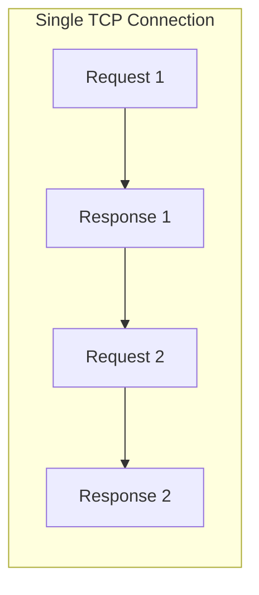
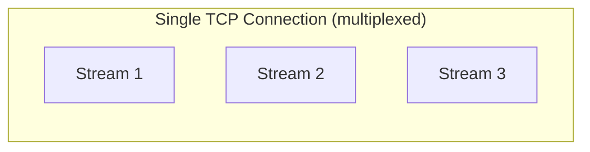
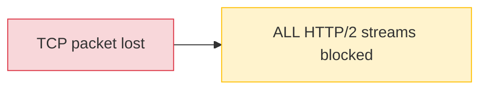
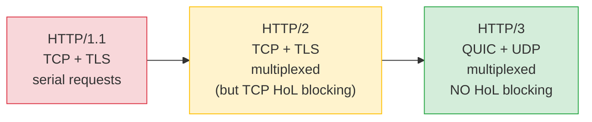

# HTTP Evolution: 1 vs 2 vs 3

[< Back](./tls.md) | [Index](./README.md) | Next: [QUIC >](./quic.md)

---

## HTTP/1.1

The classic (1997). Simple, text-based, but slow for modern pages.

- **One request per connection at a time** - must wait for the response before sending
  the next request on that connection.
- Browsers hacked around this by opening **6+ parallel TCP connections** per domain.
- **Head-of-line blocking at the HTTP layer** - a slow response blocks the pipe.



HTTP/1.1 is plain text, you can literally type it by hand:

```bash
# Talk raw HTTP/1.1 over a plain TCP socket
printf 'GET / HTTP/1.1\r\nHost: example.com\r\nConnection: close\r\n\r\n' \
  | nc example.com 80
```

---

## HTTP/2

HTTP/2 (2015) fixed a lot, mainly via **multiplexing** over a single TCP connection:

- **Multiplexing** - many requests/responses ("streams") interleaved on **one** TCP
  connection concurrently.
- **Binary framing** - efficient binary protocol instead of plain text.
- **Header compression (HPACK)** - cuts repetitive header overhead.
- **Server push** - server can proactively send resources (now largely deprecated).



**BUT** - HTTP/2 still runs on **TCP**, so it inherits **TCP head-of-line blocking**.
If one TCP packet is lost, *all* the multiplexed streams stall waiting for that
retransmission, even though they're logically independent.



---

## HTTP/3

HTTP/3 (standardized 2022, RFC 9114) is the same HTTP semantics, but delivered over
**QUIC** instead of TCP+TLS. This finally eliminates transport-layer HoL blocking.

- **Runs on QUIC (over UDP)** - not TCP.
- **TLS 1.3 encryption built in** - no separate TLS layer.
- **Independent streams** - a lost packet only stalls *its own* stream, not the others.
- **Faster connection setup** and **connection migration**.

---

## The evolution, visualized



| Layer | HTTP/1.1 | HTTP/2 | HTTP/3 |
|-------|----------|--------|--------|
| **Application** | HTTP/1.1 | HTTP/2 | HTTP/3 |
| **Security** | TLS 1.2/1.3 | TLS 1.2/1.3 | TLS 1.3 (in QUIC) |
| **Transport** | TCP | TCP | QUIC |
| **Network base** | IP | IP | UDP -> IP |
| **Multiplexing** | No (parallel conns) | Yes (but TCP HoL) | Yes (no HoL) |
| **Header compression** | None | HPACK | QPACK |

---

## Code Example: use each HTTP version with curl

```bash
# HTTP/1.1
curl --http1.1 -sI https://example.com

# HTTP/2 (check the :status and 'HTTP/2' in output)
curl --http2 -sI https://www.google.com

# HTTP/3 (requires curl built with HTTP/3 support)
curl --http3 -sI https://www.cloudflare.com

# Discover HTTP/3 support: look for 'alt-svc: h3=...'
curl -sI https://www.cloudflare.com | grep -i alt-svc
```

## Code Example: HTTP/2 client in Python with httpx

```python
# uv pip install "httpx[http2]"
import httpx

with httpx.Client(http2=True) as client:
    r = client.get("https://www.google.com")
    print("Negotiated protocol:", r.http_version)  # 'HTTP/2' or 'HTTP/1.1'
    print("Status:", r.status_code)
```

## Code Example: HTTP/3 client in Python with httpx + aioquic

```python
# uv pip install "httpx[http3]"  (pulls in the aioquic backend)
import asyncio, httpx

async def main():
    async with httpx.AsyncClient(http_versions=["HTTP/3"]) as client:
        r = await client.get("https://cloudflare-quic.com/")
        print("Protocol:", r.http_version)   # 'HTTP/3'
        print("Status:", r.status_code)

asyncio.run(main())
```

> Tip: HTTP/3 support in Python tooling moves fast. If `httpx[http3]` isn't available in
> your environment, `aioquic` provides a reference HTTP/3 client/server directly.

---

[< Back](./tls.md) | [Index](./README.md) | Next: [QUIC >](./quic.md)
