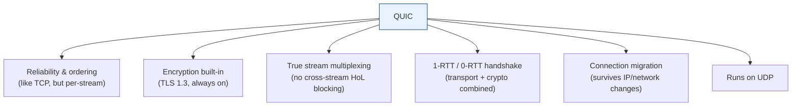
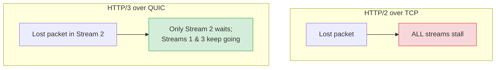
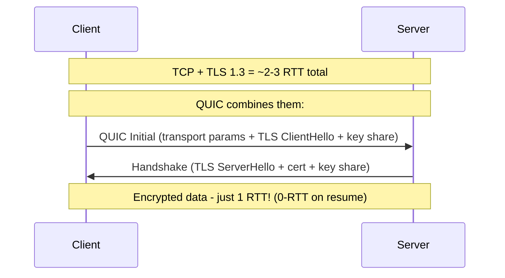
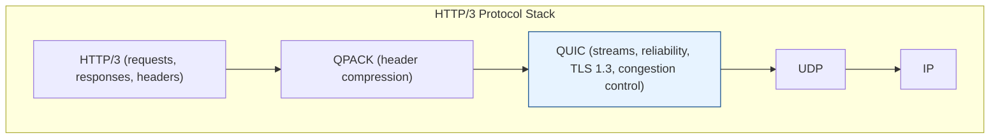
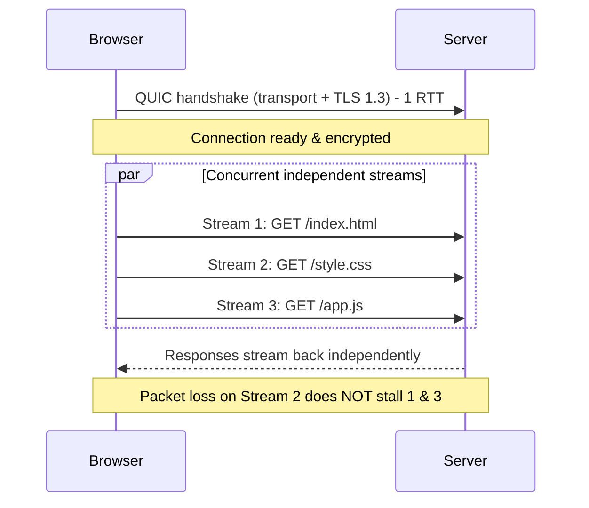

# QUIC & How It Powers HTTP/3

[< Back](./http-versions.md) | [Index](./README.md)

---

**QUIC** (originally "Quick UDP Internet Connections", now just a name) is a modern
transport protocol developed by Google and standardized by the IETF (RFC 9000). It gives
you **TCP's reliability + TLS's security + better performance**, all built on top of
**UDP**.



## Why build on UDP instead of TCP?

TCP is baked into operating-system kernels and middleboxes (routers, firewalls), it's
extremely hard to change. UDP is a thin, flexible base, so QUIC can implement all its
smarts **in user space** (in the app/browser), enabling rapid evolution.

---

## QUIC's superpowers

### 1. No head-of-line blocking (the big one)

QUIC has **independent streams**. Each stream manages its own delivery, so a lost packet
only blocks the stream it belongs to, the others keep flowing.



### 2. Faster handshake (crypto + transport merged)

TCP+TLS does the TCP handshake *then* the TLS handshake, separate round trips. QUIC
**combines the transport and cryptographic handshake into one**, so a fresh connection
is ~1 RTT, and a resumed one can be **0-RTT**.



### 3. Connection migration

A TCP connection is identified by the 4-tuple (source IP, source port, dest IP, dest
port). Change your network (Wi-Fi to cellular) and the IP changes, so the TCP connection
**breaks**. QUIC identifies connections by a **Connection ID**, independent of IP. So you
can walk out of your house and your download keeps going seamlessly.


### 4. Always encrypted

Encryption isn't optional in QUIC, TLS 1.3 is baked in. Even most of the transport
headers are encrypted/authenticated, making it harder for middleboxes to interfere.

---

## How QUIC Powers HTTP/3

HTTP/3 is essentially **HTTP semantics mapped onto QUIC streams**.



### The mapping
- Each **HTTP/3 request/response pair** rides on its own **QUIC stream**.
- Because QUIC streams are **independent**, HTTP/3 gets true concurrency with **no
  cross-request HoL blocking**, the thing HTTP/2 couldn't fully solve on TCP.
- **QPACK** replaces HTTP/2's HPACK for header compression, redesigned to work safely
  with QUIC's out-of-order delivery.
- **TLS 1.3** security comes for free because it's part of QUIC itself.
- QUIC's **1-RTT/0-RTT** setup + **connection migration** make HTTP/3 especially great
  on mobile and lossy networks.

### Putting it all together: loading a page over HTTP/3



---

## Code Example: a minimal HTTP/3 client with aioquic

`aioquic` is the reference Python implementation of QUIC + HTTP/3.

```bash
uv pip install aioquic
```

```python
import asyncio
from aioquic.asyncio.client import connect
from aioquic.h3.connection import H3_ALPN, H3Connection
from aioquic.h3.events import HeadersReceived, DataReceived
from aioquic.quic.configuration import QuicConfiguration

async def fetch(host: str, path: str = "/"):
    config = QuicConfiguration(is_client=True, alpn_protocols=H3_ALPN)

    async with connect(host, 443, configuration=config) as client:
        h3 = H3Connection(client._quic)
        stream_id = client._quic.get_next_available_stream_id()

        # Send an HTTP/3 request on its own QUIC stream
        h3.send_headers(
            stream_id,
            [
                (b":method", b"GET"),
                (b":scheme", b"https"),
                (b":authority", host.encode()),
                (b":path", path.encode()),
            ],
            end_stream=True,
        )
        client.transmit()

        # Read back HTTP/3 events (headers, then data)
        body = b""
        while True:
            event = await client._events.get() if hasattr(client, "_events") else None
            for h3_event in h3.handle_event(event) if event else []:
                if isinstance(h3_event, HeadersReceived):
                    print("Headers:", h3_event.headers)
                elif isinstance(h3_event, DataReceived):
                    body += h3_event.data
                    if h3_event.stream_ended:
                        return body

asyncio.run(fetch("cloudflare-quic.com"))
```

> Note: aioquic's low-level API evolves; the shipped `examples/http3_client.py` in the
> aioquic repo is the most reliable, copy-paste-ready HTTP/3 client. The snippet above
> shows the core idea: open a QUIC stream, send HTTP/3 headers, read HTTP/3 events.

## Code Example: run an HTTP/3 server with aioquic

```bash
# Clone the aioquic examples and run the demo HTTP/3 server
git clone https://github.com/aiortc/aioquic
cd aioquic
uv pip install -e ".[dev]"

# Generate a self-signed cert (or use tests/ssl_cert.pem provided in the repo)
python examples/http3_server.py \
    --certificate tests/ssl_cert.pem \
    --private-key tests/ssl_key.pem \
    --host 0.0.0.0 --port 4433
```

Then hit it with an HTTP/3-capable curl:
```bash
curl --http3 -k https://localhost:4433/
```

---

## Summary: Why QUIC/HTTP/3 wins

1. **No head-of-line blocking** - independent streams.
2. **Faster connections** - combined 1-RTT (or 0-RTT) handshake.
3. **Connection migration** - survives network switches.
4. **Always encrypted** - TLS 1.3 baked in.
5. **Evolvable** - lives in user space, not the OS kernel.

| Concept | One-liner |
|---------|-----------|
| **TCP** | Reliable, ordered, connection-based - but slow to set up & suffers HoL blocking. |
| **UDP** | Fast, connectionless, no guarantees - the flexible base for QUIC. |
| **TLS 1.2** | Secure but 2-RTT handshake and some legacy weak ciphers. |
| **TLS 1.3** | Faster (1-RTT / 0-RTT), forward secrecy mandatory, cleaned-up ciphers. |
| **HTTP/1.1** | One request at a time per connection; app-level HoL blocking. |
| **HTTP/2** | Multiplexed streams over TCP - but TCP HoL blocking remains. |
| **HTTP/3** | HTTP over QUIC - true multiplexing, no HoL blocking, built-in TLS 1.3. |
| **QUIC** | UDP-based transport = TCP reliability + TLS security + speed + migration. |

---

[< Back](./http-versions.md) | [Index](./README.md)
