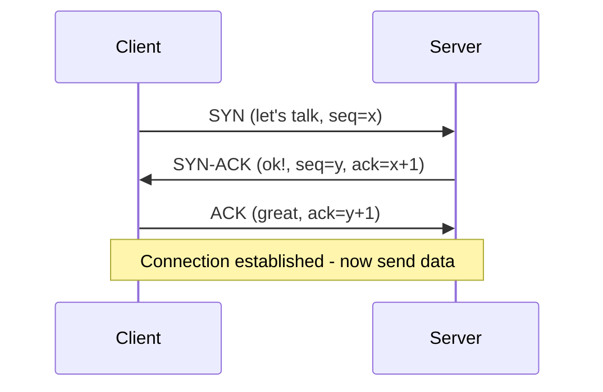
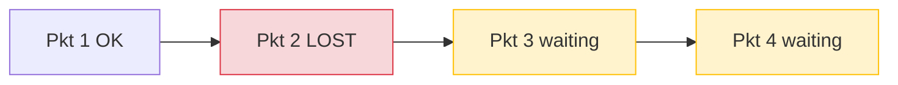
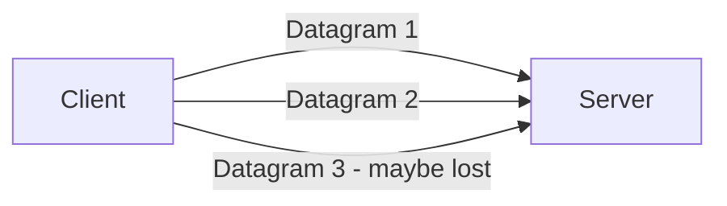

# TCP vs UDP

[Index](./README.md) | Next: [TLS >](./tls.md)

---

## TCP - Transmission Control Protocol

**TCP** is the reliable, connection-oriented workhorse of the internet. When you need
every byte to arrive, in order, without corruption, TCP is your friend.

### Key features
- **Connection-oriented** - establishes a session before sending data.
- **Reliable** - retransmits lost packets.
- **Ordered** - data arrives in the exact order it was sent.
- **Flow & congestion control** - won't overwhelm the receiver or the network.

### The 3-way handshake

Before *any* data flows, TCP does a handshake to synchronize both sides:



That's **1 full round trip (RTT)** of latency *before* you send a single byte of real
data. Add TLS on top and it gets worse.

### Head-of-Line (HoL) blocking

TCP delivers a single ordered byte-stream. If **one packet is lost**, *everything*
behind it must wait for the retransmission, even unrelated data.



---

## UDP - User Datagram Protocol

**UDP** is the fast, no-frills, connectionless alternative. It just fires packets
("datagrams") off and hopes for the best.

### Key features
- **Connectionless** - no handshake, just send.
- **Unreliable** - no retransmission; lost packets stay lost.
- **Unordered** - packets may arrive out of order.
- **Lightweight & fast** - tiny header (8 bytes), minimal overhead.



Where UDP shines: live video/voice calls, gaming, DNS lookups, streaming, where
**speed beats perfection** and a dropped packet is better than a delayed one.

> Plot twist: QUIC is built *on top of* UDP and adds back reliability, ordering, and
> security, but in a smarter, more flexible way than TCP.

---

## TCP vs UDP

| Feature | TCP | UDP |
|---------|-----|-----|
| **Connection** | Yes (handshake) | No |
| **Reliability** | Guaranteed delivery | Best-effort |
| **Ordering** | Ordered | Unordered |
| **Speed** | Slower | Faster |
| **Header size** | 20-60 bytes | 8 bytes |
| **Congestion control** | Built-in | None (app's job) |
| **Use cases** | Web, email, file transfer | Streaming, gaming, DNS, VoIP |

---

## Code Example: TCP echo server & client (Python)

```python
# tcp_server.py
import socket

with socket.socket(socket.AF_INET, socket.SOCK_STREAM) as s:
    s.setsockopt(socket.SOL_SOCKET, socket.SO_REUSEADDR, 1)
    s.bind(("127.0.0.1", 9000))
    s.listen()
    print("TCP server listening on 9000...")
    conn, addr = s.accept()          # blocks until a client connects (handshake)
    with conn:
        print("Connected by", addr)
        while data := conn.recv(1024):  # reliable, ordered stream
            conn.sendall(data)           # echo back
```

```python
# tcp_client.py
import socket

with socket.socket(socket.AF_INET, socket.SOCK_STREAM) as s:
    s.connect(("127.0.0.1", 9000))   # performs the 3-way handshake
    s.sendall(b"hello over TCP")
    print("Received:", s.recv(1024).decode())
```

## Code Example: UDP echo server & client (Python)

```python
# udp_server.py
import socket

with socket.socket(socket.AF_INET, socket.SOCK_DGRAM) as s:  # DGRAM = UDP
    s.bind(("127.0.0.1", 9001))
    print("UDP server listening on 9001...")
    while True:
        data, addr = s.recvfrom(1024)  # no connection, just receive datagrams
        print("From", addr, ":", data.decode())
        s.sendto(data, addr)           # echo back (may or may not arrive!)
```

```python
# udp_client.py
import socket

with socket.socket(socket.AF_INET, socket.SOCK_DGRAM) as s:
    s.sendto(b"hello over UDP", ("127.0.0.1", 9001))  # no handshake, fire away
    s.settimeout(2.0)
    try:
        data, _ = s.recvfrom(1024)
        print("Received:", data.decode())
    except socket.timeout:
        print("No reply - UDP gives no delivery guarantee!")
```

Notice the difference: TCP uses `SOCK_STREAM` + `connect`/`accept` (a real
connection), while UDP uses `SOCK_DGRAM` + `sendto`/`recvfrom` (fire-and-forget).

---

[Index](./README.md) | Next: [TLS >](./tls.md)
