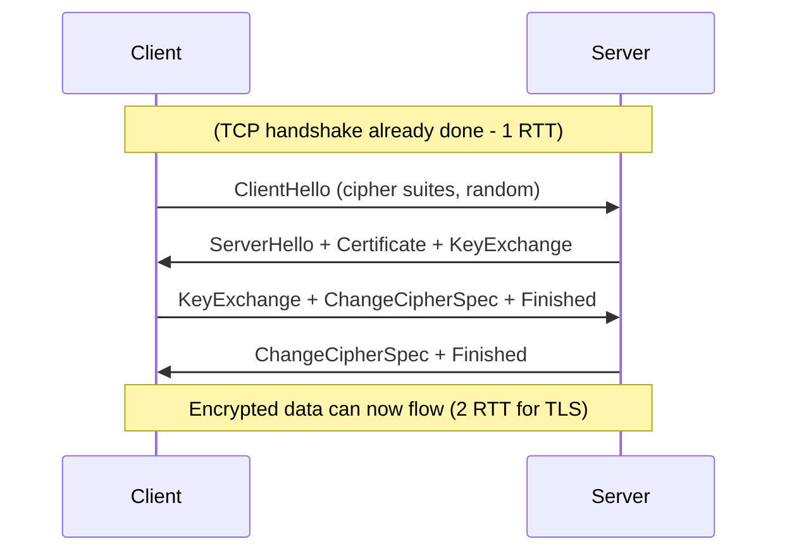
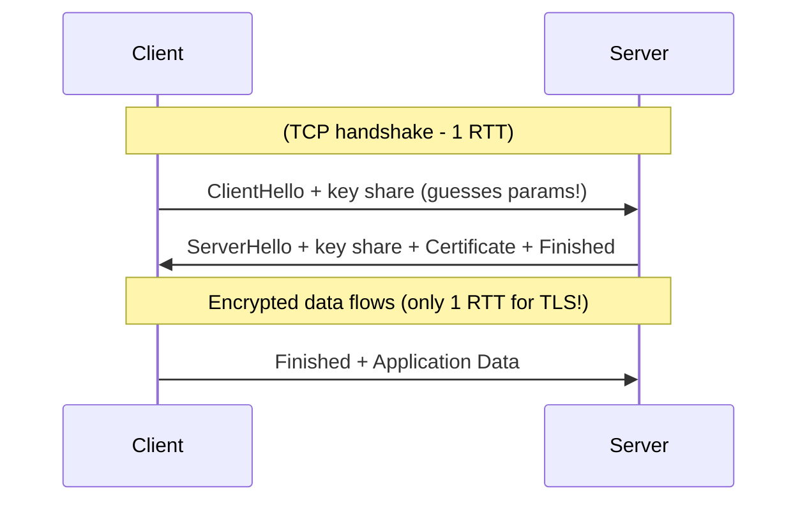

# TLS - Transport Layer Security

[< Back](./tcp-vs-udp.md) | [Index](./README.md) | Next: [HTTP versions >](./http-versions.md)

---

**TLS** is the encryption layer that turns plain HTTP into secure **HTTPS**. It provides:

- **Confidentiality** - encrypts data so eavesdroppers see gibberish.
- **Integrity** - detects tampering.
- **Authentication** - verifies the server (via certificates) is who it claims to be.

TLS sits *between* the application (HTTP) and transport (TCP). It uses **hybrid
encryption**: asymmetric crypto to exchange keys, then fast symmetric crypto for data.

---

## TLS 1.2

TLS 1.2 (2008) secured the web for over a decade, but its handshake is chatty, it needs
**2 round trips** before encrypted data can flow.



**Total cost:** ~1 RTT (TCP) + ~2 RTT (TLS) = **3 RTT before first byte of data.**

---

## TLS 1.3

TLS 1.3 (2018) is a major cleanup and speed-up:

- **Faster handshake** - just **1 RTT** (and **0-RTT** for resumed connections!).
- **Removed old, insecure ciphers** (RC4, SHA-1, static RSA, etc.).
- **Forward secrecy is mandatory** (ephemeral keys - ECDHE only).
- **Encrypts more of the handshake** itself.



The trick: the client **guesses** the key-exchange parameters and sends its key share
immediately, collapsing two trips into one.

**0-RTT resumption:** for a returning client, TLS 1.3 can send encrypted data in the
*very first* packet using a pre-shared key, **zero** handshake round trips. (Caveat:
0-RTT data has replay-attack risks, so it's used carefully.)

---

## TLS 1.2 vs 1.3

| Feature | TLS 1.2 | TLS 1.3 |
|---------|---------|---------|
| **Handshake RTT** | 2 RTT | 1 RTT (0-RTT on resume) |
| **Forward secrecy** | Optional | Mandatory |
| **Cipher suites** | Many (some weak) | 5 strong AEAD ones only |
| **Legacy/weak crypto** | Allowed | Removed |
| **Handshake encryption** | Partial | Most of it encrypted |
| **Released** | 2008 | 2018 |

---

## Code Example: inspect a TLS connection (Python)

```python
import socket, ssl

hostname = "www.google.com"
ctx = ssl.create_default_context()

with socket.create_connection((hostname, 443)) as sock:
    with ctx.wrap_socket(sock, server_hostname=hostname) as ssock:
        print("TLS version negotiated:", ssock.version())      # e.g. TLSv1.3
        print("Cipher suite:", ssock.cipher())                 # (name, version, bits)
        cert = ssock.getpeercert()
        print("Server cert subject:", dict(x[0] for x in cert["subject"]))
        print("Issued by:", dict(x[0] for x in cert["issuer"]))
        print("Valid until:", cert["notAfter"])
```

## Code Example: a minimal TLS echo server (self-signed)

```python
# First, generate a self-signed cert:
#   openssl req -x509 -newkey rsa:2048 -keyout key.pem -out cert.pem \
#       -days 365 -nodes -subj "/CN=localhost"

import socket, ssl

ctx = ssl.SSLContext(ssl.PROTOCOL_TLS_SERVER)
ctx.load_cert_chain(certfile="cert.pem", keyfile="key.pem")
ctx.minimum_version = ssl.TLSVersion.TLSv1_2   # enforce >= TLS 1.2

with socket.socket(socket.AF_INET, socket.SOCK_STREAM) as sock:
    sock.setsockopt(socket.SOL_SOCKET, socket.SO_REUSEADDR, 1)
    sock.bind(("127.0.0.1", 8443))
    sock.listen()
    print("TLS server on 8443...")
    with ctx.wrap_socket(sock, server_side=True) as ssock:
        conn, addr = ssock.accept()
        print("TLS handshake done with", addr, "using", conn.version())
        conn.sendall(b"hello over TLS")
        conn.close()
```

## Command-line: explore the handshake with OpenSSL

```bash
# Full handshake details, cert chain, negotiated version & cipher
openssl s_client -connect www.google.com:443 -tls1_3 </dev/null

# Check which TLS versions a server supports
openssl s_client -connect example.com:443 -tls1_2 </dev/null 2>&1 | grep "Protocol"
```

---

[< Back](./tcp-vs-udp.md) | [Index](./README.md) | Next: [HTTP versions >](./http-versions.md)
