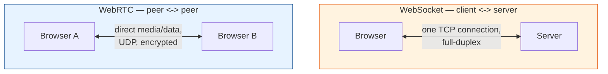

# Real-Time Web Tech Docs

How the web does **real-time, bidirectional communication** — from server push to
peer-to-peer video — split into focused topics with code examples.

## Contents

| # | Topic | File |
|---|-------|------|
| 0 | Intro & the big picture | *(this file)* |
| 1 | WebSocket | [websocket.md](./websocket.md) |
| 2 | WebRTC | [webrtc.md](./webrtc.md) |
| 3 | WebSocket vs WebRTC | [websocket-vs-webrtc.md](./websocket-vs-webrtc.md) |
| 4 | STUN, TURN & ICE (NAT traversal) | [stun-turn-ice.md](./stun-turn-ice.md) |

---

## The Big Picture

Plain HTTP is **request/response**: the client asks, the server answers, done. That's
terrible for chat, notifications, multiplayer games, or video calls where the server (or
another user) needs to push data *whenever it wants*.

Two technologies fix this in different ways:

- **WebSocket** — one persistent, full-duplex connection **between a client and a server**.
  Great for chat, live feeds, dashboards, collaborative editing.
- **WebRTC** — encrypted, low-latency, usually **peer-to-peer** media & data channels
  between browsers. Great for video/voice calls, screen share, P2P file transfer.

They're often used *together*: WebRTC needs a **signaling channel** to set up the call,
and that channel is very frequently a WebSocket.

Read in order, starting with [websocket.md](./websocket.md).
