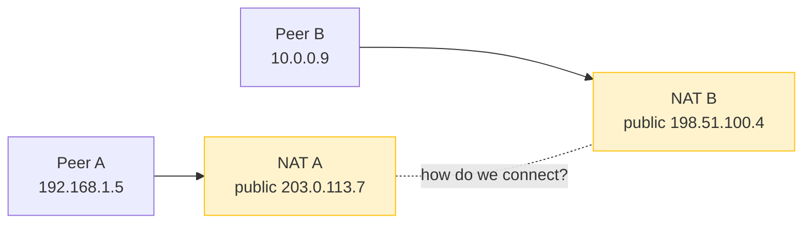
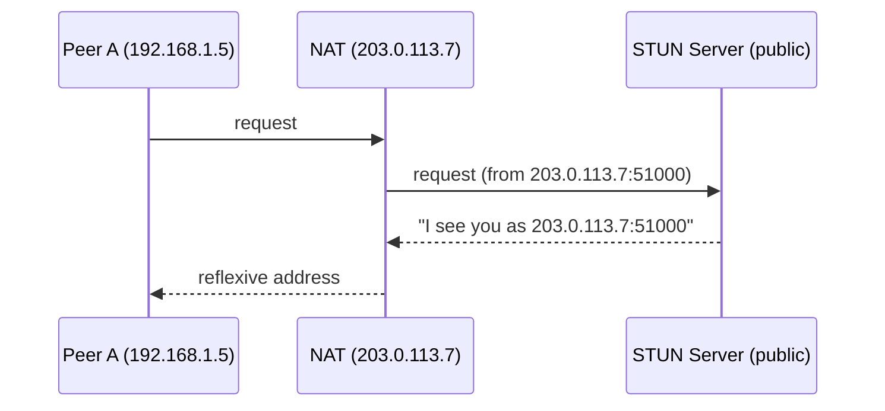
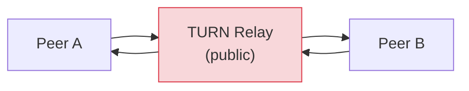
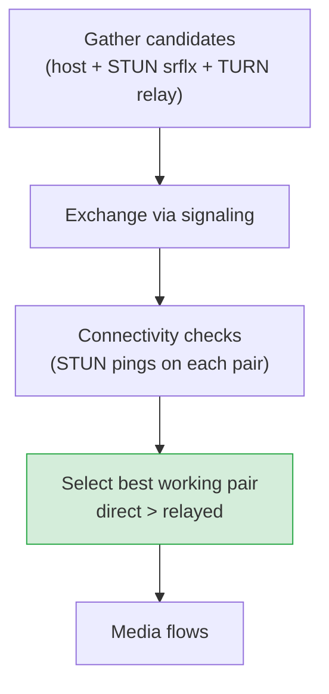
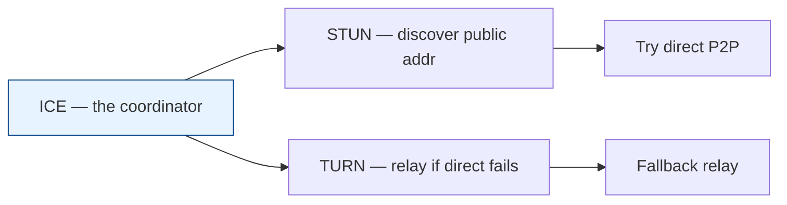

# STUN, TURN & ICE — NAT Traversal

[< Back](./websocket-vs-webrtc.md) | [Index](./README.md)

---

## The problem: NAT hides you

Your laptop has a **private IP** (`192.168.x.x`) that's meaningless on the public internet.
Your router uses **NAT (Network Address Translation)** to share one public IP among all
your devices. That's fine for *you dialing out*, but it means **nobody on the internet can
directly reach you** — there's no public address+port that maps to your app until you
create one.

For client↔server (WebSocket, HTTP) this is a non-issue: the server has a public IP, you
dial it. But for **peer-to-peer** (WebRTC), *both* peers are hidden behind NAT. Solving
"how do these two find a working path to each other" is **NAT traversal**, and it's what
STUN, TURN, and ICE do.



---

## STUN — "What's my public address?"

**STUN (Session Traversal Utilities for NAT)** is a tiny, cheap service. A peer asks a
public STUN server *"what public IP and port do you see me coming from?"* The server
replies with the peer's **reflexive address** — the public `IP:port` the NAT assigned.

Now each peer knows its own public-facing address and can share it (via signaling). Often
that's enough to punch a hole through both NATs and connect **directly**.



- **Lightweight** — STUN just answers a question; it does **not** relay your media.
- **Free/cheap to run** (e.g., `stun:stun.l.google.com:19302`).
- **Fails against symmetric NATs / strict firewalls** where the mapping differs per
  destination — then you need TURN.

---

## TURN — "Relay it for me"

**TURN (Traversal Using Relays around NAT)** is the fallback when a direct path is
impossible (symmetric NAT, restrictive corporate firewall). The TURN server acts as a
**public relay**: both peers send their media *to* the TURN server, which forwards it on.



- **Always works** (both peers can reach a public server), so it's the guaranteed fallback.
- **Expensive** — all media flows through *your* server, consuming bandwidth and CPU. This
  is no longer peer-to-peer.
- Requires **credentials** (username/password, usually short-lived) to prevent abuse.
- Rule of thumb: ~**10-20%** of real-world calls end up needing TURN.

> STUN = "tell me my address so I can connect directly (cheap)."
> TURN = "just relay everything through you (works always, costs more)."

---

## ICE — the strategy that tries everything

**ICE (Interactive Connectivity Establishment)** is the **framework that orchestrates**
STUN and TURN to find the *best working path*. It doesn't replace them — it uses them.

ICE gathers **candidates** (possible addresses) of three kinds:

| Candidate type | Source | Meaning | Preference |
|----------------|--------|---------|------------|
| **host** | local NIC | your private LAN address | highest (best if peers are on same network) |
| **srflx** (server-reflexive) | STUN | your public NAT address | medium (direct across internet) |
| **relay** | TURN | address on the relay server | lowest (works, but relayed) |

ICE exchanges all candidates via signaling, then runs **connectivity checks** (STUN
ping/pong) on every pair, and picks the **best pair that actually works** — preferring
direct (host/srflx) and only falling back to relay when nothing else connects.



## How they fit together



- **STUN** answers *"what's my public address?"*
- **TURN** provides *"a relay when we can't connect directly."*
- **ICE** is the *"try all candidates, pick the best working one"* algorithm that uses both.

## Configuring them in WebRTC

```javascript
const pc = new RTCPeerConnection({
  iceServers: [
    // STUN: cheap, enables direct connections
    { urls: "stun:stun.l.google.com:19302" },
    // TURN: fallback relay (needs auth), used only when direct fails
    { urls: "turn:turn.example.com:3478", username: "user", credential: "pass" },
  ],
  iceTransportPolicy: "all",   // "relay" forces TURN-only (useful for testing)
});
```

The browser's ICE agent then does all the candidate gathering, exchange (via your
signaling), checking, and selection **automatically** — you just supply the servers.

> **Takeaway:** always configure **both** a STUN and a TURN server. STUN gets you cheap
> direct connections for most users; TURN guarantees the call still connects for the
> ~15% stuck behind hostile NATs/firewalls.

---

[< Back](./websocket-vs-webrtc.md) | [Index](./README.md)
