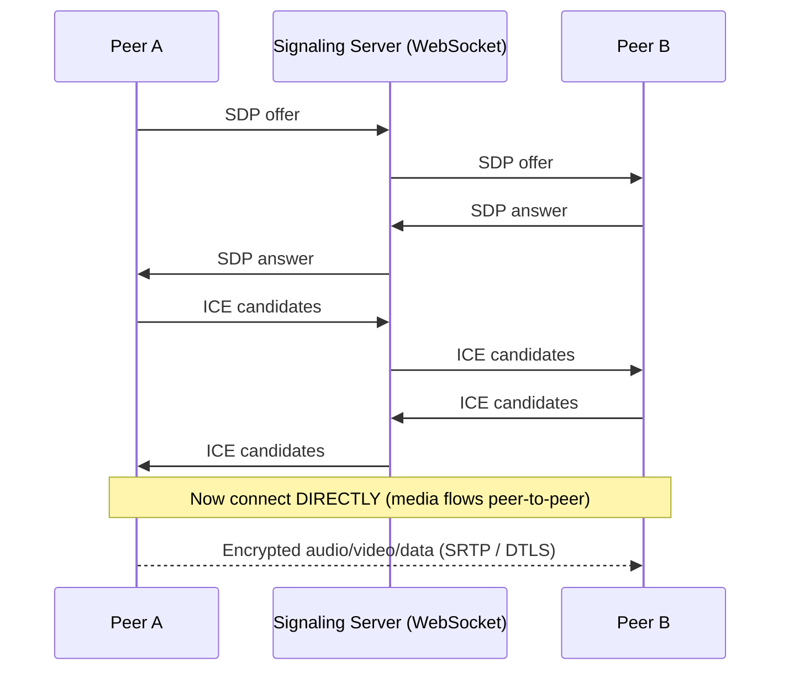
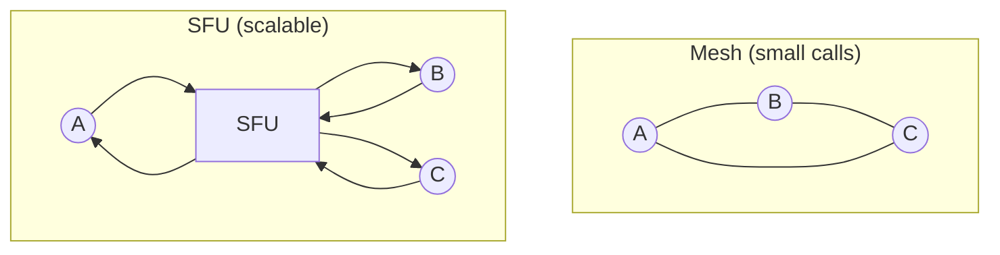

# WebRTC

[< Back](./websocket.md) | [Index](./README.md) | Next: [WebSocket vs WebRTC >](./websocket-vs-webrtc.md)

---

## What is WebRTC?

**WebRTC** (Web Real-Time Communication) lets browsers (and native apps) exchange
**audio, video, and arbitrary data directly with each other** — usually **peer-to-peer**,
with very low latency, and **always encrypted**. It's the tech behind Google Meet, Discord
voice, and most in-browser video calling.

Three main APIs:

| API | Purpose |
|-----|---------|
| `getUserMedia()` | Capture camera / microphone / screen |
| `RTCPeerConnection` | The P2P connection carrying media (SRTP) |
| `RTCDataChannel` | Arbitrary app data P2P (like WebSocket, but peer-to-peer over SCTP/DTLS) |

## The catch: peers can't just "connect"

Two browsers behind home routers have **private IPs** hidden behind **NAT**, and no public
address to dial. So WebRTC needs a two-step dance:

1. **Signaling** — exchange session details (media formats, encryption keys, candidate
   addresses). WebRTC does **not** define this — *you* provide a channel, typically a
   **WebSocket** server. It just relays messages between the two peers.
2. **NAT traversal** — discover a network path that actually works, using
   **STUN / TURN / ICE** (see [stun-turn-ice.md](./stun-turn-ice.md)).



- **SDP (Session Description Protocol)** — a text blob describing codecs, resolutions,
  encryption params. Offer/answer negotiates a common set.
- After signaling, **media flows directly** between peers (or via a TURN relay if direct
  fails). The signaling server is only needed for setup.

## Code Example: minimal offer/answer (browser)

```javascript
// ----- Peer A (caller) -----
const pc = new RTCPeerConnection({
  iceServers: [
    { urls: "stun:stun.l.google.com:19302" },
    { urls: "turn:turn.example.com:3478", username: "u", credential: "p" },
  ],
});

// send local ICE candidates to the other peer via your signaling channel
pc.onicecandidate = (e) => e.candidate && signaling.send({ ice: e.candidate });

// add camera/mic
const stream = await navigator.mediaDevices.getUserMedia({ video: true, audio: true });
stream.getTracks().forEach((t) => pc.addTrack(t, stream));

// render remote media when it arrives
pc.ontrack = (e) => (remoteVideo.srcObject = e.streams[0]);

// create & send the offer
const offer = await pc.createOffer();
await pc.setLocalDescription(offer);
signaling.send({ sdp: offer });

// ----- Peer B (callee) receives the offer -----
await pc.setRemoteDescription(offer);
const answer = await pc.createAnswer();
await pc.setLocalDescription(answer);
signaling.send({ sdp: answer });   // A applies this via setRemoteDescription
```

## DataChannel: P2P messaging (no server in the middle)

```javascript
const dc = pc.createDataChannel("chat");
dc.onopen    = () => dc.send("hello peer!");
dc.onmessage = (e) => console.log("peer says:", e.data);
```

`RTCDataChannel` feels like WebSocket but the bytes go **directly between browsers**, and
you can choose **unreliable/unordered** mode (like UDP) for games, or reliable/ordered
(like TCP) for file transfer.

## When direct fails: SFU/MFU for group calls

Pure mesh P2P doesn't scale past a few peers (N-to-N connections explode). For group
calls, peers connect to a **media server**:

- **SFU (Selective Forwarding Unit)** — each peer sends *one* stream up; the SFU forwards
  it to everyone. Efficient, most common (LiveKit, Janus, mediasoup).
- **MCU (Multipoint Control Unit)** — server mixes all streams into one. Heavy CPU, but
  clients only receive one stream.



---

[< Back](./websocket.md) | [Index](./README.md) | Next: [WebSocket vs WebRTC >](./websocket-vs-webrtc.md)
