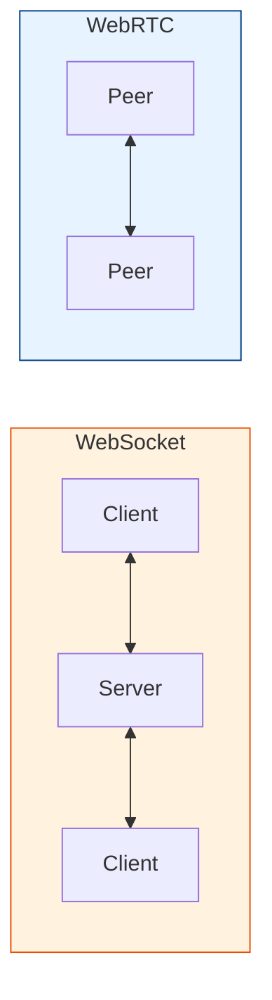
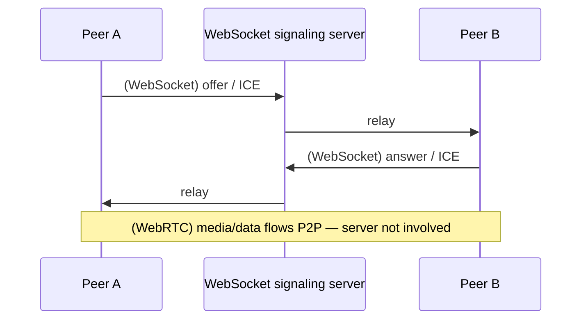

# WebSocket vs WebRTC

[< Back](./webrtc.md) | [Index](./README.md) | Next: [STUN, TURN & ICE >](./stun-turn-ice.md)

---

Both give you real-time communication, but they solve **different problems**. The single
biggest difference: **WebSocket is client-to-server; WebRTC is (usually) peer-to-peer.**

In WebSocket, two clients talk *through* the server (the server sees everything). In
WebRTC, once set up, the two peers talk **directly** (the server is out of the data path).

## Side-by-side

| Dimension | WebSocket | WebRTC |
|-----------|-----------|--------|
| **Topology** | Client ↔ Server | Peer ↔ Peer (or via SFU) |
| **Transport** | TCP | UDP (primarily), falls back to TCP/TLS |
| **Latency** | Low | Ultra-low (UDP, no HoL blocking) |
| **Reliability** | Always reliable/ordered (TCP) | Configurable: reliable *or* unreliable/unordered |
| **Media (audio/video)** | Not built-in (you'd ship raw bytes) | First-class (codecs, echo cancel, jitter buffer) |
| **Encryption** | Optional (`wss://` = TLS) | **Mandatory** (DTLS/SRTP) |
| **NAT traversal** | Not needed (server has public IP) | Needs STUN/TURN/ICE |
| **Signaling** | Is the connection itself | Needs a *separate* signaling channel (often a WebSocket!) |
| **Server load** | High (all traffic flows through it) | Low (media is P2P; TURN only if relayed) |
| **Setup complexity** | Simple | Complex (SDP, ICE, TURN infra) |
| **Browser API** | `WebSocket` | `RTCPeerConnection`, `getUserMedia`, `RTCDataChannel` |

## Which do I use?

**Reach for WebSocket when:**
- Chat, notifications, live dashboards, tickers, presence.
- Collaborative editing (Google-Docs-style), multiplayer where the server is authoritative.
- You need the server to see/store all messages.
- You want simple infra and reliable ordered delivery.

**Reach for WebRTC when:**
- Audio/video calls, screen sharing.
- Ultra-low-latency P2P data (cloud gaming input, fast-paced multiplayer).
- Large P2P file transfer without routing bytes through your server.
- You want to *offload bandwidth* from your servers (media goes peer-to-peer).

**Use both together (the common pattern):**
WebRTC needs a signaling channel to exchange SDP offers/answers and ICE candidates — that
channel is almost always a **WebSocket**. So a video app uses WebSocket for setup +
control, and WebRTC for the actual media.

## Example contrast in one line

- **WebSocket:** "Every message goes to my server, which decides what to do and who to
  broadcast to." — great for a chat room's message history.
- **WebRTC:** "Set up the call through my server, then get out of the way so the two
  browsers stream video straight to each other." — great for the actual video.

---

[< Back](./webrtc.md) | [Index](./README.md) | Next: [STUN, TURN & ICE >](./stun-turn-ice.md)
