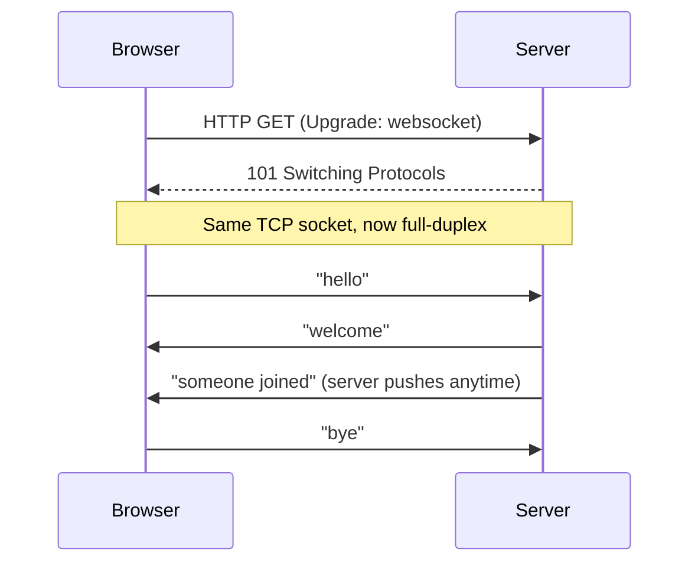
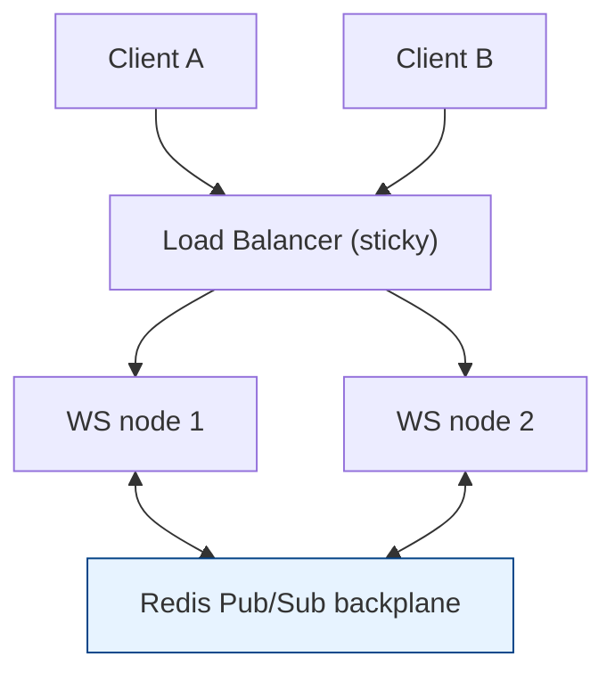

# WebSocket

[Index](./README.md) | Next: [WebRTC >](./webrtc.md)

---

## What is WebSocket?

**WebSocket** gives you a **single, long-lived, full-duplex** connection between a client
and a server over TCP. Once established, *either side* can send messages at any time with
almost no overhead — no polling, no repeated HTTP headers.



## The upgrade handshake

WebSocket **starts life as an HTTP request** and then "upgrades" the same TCP connection:

```
GET /chat HTTP/1.1
Host: example.com
Upgrade: websocket
Connection: Upgrade
Sec-WebSocket-Key: dGhlIHNhbXBsZSBub25jZQ==
Sec-WebSocket-Version: 13
```

Server replies `101 Switching Protocols` and from then on the bytes are **WebSocket
frames**, not HTTP. The URL scheme is `ws://` (plaintext) or `wss://` (over TLS — always
use this in production).

## Why not just poll HTTP?

| Approach | How | Downside |
|----------|-----|----------|
| **Polling** | Client asks every N seconds | Wasteful, laggy |
| **Long-polling** | Server holds request open until data | Header overhead, complexity |
| **SSE (Server-Sent Events)** | One-way server → client stream | No client → server push |
| **WebSocket** | One full-duplex socket | Slightly more infra (stateful conns) |

## Code Example: chat server & client

```python
# server.py  — pip install websockets
import asyncio, websockets

clients = set()

async def handler(ws):
    clients.add(ws)
    try:
        async for message in ws:          # receive
            # broadcast to everyone (server push)
            for c in clients:
                await c.send(message)
    finally:
        clients.remove(ws)

async def main():
    async with websockets.serve(handler, "localhost", 8765):
        print("ws://localhost:8765")
        await asyncio.Future()            # run forever

asyncio.run(main())
```

```javascript
// client.js (browser)
const ws = new WebSocket("wss://localhost:8765");
ws.onopen    = () => ws.send("hello");
ws.onmessage = (e) => console.log("recv:", e.data);   // server can push anytime
ws.onclose   = () => console.log("closed");
```

## Operating WebSockets in production

- **Use `wss://`** (TLS). Plaintext `ws://` leaks everything.
- **Heartbeats** — send periodic ping/pong frames to detect dead connections and keep
  NAT/proxy timeouts from silently killing idle sockets.
- **Backpressure** — a slow client can pile up unsent messages; drop or buffer with limits.
- **Auth** — you can't set custom headers from the browser `WebSocket` API, so authenticate
  during the initial HTTP upgrade (cookie/session) or pass a short-lived token in the URL /
  first message.
- **Scaling is stateful** — connections are pinned to one server. To broadcast across a
  cluster, use a **pub/sub backplane** (Redis, NATS, Kafka) so a message on node A reaches
  clients on node B. Load-balance with sticky sessions or a connection-aware L4 LB.
- **Proxies** must support the `Upgrade` header (nginx: `proxy_set_header Upgrade $http_upgrade;`).



> Use WebSocket when a **client and server** need continuous two-way messaging. For
> **browser-to-browser** media/low-latency data, reach for WebRTC instead.

---

[Index](./README.md) | Next: [WebRTC >](./webrtc.md)
