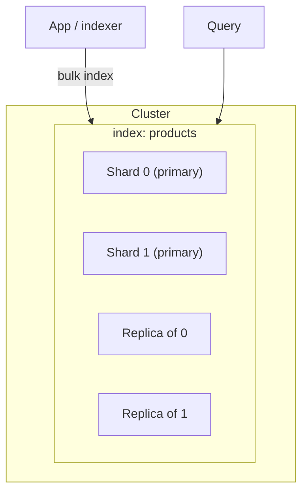

# Search Engines in Practice

[< Back](./search-fundamentals.md) | [Index](./README.md) | [Next: Ranking, Relevance & Autocomplete >](./ranking-and-autocomplete.md)

---

Theory is the inverted index. Practice is Elasticsearch, OpenSearch, Solr, or Typesense sitting
next to your primary database — accepting documents, building shards, and answering queries in
tens of milliseconds. This chapter is how that box actually works in production.

## The Usual Suspects

| Engine | Vibe |
|--------|------|
| **Elasticsearch / OpenSearch** | Industry default. Lucene under the hood. Powerful, ops-heavy. |
| **Solr** | Also Lucene. Strong in enterprise/CMS worlds. |
| **Typesense / Meilisearch** | Developer-friendly, great UX defaults, lighter ops. |
| **Postgres FTS / ParadeDB** | Keep search in the DB when "good enough" beats another system. |

Most backend interviews and large systems still mean **Elasticsearch-shaped** thinking: indexes,
shards, mappings, and query DSL.

## Documents, Indexes, Shards



- **Document** — a JSON object you index (a product, a ticket, an email).
- **Index** — a collection of documents with a shared mapping (schema-ish).
- **Shard** — a horizontal partition of an index. Queries fan out to shards and merge.
- **Replica** — a copy of a shard for HA and read throughput.

> Shard count is hard to change later. Start with a reasoned count (often based on expected
> size — aim for shards in the ~10–50GB range), don't cargo-cult `number_of_shards: 5`.

## Mappings: Your Schema

Search engines are schema-flexible, not schema-free. Wrong mappings silently ruin relevance.

```json
{
  "mappings": {
    "properties": {
      "title":   { "type": "text",  "analyzer": "standard" },
      "sku":     { "type": "keyword" },
      "price":   { "type": "float" },
      "created": { "type": "date" }
    }
  }
}
```

| Field type | Use for |
|------------|---------|
| `text` | Full-text search (analyzed into tokens) |
| `keyword` | Exact match, sorting, aggregations (IDs, SKUs, tags) |
| numeric / date | Range filters and sorting |

**Classic footgun:** indexing an ID as `text` so `"ABC-12"` becomes tokens `abc` and `12`. Use
`keyword` for identifiers.

## The Indexing Pipeline

Your primary DB is the source of truth. The search index is a **derived view**.

| Pattern | How it works | Trade-off |
|---------|--------------|-----------|
| **Sync on write** | App writes DB + search in one request | Simple; dual-write failures; latency |
| **Async via queue** | App writes DB, emits event, worker indexes | Resilient; eventual consistency |
| **CDC** | Stream DB changes (Debezium) into the index | Lowest app coupling; ops complexity |

Expect the index to lag. Design UX for it (e.g., "your listing may take a few seconds to appear").

## Query Types You'll Actually Use

- **Match** — full-text against analyzed fields
- **Term / terms** — exact match on `keyword` fields (filters)
- **Bool** — compose `must` (scoring) + `filter` (no score, cacheable) + `should` (optional boost)
- **Range** — price, dates
- **Multi-match** — same query across title, description, tags with different weights

```json
{
  "query": {
    "bool": {
      "must":   [{ "match": { "title": "running shoes" } }],
      "filter": [{ "term": { "in_stock": true } }, { "range": { "price": { "lte": 120 } } }]
    }
  }
}
```

Put pure constraints in **filter** (cached, no scoring). Put relevance in **must/should**.

## Operations Reality

- **Heap & circuit breakers** — ES loves RAM; undersize the heap and you get OOM or rejected queries.
- **Bulk indexing** — never index one doc at a time in a loop; batch.
- **Refresh interval** — documents aren't searchable until refresh (default ~1s). Tune for bulk loads.
- **Cluster health** — yellow (unassigned replicas) vs red (missing primaries). Red means data loss risk.

## Takeaways

- Treat the search index as a **derived, eventually consistent** view of your source of truth.
- Get **mappings** right early — `text` vs `keyword` is the most expensive mistake.
- Use **filters** for constraints and **queries** for relevance scoring.
- Shard count, heap size, and bulk indexing decide whether the cluster survives production.

---

[< Back](./search-fundamentals.md) | [Index](./README.md) | [Next: Ranking, Relevance & Autocomplete >](./ranking-and-autocomplete.md)
