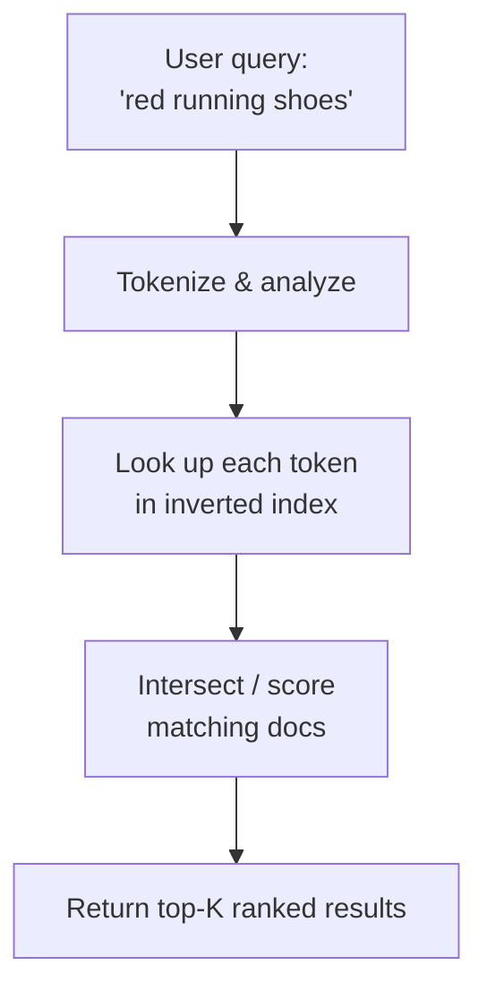

# Search Fundamentals

[< Back](./README.md) | [Index](./README.md) | [Next: Search Engines in Practice >](./search-engines.md)

---

"Just put it in Postgres and use `ILIKE`" is fine for an admin panel with 10,000 rows. It is a
career-limiting move for a product search box. Full-text search has different goals, different
data structures, and different failure modes from transactional databases.

## Why SQL Search Falls Over

| Approach | What it does | Where it dies |
|----------|--------------|---------------|
| `LIKE '%foo%'` | Sequential scan for substring | No index help with leading `%`; O(n) in table size |
| SQL full-text (`tsvector`) | Decent inverted index for one language | Weak ranking controls, hard multi-field relevance, limited fuzzy/typo UX |
| Dedicated search engine | Purpose-built inverted index + analyzers | Extra system to run, eventual consistency with source of truth |

SQL databases optimize for **exact lookups and joins**. Search engines optimize for **token
matching and ranked retrieval**.



## The Inverted Index

A normal (forward) index maps **document → terms**. An **inverted index** maps **term → documents**.

```
Document 1: "the quick brown fox"
Document 2: "quick brown dogs"
Document 3: "lazy fox"

Inverted index:
  brown → [1, 2]
  dogs  → [2]
  fox   → [1, 3]
  lazy  → [3]
  quick → [1, 2]
  the   → [1]
```

To find documents containing both `quick` and `fox`, intersect the postings lists: `[1, 2] ∩ [1, 3] = [1]`.

Postings lists often store more than doc IDs:
- **Term frequency** (how often the term appears in the doc) — for ranking
- **Positions** (where in the doc) — for phrase queries (`"brown fox"`)
- **Offsets** — for highlighting snippets

## Tokenization and Analysis

Raw text never goes into the index as-is. An **analyzer** pipeline turns text into tokens:

1. **Character filters** — strip HTML, map unicode
2. **Tokenizer** — split on whitespace/punctuation → tokens
3. **Token filters** — lowercase, remove stopwords (`the`, `a`), stem (`running` → `run`), synonyms

```
"Running Shoes!!" 
  → tokenize  → ["Running", "Shoes"]
  → lowercase → ["running", "shoes"]
  → stem      → ["run", "shoe"]
```

**Critical rule:** query text and document text must go through the **same analyzer** (or a
compatible pair). If you stem documents but not queries, you get silent empty results.

## Precision vs Recall

| Metric | Meaning | Trade-off |
|--------|---------|-----------|
| **Precision** | Of results returned, how many are relevant? | High precision → fewer false positives, may miss good docs |
| **Recall** | Of all relevant docs, how many did you return? | High recall → fewer misses, more noise |

Stemming and synonyms boost recall. Exact phrase matching boosts precision. Product search usually
wants high precision on the first page; legal/e-discovery wants high recall.

## When You Still Don't Need a Search Engine

- Small catalogs (< ~100k docs) with simple filters → SQL + indexes is fine
- Exact ID / SKU lookup → primary key, not search
- Structured filters only (price range, category) → relational or columnar DB

Reach for a search engine when you need **ranked free-text**, **typo tolerance**, **multi-field
relevance**, or **autocomplete** at scale.

## Takeaways

- SQL `LIKE` and even SQL FTS are weak substitutes for real product search.
- An **inverted index** maps terms → document lists; that's the core data structure.
- **Analyzers** (tokenize + normalize) must be consistent between index-time and query-time.
- Search optimizes for **ranked retrieval**, not transactional consistency.

---

[< Back](./README.md) | [Index](./README.md) | [Next: Search Engines in Practice >](./search-engines.md)
