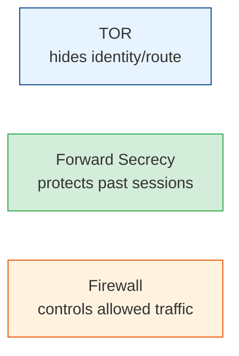

# Network Security Tech Docs

Key building blocks of network privacy and defense — how anonymity, key hygiene, and
perimeter control actually work.

## Contents

| # | Topic | File | Level |
|---|-------|------|-------|
| 0 | Overview | *(this file)* | L1 · Beginner |
| 1 | TOR — The Onion Router | [tor.md](./tor.md) | L3 · Intermediate |
| 2 | Forward Secrecy | [forward-secrecy.md](./forward-secrecy.md) | L3 · Intermediate |
| 3 | Firewalls | [firewall.md](./firewall.md) | L2 · Novice |

---

## Overview

Three independent-but-complementary ideas:

- **TOR** protects *who is talking to whom* (anonymity / metadata privacy) by bouncing
  traffic through layered encryption across volunteer relays.
- **Forward secrecy** protects *past conversations* even if the server's long-term private
  key is later stolen — by using ephemeral session keys.
- **Firewalls** control *what traffic is allowed* in and out of a network or host.

Start with [tor.md](./tor.md).
