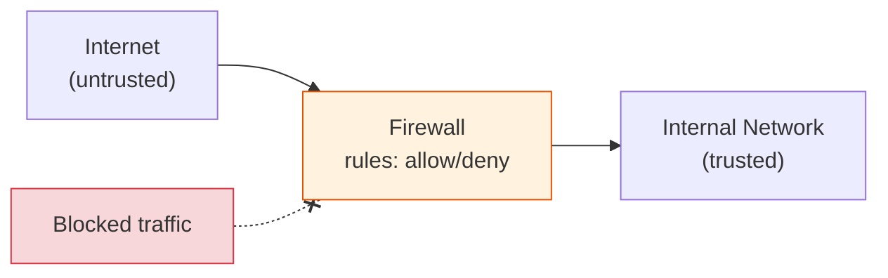
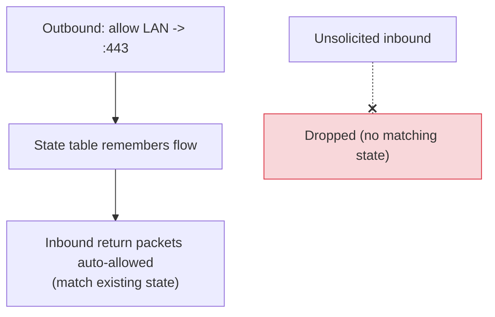

# Firewalls

[< Back](./forward-secrecy.md) | [Index](./README.md)

---

## What is a firewall?

A **firewall** is a security control that **monitors and filters** network traffic based on
a set of **rules**, deciding what's allowed to pass between zones (e.g., the internet and
your private network). It's the perimeter guard: default-deny, allow only what you intend.



## Types of firewalls (by how deeply they inspect)

| Type | Inspects | Notes |
|------|----------|-------|
| **Packet filter (stateless)** | IP, port, protocol per packet | Fast, dumb; no memory of connections |
| **Stateful** | Tracks connection state (the flow) | Allows return traffic of established conns automatically |
| **Application / L7 (proxy)** | Full payload (HTTP, etc.) | Can block by URL, method, content; slower |
| **NGFW (Next-Gen)** | L7 + IDS/IPS + app awareness + threat intel | Modern enterprise standard |
| **WAF (Web App Firewall)** | HTTP semantics | Blocks SQLi/XSS/etc. for web apps specifically |

### Stateless vs stateful

- **Stateless** evaluates each packet in isolation — you must write rules for *both*
  directions. Fast but crude.
- **Stateful** remembers active connections in a **state table**. If you allow an outbound
  request, the matching **return** packets are permitted automatically. This is what almost
  everything uses today.



## Default-deny is the golden rule

Start by **blocking everything**, then explicitly **allow** only what's needed. The
opposite (allow-all, block-known-bad) is a losing game.

```bash
# Linux nftables / iptables sketch (conceptual)
# 1) default drop inbound
iptables -P INPUT DROP
# 2) allow established/related (stateful return traffic)
iptables -A INPUT -m conntrack --ctstate ESTABLISHED,RELATED -j ACCEPT
# 3) allow loopback
iptables -A INPUT -i lo -j ACCEPT
# 4) explicitly allow the services you actually run
iptables -A INPUT -p tcp --dport 22  -j ACCEPT     # SSH
iptables -A INPUT -p tcp --dport 443 -j ACCEPT     # HTTPS
```

## Where firewalls live (defense in depth)

- **Network firewall** — at the perimeter/edge (or between VPC subnets, security groups).
- **Host firewall** — on each server (`ufw`, `firewalld`, Windows Defender Firewall).
- **Application firewall / WAF** — in front of web apps.
- **Cloud** — Security Groups (stateful) + Network ACLs (stateless) in AWS/GCP/Azure.

Layer them: perimeter blocks the internet, segmentation limits lateral movement, host
firewalls protect individual boxes, and a WAF guards the app layer.

## Firewall vs adjacent tools

| Tool | Job |
|------|-----|
| **Firewall** | Allow/deny traffic by rules |
| **IDS** (Intrusion Detection) | *Detects* and alerts on suspicious traffic |
| **IPS** (Intrusion Prevention) | Detects **and blocks** inline |
| **WAF** | Firewall specialized for HTTP/web attacks |
| **NAT** | Address translation (a side effect: hides internal hosts) — not itself security |

> **Key mindset:** a firewall enforces *policy* ("what is allowed"), not *identity*. Pair
> it with authentication, encryption (TLS/forward secrecy), and monitoring (IDS/IPS) for
> real defense in depth.

---

[< Back](./forward-secrecy.md) | [Index](./README.md)
