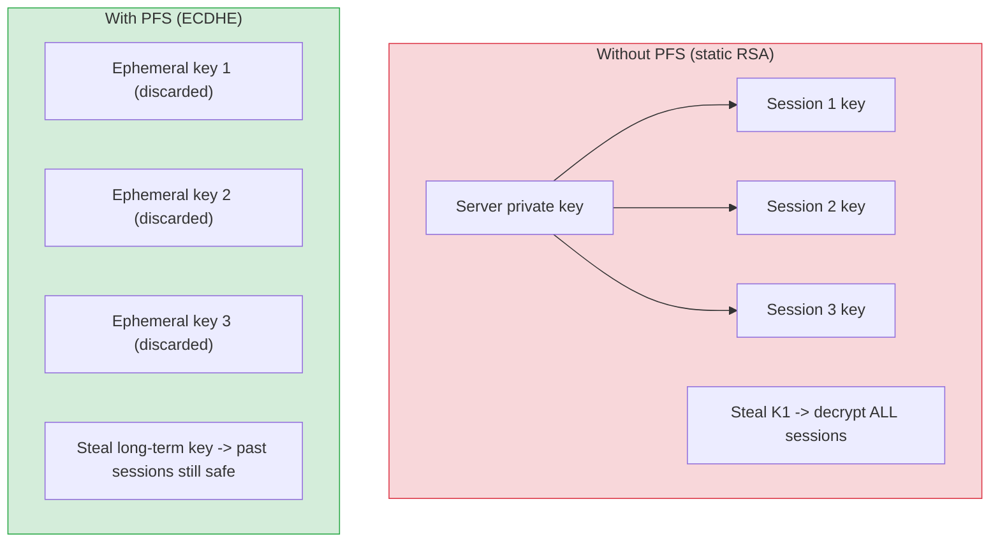
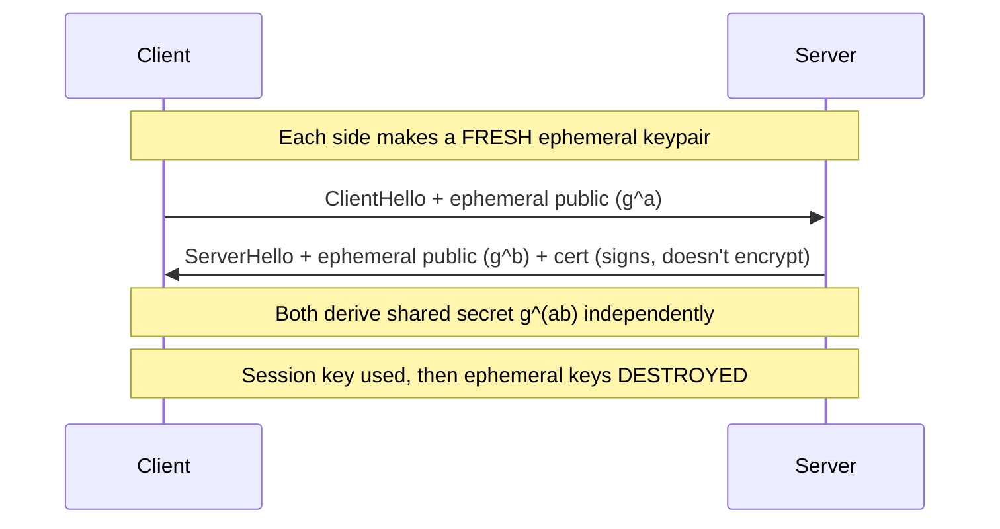

# Forward Secrecy

[< Back](./tor.md) | [Index](./README.md) | Next: [Firewalls >](./firewall.md)

---

## The problem it solves

Imagine an attacker **records all your encrypted TLS traffic today** and stores it. Years
later, they **steal the server's private key** (breach, subpoena, coercion). Can they now
decrypt everything they recorded?

- **Without forward secrecy:** **YES.** If the session key was encrypted *with* the
  server's long-term key (old RSA key exchange), one stolen key unlocks *all* past sessions.
- **With forward secrecy (PFS):** **NO.** Each session used a unique **ephemeral** key that
  was never transmitted and was thrown away after the session. The long-term key can't
  recover them.

**Forward Secrecy** (a.k.a. Perfect Forward Secrecy, PFS) means: **compromise of a
long-term key does not compromise past session keys.**



## How it works: ephemeral Diffie-Hellman

Forward secrecy comes from **ephemeral key exchange** — **DHE** (Diffie-Hellman Ephemeral)
or, faster, **ECDHE** (Elliptic Curve DHE). For *each* connection:

1. Both sides generate a **fresh, temporary key pair**.
2. They exchange **public** parts and each derive the same **shared secret** — the actual
   private values never travel the wire.
3. That shared secret becomes the session key.
4. When the session ends, the ephemeral keys are **destroyed**. Nothing stored can recover
   them.



The server's **long-term certificate key is only used to *sign*** (prove identity), **not
to encrypt** the key exchange. That decoupling is exactly what gives forward secrecy.

## In practice

- **TLS 1.3 mandates forward secrecy** — it removed static RSA key exchange entirely. Every
  TLS 1.3 handshake is (EC)DHE. Just using TLS 1.3 gives you PFS for free.
- **In TLS 1.2**, prefer cipher suites starting with `ECDHE_` (e.g.,
  `ECDHE-RSA-AES256-GCM-SHA384`); avoid plain `TLS_RSA_*` (no PFS).
- It's a headline reason the industry pushed hard to TLS 1.3.
- Related to how **TOR** and **Signal** (Double Ratchet) build even stronger per-message
  forward secrecy.

```bash
# Check what a server negotiates (look for ECDHE in the cipher)
openssl s_client -connect www.google.com:443 </dev/null 2>/dev/null | grep -Ei "protocol|cipher"
```

> **One-liner:** Forward secrecy = **fresh, ephemeral, throwaway keys per session**, so
> stealing the master key tomorrow can't decrypt what you captured today.

---

[< Back](./tor.md) | [Index](./README.md) | Next: [Firewalls >](./firewall.md)
