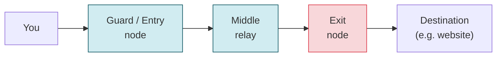
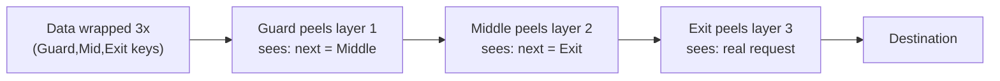

# TOR — The Onion Router

[Index](./README.md) | Next: [Forward Secrecy >](./forward-secrecy.md)

---

## What is TOR?

**TOR (The Onion Router)** is a network that provides **anonymity** by routing your traffic
through a chain of **volunteer-run relays**, wrapping it in **layers of encryption** (like
an onion). No single relay knows both *who you are* and *what you're accessing*.

The goal is not (only) to hide the *content* — TLS already does that — but to hide the
**metadata**: who is talking to whom.

## The circuit: three relays

A TOR client builds a **circuit** of (usually) three relays:

| Relay | Knows | Doesn't know |
|-------|-------|--------------|
| **Guard (entry)** | your real IP | the destination |
| **Middle** | nothing about ends | neither your IP nor the destination |
| **Exit** | the destination | your real IP |

Because no single relay sees both ends, **no one relay can deanonymize you.**

## Onion encryption: layered wrapping

The client encrypts the message in **three layers**, one per relay. Each relay peels off
**exactly one layer** (revealing only the *next hop*), then forwards it.

- Layers are built with **ephemeral keys** negotiated hop-by-hop (so it also has forward
  secrecy properties).
- The **exit node sees the final plaintext** *unless* you use end-to-end TLS (`https://`).
  So: **always use HTTPS over TOR** — a malicious exit can otherwise read/modify plain HTTP.

## Onion services (.onion)

TOR can also host **hidden services** (`.onion` addresses) where *the server* is anonymous
too. The client and server each build circuits to a shared **rendezvous point**, so
neither learns the other's IP. This is how anonymous sites and some secure drop boxes work.

## What TOR does and doesn't protect

| Protects | Does NOT protect |
|----------|------------------|
| Your IP / location from the destination | You, if you log into your real accounts |
| Which sites you visit from your ISP | Content at the exit if you use plain HTTP |
| Metadata linking you to a service | Against browser fingerprinting/malware (use Tor Browser) |
| Server identity (onion services) | Against global adversaries doing traffic correlation |

## Practical notes

- **Use the Tor Browser**, not just any browser over the TOR SOCKS proxy — it's hardened
  against fingerprinting and leaks.
- **It's slow-ish** by design (3 hops, volunteer bandwidth). Don't use it for bulk downloads.
- **Legitimate uses**: journalism, activism under censorship, privacy, security research.
- **Corporate note**: many orgs (including per our environment rules) prohibit
  tunneling/anonymity tools on managed networks — know your policy before running it.

> Onion routing = **layered encryption + multi-hop relaying** so that anonymity comes from
> *no single party knowing both ends*.

---

[Index](./README.md) | Next: [Forward Secrecy >](./forward-secrecy.md)
