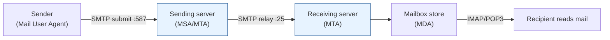

# SMTP Tech Docs

How email actually gets from "Send" to an inbox — the **Simple Mail Transfer Protocol** and
the ecosystem around it.

## Contents

| # | Topic | File | Level |
|---|-------|------|-------|
| 0 | Overview & the mail journey | *(this file)* | L1 · Beginner |
| 1 | SMTP protocol in depth | [smtp.md](./smtp.md) | L2 · Novice |

---

## The Mail Journey (Big Picture)

**SMTP** is the protocol for **sending and relaying** email between servers. It is a
**push** protocol — it *delivers* mail. It is **not** used to *read* mail from your inbox;
that's **IMAP/POP3**.

| Component | Role |
|-----------|------|
| **MUA** (Mail User Agent) | Your email client (Outlook, Gmail app) |
| **MSA** (Mail Submission Agent) | Accepts your outgoing mail (port 587, authenticated) |
| **MTA** (Mail Transfer Agent) | Relays mail server-to-server (port 25) |
| **MDA** (Mail Delivery Agent) | Drops mail into the mailbox |
| **IMAP/POP3** | Protocols the recipient uses to *read* mail |

> Headline: **SMTP pushes mail out and between servers; IMAP/POP pull it into your reader.**

Read the details in [smtp.md](./smtp.md).
