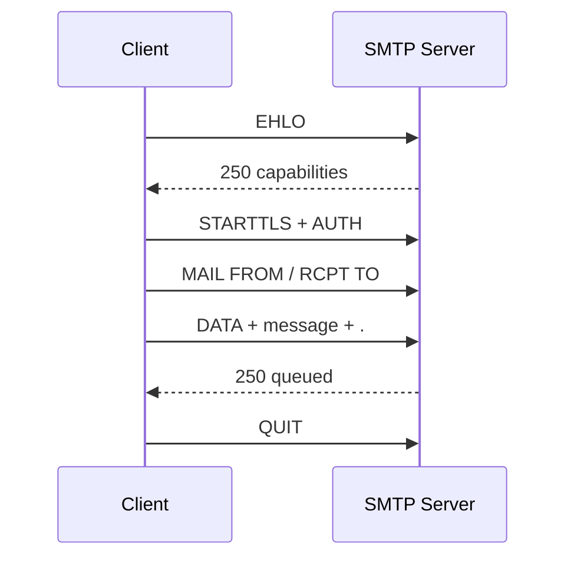
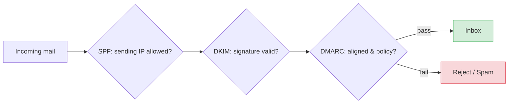

# SMTP — Simple Mail Transfer Protocol

[Index](./README.md)

---

## What is SMTP?

**SMTP** is a **text-based, push** protocol for **sending and relaying** email. A client
opens a TCP connection to a mail server and issues human-readable commands (`HELO`,
`MAIL FROM`, `RCPT TO`, `DATA`) to hand off a message.

## Ports

| Port | Use | Encryption |
|------|-----|------------|
| **25** | Server-to-server relay (MTA→MTA) | Optional STARTTLS; blocked by many ISPs for clients |
| **587** | **Submission** (client→server, authenticated) | STARTTLS — **use this to send** |
| **465** | Submission over implicit TLS | TLS from the first byte |

> As a client/app sending mail, use **587 (STARTTLS)** or **465 (implicit TLS)** with
> authentication. Port 25 is for servers relaying to each other.

## The conversation (a raw SMTP session)

SMTP is refreshingly readable. Here's a full exchange (`C:` = client, `S:` = server):

```
S: 220 mail.example.com ESMTP ready
C: EHLO client.acme.com
S: 250-mail.example.com
S: 250-STARTTLS
S: 250-AUTH LOGIN PLAIN
S: 250 SIZE 35882577
C: STARTTLS
S: 220 Ready to start TLS
   ... TLS handshake, everything below is now encrypted ...
C: AUTH LOGIN            (then base64 user/pass)
S: 235 Authentication successful
C: MAIL FROM:<alice@acme.com>
S: 250 OK
C: RCPT TO:<bob@example.com>
S: 250 OK
C: DATA
S: 354 Start mail input; end with <CRLF>.<CRLF>
C: Subject: Hi Bob
C: From: alice@acme.com
C: To: bob@example.com
C:
C: Hello Bob, this is the body.
C: .
S: 250 OK: queued as 12345
C: QUIT
S: 221 Bye
```

- **`EHLO`** (Extended HELO) starts an **ESMTP** session and lists server capabilities.
- The body ends with a lone **`.`** on its own line.
- Reply codes: **2xx** success, **3xx** need more input, **4xx** temporary failure (retry),
  **5xx** permanent failure (bounce).



## Code Example: sending mail (Python)

```python
import smtplib
from email.message import EmailMessage

msg = EmailMessage()
msg["From"] = "alice@acme.com"
msg["To"] = "bob@example.com"
msg["Subject"] = "Hi Bob"
msg.set_content("Hello Bob, this is the body.")

# 587 + STARTTLS (upgrade the plaintext connection to TLS)
with smtplib.SMTP("smtp.acme.com", 587) as s:
    s.starttls()                          # encrypt
    s.login("alice@acme.com", "app-password")
    s.send_message(msg)

# or 465 implicit TLS
# with smtplib.SMTP_SSL("smtp.acme.com", 465) as s:
#     s.login(...); s.send_message(msg)
```

## Deliverability: SPF, DKIM, DMARC

SMTP itself has **no built-in sender authentication** — anyone can claim any `MAIL FROM`.
Three DNS-based standards fight spoofing and keep you out of spam folders:

| Standard | What it does |
|----------|--------------|
| **SPF** | DNS record listing which IPs may send for your domain |
| **DKIM** | Cryptographic signature on the message; receiver verifies via your DNS public key |
| **DMARC** | Policy tying SPF+DKIM together + tells receivers what to do on failure (+ reports) |



## SMTP vs IMAP/POP3

| Protocol | Direction | Purpose |
|----------|-----------|---------|
| **SMTP** | Push / send | Send & relay mail between servers |
| **IMAP** | Pull / sync | Read mail, kept on server, multi-device sync |
| **POP3** | Pull / download | Download mail (often deletes from server) |

> Mnemonic: **S**MTP = **S**end. IMAP/POP = receive/read.

## Operational tips

- Handle **4xx = retry later**, **5xx = give up / bounce**. Real MTAs queue and retry with
  backoff for hours.
- Use a reputable **relay/ESP** (SES, SendGrid, Postmark) for bulk/transactional mail —
  they manage IP reputation, SPF/DKIM/DMARC, and retries.
- Always **STARTTLS/TLS**; never send credentials over plaintext port 25.
- Warm up new sending IPs; monitor bounce/complaint rates.

---

[Index](./README.md)
