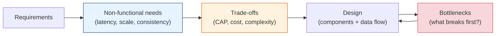

# System Design Fundamentals

The bedrock. Before you can design Twitter, a payment system, or a global CDN, you need the
vocabulary and mental models every engineer uses to reason about systems. This module is
**where you start.**

## Contents

| # | Topic | File | Level |
|---|-------|------|-------|
| 0 | The map (this file) | *(here)* | L1 · Beginner |
| 1 | The core properties (scalability, latency, availability, reliability) | [core-properties.md](./core-properties.md) | L1 · Beginner |
| 2 | Back-of-the-envelope estimation | [back-of-envelope.md](./back-of-envelope.md) | L1 · Beginner |
| 3 | CAP, PACELC & consistency models | [cap-and-consistency.md](./cap-and-consistency.md) | L3 · Intermediate |
| 4 | Scaling: vertical, horizontal, and everything between | [scaling.md](./scaling.md) | L1 · Beginner |
| 5 | The design-interview framework (how to approach *any* system) | [design-framework.md](./design-framework.md) | L3 · Intermediate |
| 6 | Trade-offs & the wisdom of "it depends" | [tradeoffs.md](./tradeoffs.md) | L4 · Advanced |

---

## Why this module exists

Junior engineers memorize solutions ("use Redis"). Senior engineers reason from
**properties and trade-offs** ("we need low read latency and can tolerate a few seconds of
staleness, so a cache with short TTL fits — here's what we give up").

The difference is not knowing more tools. It's having a **framework** to pick the right tool
and being able to **say out loud what you're trading away.**

## The one thing to remember

> **There is no "best" architecture — only the best architecture *for a given set of
> constraints*.** The senior skill is naming the constraints out loud, then choosing.

Start with [core-properties.md](./core-properties.md). **Next >**
