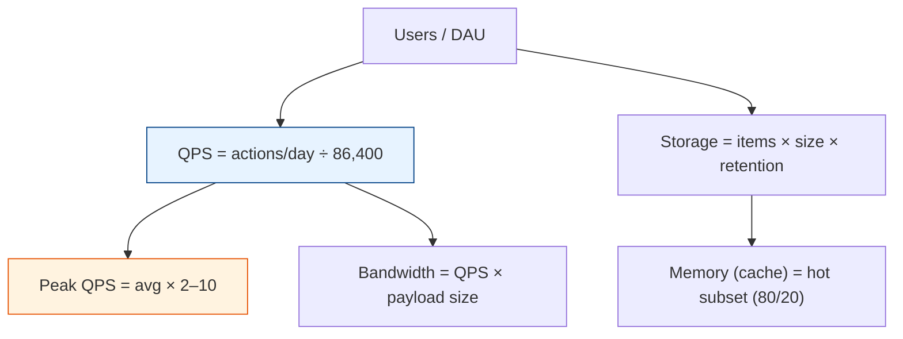

# Back-of-the-Envelope Estimation

[< Back](./core-properties.md) | [Index](./README.md) | [Next: CAP & Consistency >](./cap-and-consistency.md)

---

Estimation is a superpower. Before building (or in an interview), you answer: *"Roughly how
big is this?"* Good enough beats precise. You're checking **order of magnitude** — is this a
laptop problem, a rack problem, or a datacenter problem?

## The numbers to memorize

| Powers of ten | Value | "Data" name |
|---------------|-------|-------------|
| 10³ | Thousand | KB |
| 10⁶ | Million | MB |
| 10⁹ | Billion | GB |
| 10¹² | Trillion | TB |
| 10¹⁵ | — | PB |

| Time | Seconds |
|------|---------|
| 1 day | ~86,400 (**~10⁵**) |
| 1 month | ~2.5 million (**~2.5 × 10⁶**) |
| 1 year | ~31.5 million (**~3 × 10⁷**) |

> **Handy shortcut:** 1 million requests/day ≈ **~12 requests/second**. Memorize this and
> most QPS estimates fall out instantly.

## The estimation recipe



1. **Users → QPS.** Start from DAU (daily active users), estimate actions per user per day.
2. **Average → Peak.** Traffic isn't flat. Multiply average by 2–10× for peak.
3. **Storage.** items/day × bytes/item × retention period. Add replication factor (×3).
4. **Bandwidth.** QPS × average payload size, split read/write.
5. **Memory.** Apply the **80/20 rule**: ~20% of data serves ~80% of requests → cache that.

## Worked example: design a URL shortener

**Assumptions:** 100M new URLs/day, read:write ratio 100:1, store links 5 years.

**Write QPS:**
```
100M / 86,400 s ≈ 1,160 writes/sec  (avg)
Peak ≈ ~2,300–3,000 writes/sec
```

**Read QPS:**
```
100:1 ratio → ~116,000 reads/sec (avg), peak ~250k/sec
```

**Storage (5 years):**
```
100M/day × 365 × 5 ≈ 182 billion URLs
~500 bytes/record → 182B × 500 ≈ 91 TB  (before replication)
```
→ This does **not** fit on one machine. You need sharding + a distributed store. That single
conclusion — reached in 90 seconds — shapes the entire design.

**Cache (memory):**
```
Cache the hot 20% of daily reads.
~116k reads/sec × 86,400 ≈ 10B reads/day; 20% ≈ 2B hot entries
Even at 100 bytes each ≈ 200 GB → a small Redis cluster, not one box.
```

## Rules of thumb for good estimates

1. **Round aggressively.** 86,400 → 100,000. 365 → 400 or 350. Precision is noise.
2. **Always separate read vs write** — they scale differently and hit different components.
3. **Always apply a peak multiplier** — designing for average is designing to fail at lunch.
4. **State your assumptions out loud.** The number matters less than the reasoning.
5. **Sanity-check the conclusion:** "Does it fit on one machine?" is the most important
   question estimation answers.

> The point of estimation isn't the number — it's the **decision** the number forces:
> single box vs cluster, cache vs no cache, SQL vs NoSQL, one region vs many.

---

[< Back](./core-properties.md) | [Index](./README.md) | [Next: CAP & Consistency >](./cap-and-consistency.md)
