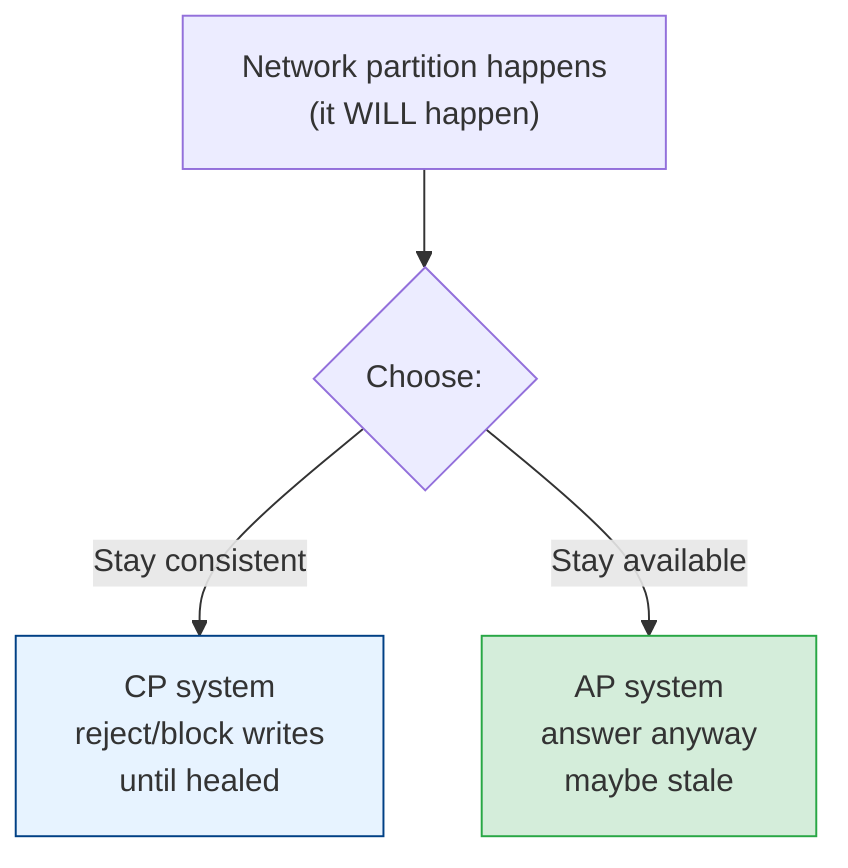
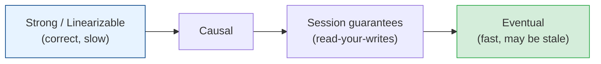

# CAP, PACELC & Consistency Models

[< Back](./back-of-envelope.md) | [Index](./README.md) | [Next: Scaling >](./scaling.md)

---

This is the topic that separates people who *read* about distributed systems from people who
*understand* them. Slow down here.

## The CAP theorem

In a distributed system you get **at most two** of these three, and you *must* pick between C
and A when the network breaks:

- **C**onsistency — every read sees the most recent write (all nodes agree).
- **A**vailability — every request gets a (non-error) response.
- **P**artition tolerance — the system keeps working when the network between nodes drops.

**The crucial nuance:** partitions are not optional in a real network — they happen. So CAP
is really a **binary choice during a partition: C or A.** When the network is healthy, you
get both.

| Type | Behavior during partition | Examples |
|------|---------------------------|----------|
| **CP** | Sacrifice availability; refuse/stall to stay correct | HBase, MongoDB (default), ZooKeeper, etcd |
| **AP** | Sacrifice consistency; keep serving, reconcile later | Cassandra, DynamoDB, Riak |

> A bank ATM network partitioned? A CP choice (block the withdrawal) is safer than an AP one
> (allow double-spend). A shopping cart? AP is fine — merge carts later, never show an error.

## PACELC — the theorem CAP forgot

CAP only talks about the partition case. **PACELC** completes the picture:

> **If Partition (P): choose A or C. Else (E): choose Latency (L) or Consistency (C).**

Even with a healthy network, strong consistency **costs latency** (coordination between
nodes). So the real everyday trade-off is **latency vs consistency**, which most systems face
far more often than actual partitions.

- **PC/EC** — consistency always (e.g., VoltDB, BigTable): correct but slower.
- **PA/EL** — availability + low latency (e.g., Cassandra, Dynamo): fast but eventually
  consistent.

## Consistency models (a spectrum, not a switch)

"Consistency" isn't binary. From strongest (most expensive) to weakest (cheapest/fastest):

| Model | Guarantee | Cost |
|-------|-----------|------|
| **Linearizable / Strong** | Reads see the latest write, globally, instantly | Highest latency, coordination |
| **Sequential** | Everyone sees ops in the same order (not necessarily real-time) | High |
| **Causal** | Causally-related ops seen in order; concurrent ops may differ | Medium |
| **Read-your-writes** | You always see your own writes | Medium (session-scoped) |
| **Monotonic reads** | You never see time go backwards | Medium |
| **Eventual** | If writes stop, all replicas eventually converge | Lowest latency, cheapest |

**Eventual consistency** does not mean "wrong." It means "correct *eventually*, and probably
within milliseconds." For likes, view counts, and feeds, that's perfect. For account
balances and inventory-you-oversell, it's dangerous.

## The senior takeaways

1. **You will have partitions.** Design for the C-vs-A choice explicitly, per feature — not
   per company.
2. **Different data needs different consistency.** The same app can put orders in a strongly
   consistent store and view counts in an eventually consistent one. Don't apply one model
   globally.
3. **Strong consistency is a latency and availability tax.** Only pay it where correctness
   demands it.
4. **"Eventual" is a feature, not a bug** — for the right data.

---

[< Back](./back-of-envelope.md) | [Index](./README.md) | [Next: Scaling >](./scaling.md)
