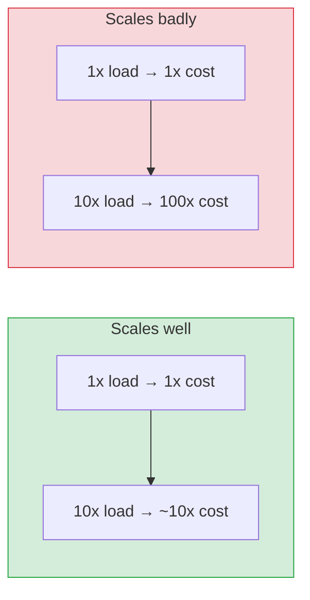

# Core Properties: Scalability, Latency, Availability, Reliability

[Index](./README.md) | [Next: Back-of-the-envelope >](./back-of-envelope.md)

---

These four words get thrown around interchangeably. They are **not** the same thing, and
mixing them up is a junior tell. Nail the definitions.

## Latency vs Throughput

| Term | Meaning | Analogy |
|------|---------|---------|
| **Latency** | Time for **one** request to complete | How long one car takes to cross the bridge |
| **Throughput** | **How many** requests per unit time | How many cars cross per minute |

They're related but independent. A bridge can be **wide** (high throughput) yet **long**
(high latency). You optimize them differently:

- Lower **latency** → caching, closer servers (CDN/edge), faster code, fewer network hops.
- Higher **throughput** → parallelism, horizontal scaling, batching, async processing.

> **The trap:** adding servers raises throughput but does **nothing** for the latency of a
> single slow query. Know which one your user is actually complaining about.

### Latency you should feel in your bones

| Operation | ~Time |
|-----------|-------|
| L1 cache reference | 1 ns |
| Main memory (RAM) | 100 ns |
| SSD random read | 16 µs |
| Datacenter round trip | 0.5 ms |
| Read 1 MB from SSD | 1 ms |
| Disk (HDD) seek | 10 ms |
| Round trip US ↔ Europe | ~150 ms |

The lesson: **network and disk are ~1,000,000× slower than memory.** Every architecture
decision is, at heart, about avoiding slow tiers.

## Availability

**Availability** = the fraction of time the system is up and serving. Measured in "nines."

| Nines | Uptime % | Downtime / year |
|-------|----------|-----------------|
| Two nines | 99% | ~3.65 days |
| Three nines | 99.9% | ~8.8 hours |
| Four nines | 99.99% | ~52 minutes |
| Five nines | 99.999% | ~5 minutes |

Each extra nine is **~10× more expensive**. Five-nines needs multi-region, automated
failover, no human in the recovery loop. Don't promise nines you can't pay for.

> Availability of a chain = product of each link. Two services at 99.9% in series give
> `0.999 × 0.999 ≈ 99.8%`. **Dependencies erode availability.** Redundancy (parallel paths)
> restores it: two 99% replicas in parallel give `1 - (0.01 × 0.01) = 99.99%`.

## Reliability

**Reliability** = the system does the **correct** thing, consistently, even under failure.
A system can be *available* (responding) but *unreliable* (returning wrong answers or losing
data). Reliability covers correctness, durability, and fault tolerance.

## Scalability

**Scalability** = the ability to handle growth (traffic, data, users) by adding resources —
ideally **linearly** and without a redesign. A system "scales" if 10× the load needs
roughly 10× the resources, not 100×.

## Durability

Often forgotten. **Durability** = once you acknowledge a write, the data survives (crashes,
power loss, disk failure). S3 advertises "eleven nines" (99.999999999%) of durability via
replication across devices/zones. Availability is "can I reach it now"; durability is "is it
still there."

## How they interact (the senior mental model)

You almost never maximize all of them. Real systems pick a point in this space:

- A **cache** trades reliability/consistency for latency.
- A **replica** trades cost and consistency for availability.
- A **queue** trades latency for throughput and reliability.
- A **strongly consistent DB** trades availability for correctness (see CAP, chapter 3).

Say the trade-off out loud every time. That habit *is* seniority.

---

[Index](./README.md) | [Next: Back-of-the-envelope >](./back-of-envelope.md)
