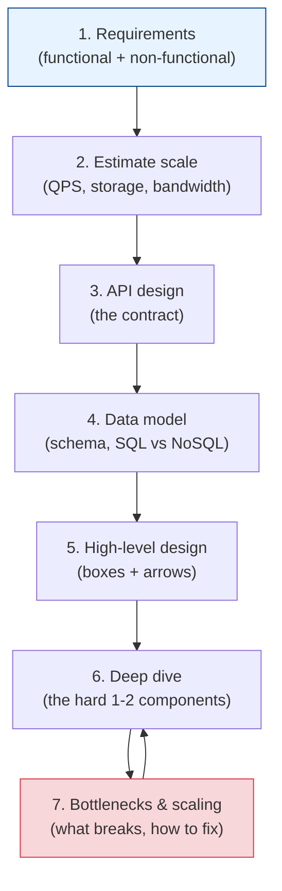

# The Design Framework: How to Approach *Any* System

[< Back](./scaling.md) | [Index](./README.md) | [Next: Trade-offs >](./tradeoffs.md)

---

Whether it's a real design doc or an interview whiteboard, the process is the same. Structure
beats brilliance. Follow these steps **in order** and never freeze on a blank page again.



## Step 1 — Requirements (don't skip this)

Spend real time here. Jumping to boxes-and-arrows before you know what you're building is the
#1 mistake.

- **Functional:** what must it *do*? ("Users post tweets, follow others, see a feed.")
- **Non-functional:** how *well*? Scale, latency, availability, consistency, durability.
- **Scope it down:** "Should we include DMs? Let's assume no for now." Narrow explicitly.

> **Ask clarifying questions.** In interviews and in real life, the strongest signal is
> refusing to build the wrong thing.

## Step 2 — Estimate scale

Use the [back-of-the-envelope](./back-of-envelope.md) method. The numbers decide
single-box vs cluster, SQL vs NoSQL, cache vs no cache. Do it early — it steers everything.

## Step 3 — API design

Define the contract before the internals. It forces clarity on what the system offers.

```
POST /v1/tweets            { text }              -> { tweet_id }
GET  /v1/feed?cursor=...&limit=20                -> { tweets[], next_cursor }
POST /v1/users/{id}/follow                       -> 200
```

Prefer **cursor-based pagination** over offset for large/real-time feeds. Version your API
(`/v1/`). Decide REST vs gRPC vs GraphQL and *say why*.

## Step 4 — Data model

- Entities, relationships, and the **access patterns** (you model for how you *read*).
- **SQL** for relations, transactions, and flexible queries. **NoSQL** for scale, flexible
  schema, and known access patterns. (See [databases module](../databases/README.md).)
- Pick indexes based on your queries. Call out the **shard key** if you'll partition.

## Step 5 — High-level design

Draw the boxes: client → LB → gateway → services → cache → DB, plus queues, workers, CDN,
blob storage. Show the **data flow** for the main use cases (write path *and* read path — they
often differ dramatically).

## Step 6 — Deep dive

You can't detail everything. Pick the **1–2 hardest / most interesting** components and go
deep. For a feed: the fan-out strategy. For a chat app: message delivery + presence. For a
rate limiter: the algorithm and storage. This is where senior signal lives.

### Example: the classic feed fan-out trade-off

| Strategy | Write path | Read path | Best for |
|----------|-----------|-----------|----------|
| **Fan-out on write** (push) | Write to every follower's feed | Cheap read | Most users; precomputed feeds |
| **Fan-out on read** (pull) | Just store the post | Assemble feed at read time | Celebrities (millions of followers) |
| **Hybrid** | Push for normal users, pull for celebrities | Best of both | Real systems (Twitter/Instagram) |

Naming this trade-off unprompted is exactly the senior move.

## Step 7 — Bottlenecks, failure & scaling

Close the loop: "What breaks first? What if this DB dies? A whole region?"

- **Single points of failure** → add redundancy.
- **Bottlenecks** → cache, replicate, shard, queue.
- **Failure modes** → retries (with backoff + jitter), timeouts, circuit breakers, graceful
  degradation.
- **Observability** → metrics, logs, traces, alerts (see
  [observability module](../observability-and-reliability/README.md)).

## Meta-tips that carry the whole thing

1. **Think out loud.** The process is the point; a silent genius reads as a junior.
2. **Start simple, then scale.** Get a working single-region design, *then* add complexity.
3. **State assumptions and trade-offs constantly.** "I'll use Redis here, trading a bit of
   consistency for latency — acceptable for view counts."
4. **There is no single right answer.** There are defensible answers and indefensible ones.
   Be defensible.

---

[< Back](./scaling.md) | [Index](./README.md) | [Next: Trade-offs >](./tradeoffs.md)
