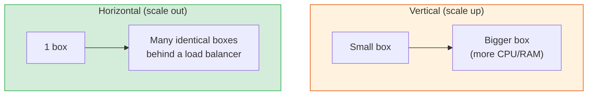

# Scaling: Vertical, Horizontal & Everything Between

[< Back](./cap-and-consistency.md) | [Index](./README.md) | [Next: Design Framework >](./design-framework.md)

---

Growth is a good problem — but only if you know how to absorb it. There are exactly two ways
to add capacity, and a handful of techniques built on top.

## Vertical vs Horizontal

| | Vertical (scale up) | Horizontal (scale out) |
|-|---------------------|------------------------|
| **How** | Bigger machine | More machines |
| **Ceiling** | Hardware limit (hard cap) | Effectively unlimited |
| **Complexity** | Low — no code changes | High — needs LB, statelessness, coordination |
| **Failure** | Single point of failure | Survives node loss |
| **Cost curve** | Cheap then brutally expensive | Linear-ish |

**Rule of thumb:** scale **up** first (it's simple and buys you time), scale **out** when you
hit the ceiling or need fault tolerance. Startups over-engineer horizontal scaling for
traffic they don't have. Don't.

## The prerequisite for horizontal scaling: statelessness

You cannot scale out if a user must return to the *same* server (sticky session in memory).
Push state **out** of the app tier into a shared store (Redis/DB), and any instance can serve
any request. **Stateless app + shared state store = free horizontal scaling.**

## Database scaling (the real bottleneck)

Apps scale out easily; databases fight you. The ladder:

1. **Read replicas** — primary takes writes, replicas serve reads. Great for read-heavy
   workloads. Watch for **replication lag** (stale reads).
2. **Caching** — put Redis in front; the cheapest scaling you'll ever do.
3. **Vertical scaling the DB** — bigger box. Simple, buys time.
4. **Sharding (partitioning)** — split data across DBs by a **shard key**. The nuclear
   option: powerful but adds cross-shard queries, rebalancing, and hot-shard pain.

### Partitioning strategies

| Strategy | How | Risk |
|----------|-----|------|
| **Range** | `user_id 0–1M → shard A` | Hot shards if data is skewed |
| **Hash** | `hash(key) % N → shard` | Even spread, but resharding is painful |
| **Consistent hashing** | keys on a ring; add/remove nodes moves few keys | Standard for caches/Dynamo |
| **Geo / directory** | by region or a lookup table | Flexible, needs a routing layer |

> **Hot shard / hot key** is the classic sharding failure: one celebrity user or one viral
> product overwhelms a single shard while others idle. Mitigate with a secondary key,
> replication of the hot key, or a local cache in front.

## Load balancing (spreading horizontal capacity)

Once you have N boxes, a load balancer decides who serves each request. Common algorithms:

- **Round robin** — next server each time. Simple, ignores load.
- **Least connections** — send to the least-busy server. Good for uneven request cost.
- **Weighted** — bigger servers get more traffic.
- **IP hash / consistent hashing** — same client → same server (sticky, cache-friendly).

(See the [infrastructure module](../infrastructure/l4-load-balancer.md) for the deep dive.)

## Other scaling levers

- **Asynchronous processing** — offload slow work to a queue/worker; return to the user fast.
  (See [messaging-and-streaming](../messaging-and-streaming/README.md).)
- **CDN / edge** — serve static content and cached responses close to users.
- **Denormalization** — precompute/duplicate data to avoid expensive joins at read time.
- **Batching & bulk ops** — amortize per-request overhead.

## The scaling mindset

1. **Measure before scaling.** Find the actual bottleneck; don't scale on vibes.
2. **The database is almost always the bottleneck.** Plan its scaling first.
3. **Simple scaling (bigger box, cache, replicas) beats clever scaling (sharding)** until you
   truly need clever. Sharding is a one-way door — hard to undo.
4. **Statelessness is the unlock.** Design for it from day one; it's cheap early, expensive
   to retrofit.

---

[< Back](./cap-and-consistency.md) | [Index](./README.md) | [Next: Design Framework >](./design-framework.md)
