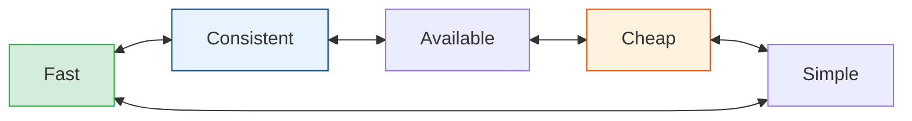

# Trade-offs & the Wisdom of "It Depends"

[< Back](./design-framework.md) | [Index](./README.md)

---

This is the capstone of the fundamentals module — the stuff that usually takes a decade to
internalize. Every senior engineer's favorite sentence is **"it depends,"** and this chapter
explains *what* it depends on. Read it, then re-read it every couple of years.

## Everything is a trade-off

There are no free lunches in system design. Each choice buys one property by spending
another. The skill is **knowing the exchange rate.**

| You want more... | You usually pay in... |
|------------------|-----------------------|
| Consistency | Latency, availability |
| Low latency | Consistency, cost (caching, replication, edge) |
| Availability | Consistency, cost, complexity |
| Throughput | Latency (batching), complexity (parallelism) |
| Flexibility (schema) | Query power / transactional guarantees |
| Simplicity | Scale ceiling |
| Cost savings | Performance, redundancy |

## The trade-offs seniors actually argue about

- **Normalization vs denormalization** — clean writes & no duplication vs fast reads & no
  joins.
- **Sync vs async** — immediate result & simple flow vs decoupling & resilience & throughput.
- **Monolith vs microservices** — simple ops & easy transactions vs independent scaling &
  team autonomy (and a *lot* of operational overhead). See
  [microservices module](../microservices/README.md).
- **SQL vs NoSQL** — relations & ACID vs scale & flexible schema.
- **Strong vs eventual consistency** — correctness vs speed & availability.
- **Build vs buy** — control vs speed-to-market & maintenance burden.
- **Push vs pull** — precompute cost vs read-time cost.

## The wisdom that only comes with scars

These aren't in textbooks. They're paid for in outages.

1. **Premature optimization is the root of most over-engineering.** Design for 10× your
   current scale, not 10,000×. You'll learn more before you get there, and requirements will
   change. YAGNI is a load-bearing principle.

2. **Boring technology wins.** Postgres, a queue, and a cache solve 90% of problems. Every
   exotic datastore is an on-call burden and a hiring constraint. Spend your "innovation
   tokens" wisely — you get about three.

3. **The best code is code you don't write.** Every line is a liability to maintain. Delete
   aggressively. The most senior PRs are often net-negative.

4. **Distributed systems fail in the middle.** The hard bugs aren't "server down" — they're
   partial failures, network partitions, duplicate messages, out-of-order delivery, and
   clock skew. Design for *partial* failure, not just total.

5. **Everything fails eventually.** Disks, networks, regions, dependencies, and people.
   Reliability isn't preventing failure; it's **containing the blast radius** and recovering
   fast (timeouts, retries with backoff+jitter, circuit breakers, bulkheads, graceful
   degradation).

6. **Idempotency is a superpower.** In any system with retries (all of them), make operations
   safe to run twice. It turns "did that payment go through?" from a nightmare into a non-issue.

7. **Data outlives code.** You'll rewrite services five times; the schema and the data linger
   for a decade. Migrations are the scariest deploys. Model data carefully; version it; never
   do a destructive migration without a rollback plan.

8. **Observability is not optional.** You cannot fix what you cannot see. Metrics, logs, and
   traces are part of the design, not an afterthought. If it's not measured, it's broken and
   you don't know yet.

9. **Complexity is the enemy.** Every component you add is another thing that breaks, another
   thing to monitor, another thing a new hire must learn. The senior instinct is toward
   **fewer moving parts**, not more.

10. **Cost is a real constraint.** "Just add servers" has a bill attached. At scale,
    efficiency *is* architecture. A 30% cost reduction can fund a whole team.

11. **The org chart ships in the product (Conway's Law).** Your system's boundaries will
    mirror your team boundaries whether you plan it or not. Design teams and services
    together.

12. **Perfect is the enemy of shipped.** A working 80% solution in production beats a perfect
    design in a doc. Iterate with real feedback.

## How to actually make a decision

1. **List the constraints** (scale, latency, consistency, cost, team size, deadline).
2. **List 2–3 viable options** — never fall in love with the first idea.
3. **For each, name what it buys and what it costs.**
4. **Pick the one whose costs you can most afford** given the constraints.
5. **Write down why** (an ADR — Architecture Decision Record). Future-you will forget, and
   context is the most perishable resource in engineering. See
   [architecture-patterns](../architecture-patterns/README.md).

> The goal is never the "best" system. It's the system whose trade-offs best fit *this*
> problem, *this* team, *this* moment — and being able to explain that choice to anyone who
> asks. That, in one sentence, is the difference between ten years of experience and one year
> of experience repeated ten times.

---

[< Back](./design-framework.md) | [Index](./README.md)
