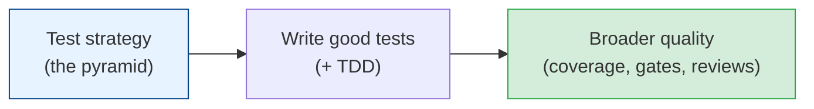

# Testing & Software Quality

Tests are how you move fast without breaking things. They're not about proving code works — they
are about **changing code with confidence** and catching regressions before your users do. A
team with good tests ships faster *and* safer; a team without them slows to a terrified crawl.
This module covers how to test well, not just a lot.

## Contents

| # | Topic | File | Level |
|---|-------|------|-------|
| 0 | The map (this file) | *(here)* | Basic |
| 1 | The testing pyramid & kinds of tests | [testing-pyramid.md](./testing-pyramid.md) | Basic |
| 2 | Writing good tests & TDD | [good-tests-and-tdd.md](./good-tests-and-tdd.md) | Intermediate |
| 3 | Coverage, quality gates & the whole quality picture | [coverage-and-quality.md](./coverage-and-quality.md) | Advanced |

---

## How to read this module

- **Chapter 1** frames the strategy: what kinds of tests exist and how to balance them (the
  pyramid). Read this before writing any tests.
- **Chapter 2** is the craft — what makes a test *good* (not just present), and the TDD workflow.
- **Chapter 3** zooms out to code quality beyond tests: coverage (and its lies), CI gates,
  linting, and reviews.

## Related modules

Pairs with [architecture-patterns/deployment](../architecture-patterns/deployment-and-cost.md)
(CI/CD runs your tests) and [code-architecture](../architecture-patterns/code-architecture.md)
(testable code is well-structured code).

## The one truth

> **Tests exist to let you change code fearlessly.** Their real value isn't the bug they catch
> today — it's the confidence to refactor, upgrade, and ship tomorrow without praying. Untested
> code isn't "done"; it's a liability nobody dares touch.

Start with [testing-pyramid.md](./testing-pyramid.md). **Next >**
