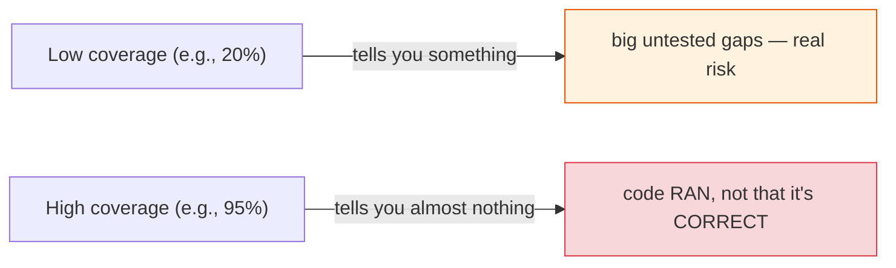
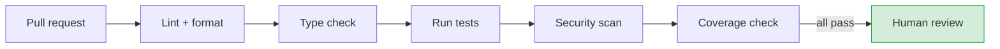
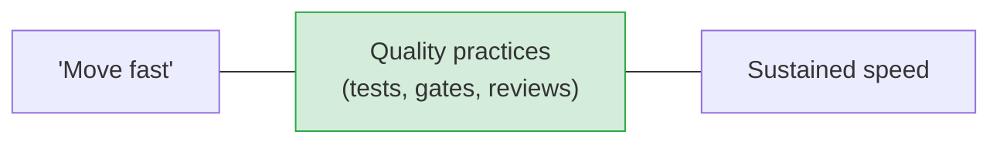

# Coverage, Quality Gates & the Whole Quality Picture

[< Back](./good-tests-and-tdd.md) | [Index](./README.md)

---

Tests are one part of software quality. This chapter zooms out to the full toolkit — coverage
(and its famous lies), automated quality gates, and the human practices that keep a codebase
healthy over years.

## Code coverage: useful metric, terrible target

**Coverage** measures what % of your code runs during tests. It's a helpful *diagnostic* and a
dangerous *goal*.

> **Coverage tells you what code *ran*, not what code *works*.** You can have 100% coverage with
> zero assertions — every line executed, nothing verified. High coverage of *bad* tests is false
> confidence. Low coverage, on the other hand, reliably signals real untested risk.

**Goodhart's Law bites here:** *"When a measure becomes a target, it ceases to be a good
measure."* Mandate "90% coverage" and you get gamed tests that hit lines without asserting
anything — the number goes green while quality flatlines.

**Sensible use of coverage:**
- Use it to **find untested gaps** (which critical paths have *no* tests?), not to chase a number.
- Set a **floor** to prevent backsliding (e.g., "don't drop below current"), not an aspirational
  ceiling.
- Care most about coverage of **critical/complex code** (payments, auth), not trivial glue.
- Remember: **80% coverage of good tests beats 100% of assertion-free ones.**

## Automated quality gates (in CI)

Your CI pipeline (see [deployment](../architecture-patterns/deployment-and-cost.md)) should
enforce quality automatically, so humans review *design*, not formatting.

| Gate | Catches | Tools (examples) |
|------|---------|------------------|
| **Linting** | Style issues, bug-prone patterns | ruff, eslint, pylint |
| **Formatting** | Inconsistent style (auto-fixed) | black, prettier |
| **Type checking** | Type errors before runtime | mypy, TypeScript |
| **Tests** | Regressions | pytest, jest |
| **Security scanning** | Vulnerable deps, secrets, SAST | Snyk, Dependabot |
| **Coverage** | Untested new code | coverage.py, jacoco |

> **Automate everything a machine can check, so human review focuses on what only humans can
> judge:** design, correctness, readability, and whether this is even the right solution.
> Arguing about tabs vs spaces in a PR is a waste of a senior brain — let the formatter decide.

## Code review (quality's human layer)

Automated gates catch the mechanical; review catches the conceptual. Good reviews:

- **Review for correctness, design, and clarity** — not style (that's automated).
- **Be kind and specific.** Critique the code, not the person. Explain *why*, and prefer
  questions ("what happens if this is null?") over commands.
- **Keep PRs small.** A 50-line PR gets a real review; a 2,000-line PR gets a rubber-stamped
  "LGTM." Small PRs = better reviews = fewer bugs (and easier rollback — see
  [deployment](../architecture-patterns/deployment-and-cost.md)).
- **Review promptly.** A blocked teammate is expensive; stale PRs rot and cause merge pain.
- **It's a teaching moment**, both ways — reviews spread knowledge and lift the whole team (see
  [technical leadership](../engineering-leadership/technical-leadership.md)).

## Other quality dimensions

- **Static analysis** — tools that find bugs without running code (null derefs, resource leaks,
  complexity hotspots). Cheap safety.
- **Technical debt** — the accumulated cost of past shortcuts. Some debt is a *deliberate*
  trade-off to ship faster; the danger is *unmanaged* debt. Track it, and pay it down
  continuously rather than in a mythical "big rewrite."
- **Observability as quality** — production monitoring (see
  [observability](../observability-and-reliability/README.md)) is the ultimate quality check:
  it tells you about the bugs your tests missed, in the only environment that truly counts.

## The quality mindset

> Quality and speed are **not** opposites — over any horizon longer than a few weeks, quality
> practices are what *let* you move fast. Skipping tests to "go faster" is borrowing time at
> brutal interest: you pay it back with interest in bugs, outages, and fear of touching the code.
> The fastest teams are the ones confident enough to change anything, because they're protected.

## The takeaways

1. **Coverage measures what ran, not what works.** Use it to find gaps and prevent backsliding —
   never as a target to chase (Goodhart's Law).
2. **Automate every mechanical check in CI** (lint, format, types, tests, security, coverage) so
   humans review design and correctness.
3. **Code review is for correctness, design, and clarity** — kind, specific, small PRs, prompt
   turnaround, and a teaching moment.
4. **Manage technical debt deliberately** — some is a fine trade-off; unmanaged debt is what
   kills velocity.
5. **Quality enables speed.** Good practices aren't a tax on shipping — they're what let you keep
   shipping fearlessly.

---

[< Back](./good-tests-and-tdd.md) | [Index](./README.md)
