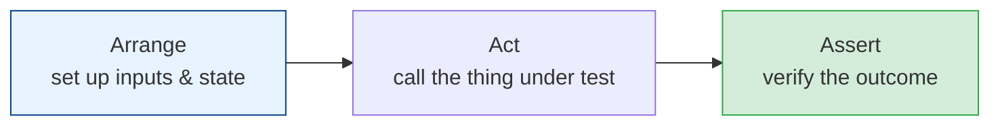
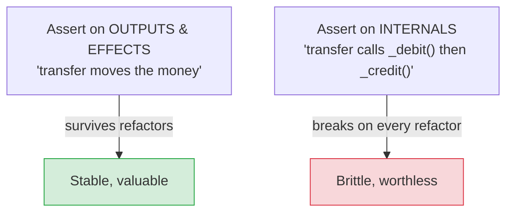
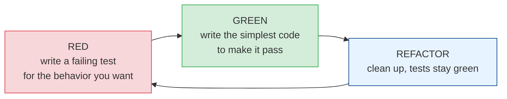

# Writing Good Tests & TDD

[< Back](./testing-pyramid.md) | [Index](./README.md) | [Next: Coverage & Quality >](./coverage-and-quality.md)

---

A test suite full of bad tests is worse than none — it gives false confidence, breaks on every
refactor, and trains the team to ignore red. This chapter is about what makes a test *good*, and
the discipline (TDD) that produces good tests naturally.

## The anatomy of a good test: Arrange-Act-Assert

Every test, at its heart, has three phases:



```python
def test_transfer_moves_money():
    # Arrange
    alice = Account(balance=100)
    bob = Account(balance=0)
    # Act
    transfer(alice, bob, amount=30)
    # Assert
    assert alice.balance == 70
    assert bob.balance == 30
```

Clear, boring, one behavior. That's the goal.

## The qualities of a good test (FIRST)

| Property | Meaning |
|----------|---------|
| **Fast** | Runs in milliseconds so people actually run it |
| **Isolated** | Doesn't depend on other tests or shared state; any order works |
| **Repeatable** | Same result every run (no reliance on time, network, randomness) |
| **Self-validating** | Passes or fails clearly — no manual inspection |
| **Timely** | Written with (or before) the code, not "someday" |

Plus:
- **One reason to fail.** A test should verify *one* behavior. When it breaks, the cause is
  obvious.
- **Readable.** The test is documentation — a new dev should learn what the code does by reading
  its tests. Descriptive names: `test_transfer_fails_when_balance_too_low`.
- **Deterministic.** Flaky tests (pass sometimes, fail others) are poison — see below.

## Test behavior, not implementation (the #1 rule)



> Test *what* the code accomplishes, not *how*. If you rename a private method or restructure the
> internals and a hundred tests break even though the behavior is identical, your tests were
> testing the wrong thing. Good tests are a safety net for refactoring; implementation-coupled
> tests are a straitjacket.

## Test-Driven Development (TDD): Red-Green-Refactor

TDD flips the order — write the test *first*, then the code to pass it.



1. **Red** — write a small test for the next bit of behavior. It fails (nothing implements it yet).
2. **Green** — write the *minimum* code to make it pass. No gold-plating.
3. **Refactor** — improve the code now that it's covered, tests staying green.
4. Repeat in tiny cycles.

**Why TDD helps (even if you don't do it religiously):**
- Forces you to define "done" (the test) *before* coding — clarifies requirements.
- Guarantees testable design — code written test-first is naturally decoupled.
- You end up with tests, instead of "I'll add them later" (you won't).
- Tiny steps mean you're never far from working code.

> TDD isn't dogma — plenty of great engineers write tests *just after* the code. The valuable
> insight is: **let testability drive design, and don't leave testing for "later."** Whether the
> test comes 5 minutes before or after the code matters less than that it comes at all, and that
> the code is shaped to be testable.

## Edge cases and error paths: where bugs hide

The happy path is easy; bugs live in the corners. Deliberately test:

- **Boundaries** — 0, 1, max, max+1, empty, full.
- **Invalid input** — null, negative, wrong type, huge, malformed.
- **Error paths** — what happens when the DB is down, the input is bad, the resource is missing?
- **Concurrency** — if relevant, simultaneous access (see [concurrency](../concurrency/README.md)).

> A test suite that only checks the happy path is theater. The edge cases and failure modes are
> exactly what breaks in production — and exactly what you must test.

## The flaky test problem (kill them ruthlessly)

A **flaky** test passes and fails non-deterministically. It's worse than no test because it
trains the team to ignore red ("just re-run CI") — and then a *real* failure gets ignored too.

Common causes and fixes:
- **Timing/sleeps** → wait for conditions, don't `sleep(2)`.
- **Real time/dates** → inject a clock; freeze time in tests.
- **Randomness** → seed it.
- **Shared state / test order** → isolate; reset between tests.
- **Real network** → stub external calls.

> **A flaky test is a bug — in the test or the code. Fix it or delete it, never ignore it.** The
> moment your team starts saying "oh that one always fails, just retry," your suite is dying.

## The takeaways

1. **Structure tests as Arrange-Act-Assert**, one behavior each, with a descriptive name.
2. **Good tests are FIRST** (Fast, Isolated, Repeatable, Self-validating, Timely) and readable —
   they double as documentation.
3. **Test behavior, not implementation** — so refactors don't break them.
4. **TDD (Red-Green-Refactor) produces testable design and real coverage** — but the core lesson
   is "let testability drive design, don't defer testing," however you order it.
5. **Test edge cases and error paths** — that's where real bugs live.
6. **Flaky tests are bugs.** Fix or delete; never train the team to ignore red.

---

[< Back](./testing-pyramid.md) | [Index](./README.md) | [Next: Coverage & Quality >](./coverage-and-quality.md)
