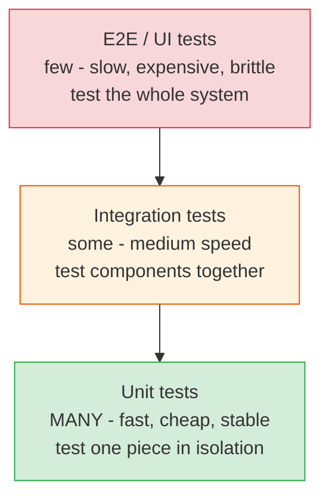
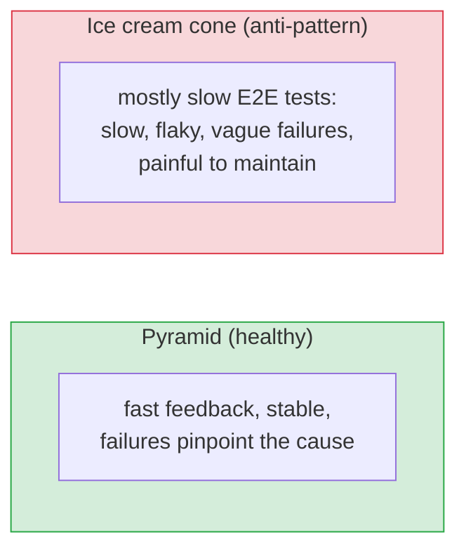

# The Testing Pyramid & Kinds of Tests

[Index](./README.md) | [Next: Good Tests & TDD >](./good-tests-and-tdd.md)

---

Not all tests are equal. Some are fast and cheap, some slow and expensive. A good test *suite*
balances them deliberately. The classic model for that balance is the **testing pyramid**.

## The testing pyramid

**The shape is the lesson:** *many* fast unit tests at the base, *some* integration tests in the
middle, *few* end-to-end tests at the top. Fast, cheap tests should vastly outnumber slow,
expensive ones.

## The kinds of tests

| Type | Tests | Speed | When it breaks, you know... |
|------|-------|-------|------------------------------|
| **Unit** | One function/class in isolation | Milliseconds | Exactly which unit is wrong |
| **Integration** | Several components together (e.g., service + DB) | Seconds | Two parts don't fit |
| **End-to-end (E2E)** | The whole system as a user would | Minutes | Something in the flow broke (but not *where*) |
| **Contract** | Two services agree on an API shape | Fast | A provider broke a consumer |
| **Performance/Load** | Behavior under traffic | Slow | It's too slow / falls over at scale |
| **Security** | Vulnerabilities | Varies | You're exposed |

### Unit tests (the foundation)
Test a single unit with everything else faked/mocked. Fast, precise, stable. When one fails, you
know *exactly* what broke. These should be the bulk of your suite.

### Integration tests (the confidence)
Test that pieces work *together* — your code with a real database, two modules, an external API
(often via a test double). Slower, but they catch the "each unit works but they don't fit"
class of bug that unit tests miss.

### End-to-end tests (the reality check)
Drive the whole system like a real user (e.g., Playwright clicking through a web app). Highest
confidence that things *actually work*, but slow, flaky, and expensive to maintain. **Keep them
few** — cover the critical happy paths (login, checkout), not every edge case.

## Why the pyramid shape matters

> **The anti-pattern is the "ice cream cone"** — lots of slow E2E tests and few unit tests. It
> *feels* thorough but is a trap: the suite is slow (developers stop running it), flaky (people
> ignore failures), and when something breaks you have no idea *where*. Invert it: push testing
> down to the fastest level that can catch the bug.

## Test doubles (faking dependencies)

To test a unit in isolation, you replace its dependencies with **doubles**:

| Double | What it does |
|--------|--------------|
| **Stub** | Returns canned answers ("when asked for user 1, return this") |
| **Mock** | A stub that also *verifies it was called* correctly |
| **Fake** | A working lightweight implementation (e.g., in-memory DB) |
| **Spy** | Records how it was called for later assertions |

> **Don't over-mock.** Tests that mock everything test your mocks, not your code — they pass while
> the real thing is broken. Mock at boundaries (network, DB, time, randomness); prefer real
> objects for your own logic. Code that's hard to test without heavy mocking is usually poorly
> structured (see [code architecture](../architecture-patterns/code-architecture.md) — inject
> dependencies at boundaries).

## What to test (and what not to)

- **Do test:** business logic, edge cases, boundary conditions, error paths, and every bug you fix
  (write a test that would have caught it — "regression test").
- **Don't obsess over:** trivial getters/setters, framework code, or third-party libraries (that's
  their job).
- **Test behavior, not implementation.** Assert *what* the code does (outputs, effects), not *how*
  it does it internally — or every refactor breaks your tests for no reason.

## The takeaways

1. **The pyramid:** many fast **unit** tests, some **integration** tests, few slow **E2E** tests.
2. **Push each test to the lowest/fastest level that can catch the bug.** Avoid the
   slow-and-flaky "ice cream cone."
3. **Use test doubles at boundaries** (network, DB, time) — but don't over-mock your own logic.
4. **Test behavior, not implementation**, so refactoring doesn't shatter your suite.
5. **Every bug fix gets a regression test** — that's how a suite gets genuinely valuable over
   time.

---

[Index](./README.md) | [Next: Good Tests & TDD >](./good-tests-and-tdd.md)
