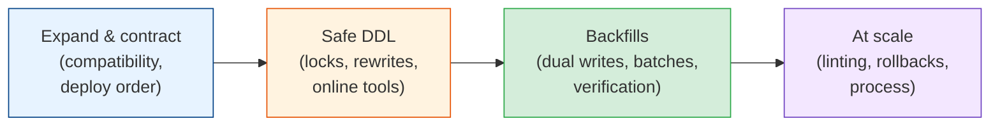

# Zero-Downtime Schema Migrations

Shipping code without downtime is mostly a solved problem: rolling deploys, canaries,
blue/green. Changing the database underneath that code is where outages still come from. A
column rename breaks every running instance the moment it commits. An index build blocks writes
for twenty minutes. An `ALTER` that should take two milliseconds waits behind a slow report
query and takes the whole table down with it. A backfill makes replicas fall an hour behind.
This module covers how to change a live schema safely: the expand-and-contract pattern, which
DDL statements lock or rewrite, how to move data while traffic keeps flowing, and the tooling
and process that make all of it routine.

## Contents

| # | Topic | File | Level |
|---|-------|------|-------|
| 0 | The map (this file) | *(here)* | L3 · Intermediate |
| 1 | Expand & contract: the compatibility window, parallel change, deploy order | [expand-and-contract.md](./expand-and-contract.md) | L3 · Intermediate |
| 2 | Safe DDL in practice: the lock queue, PostgreSQL rules, `CONCURRENTLY`, `NOT VALID`, MySQL online DDL & gh-ost | [safe-ddl-in-practice.md](./safe-ddl-in-practice.md) | L4 · Advanced |
| 3 | Backfills & dual writes: batching, throttling, copy-and-swap, verification & shadow reads | [backfills-and-dual-writes.md](./backfills-and-dual-writes.md) | L4 · Advanced |
| 4 | Migrations at scale: linting, where migrations run, rollbacks, very large tables & pitfalls | [migrations-at-scale.md](./migrations-at-scale.md) | L4 · Advanced |

---

## How to read this module

- **Chapter 1** is the idea everything else depends on: during a deploy, old and new code both
  run against the same schema, so every change has to work for both.
- **Chapter 2** is the database-specific detail. Which statements are instant, which ones
  rewrite the table, and how one waiting `ALTER` can block every query.
- **Chapter 3** is the slow part: copying data into the new shape in small, safe batches while
  users keep writing, and proving the copy is right before switching.
- **Chapter 4** is how teams make it routine. Linters in CI, where each kind of migration runs,
  why rollbacks are usually forward fixes, and the pitfalls that show up in postmortems.

## Related modules

- [databases/data-modeling.md](../databases/data-modeling.md): what the schema should look
  like. This module is about changing it once it's live.
- [cicd-and-devops/deployment-strategies.md](../cicd-and-devops/deployment-strategies.md):
  rolling deploys, canaries, and feature flags, which create the compatibility window in the
  first place.
- [api-design/versioning-and-evolution.md](../api-design/versioning-and-evolution.md): the
  same "readers before writers" rule, applied to APIs.
- [event-sourcing-and-cqrs/event-schema-evolution.md](../event-sourcing-and-cqrs/event-schema-evolution.md):
  schema evolution when the old data can never be rewritten.
- [microservices/distributed-data-patterns.md](../microservices/distributed-data-patterns.md):
  the dual-write problem and the outbox, for migrations that cross database boundaries.

## The one idea

> **Never make a change that only one version of the code can survive.** Add the new shape,
> move code and data across while both shapes exist, and remove the old shape only after
> nothing needs it. Each step is small, reversible, and boring, which is exactly what you want
> from anything that touches production data.

Start with [expand-and-contract.md](./expand-and-contract.md). **Next >**
