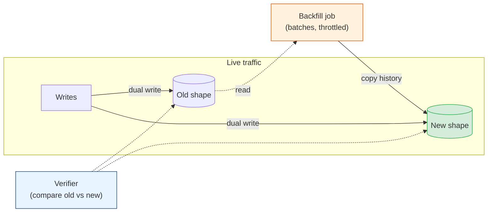
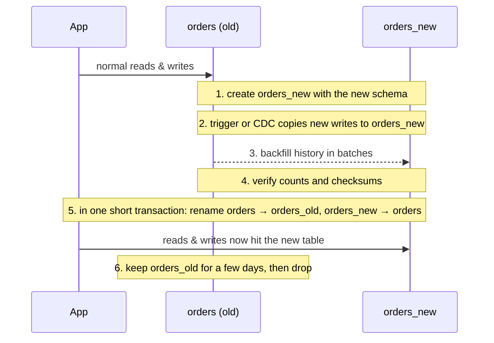

# Backfills & Dual Writes: Moving Data While Traffic Keeps Flowing

[< Back](./safe-ddl-in-practice.md) | [Index](./README.md) | [Next: Migrations at Scale >](./migrations-at-scale.md)

---

The schema changes in the first two chapters are usually quick. Moving the data is where the
hours go. Filling a new column on 800 million rows, copying a table into a new shape, or
splitting one table into two all happen while users keep writing to the very rows you're
copying. This chapter covers the two halves of that job: keeping new writes in sync (dual
writes) and copying old data (backfills), plus how to prove the two copies match before you
switch.

## The shape of a data migration



Order matters. **Turn on dual writes first, then start the backfill.** If you backfill first,
every row written between the start of the backfill and the moment dual writes begin is
missed, and you'll spend a week hunting for the gap.

## Dual writes

There are three common ways to keep the new shape up to date.

| Approach | How | Good | Watch out for |
|----------|-----|------|---------------|
| Application code | The write path updates both shapes in the same transaction | Explicit, testable, visible in code review | Every write path must be covered, including admin tools, scripts, and other services |
| Database trigger | A trigger copies each insert/update to the new shape | Catches every write, whoever makes it | Hidden logic, extra write latency, easy to forget to remove |
| Change data capture | Stream the old table's changes (Debezium, binlog, logical replication) and apply them to the new shape | Works across databases and services; no change to the write path | Asynchronous, so there's a lag; ordering and retries need care |

Inside one database, application code in the same transaction is the default. Use triggers
when you can't find every write path with confidence. Use CDC when the new shape lives in a
different database or service, which is the usual case when
[carving a table out of a monolith](../microservices/monolith-vs-microservices.md) into its own
service.

What you must not do is write to two different databases from application code without a
transaction or outbox. One write will eventually succeed and the other fail, and the two copies
will drift. That's the
[dual-write problem](../microservices/distributed-data-patterns.md#the-dual-write-problem-and-the-outbox-pattern).

## Backfills

A backfill copies existing data into the new shape. The naive version is one statement:

```sql
UPDATE users SET email_address = email WHERE email_address IS NULL;   -- don't
```

On a large table this holds row locks on millions of rows for a long time, bloats the table
with dead tuples, generates a burst of WAL that can make replicas fall behind, and if it fails
at 90% the whole thing rolls back. Instead, backfill in small batches by primary key:

```python
BATCH = 5_000

def backfill_email_address(conn):
    last_id = 0
    while True:
        with conn.transaction():
            rows = conn.execute("""
                UPDATE users SET email_address = email
                WHERE id IN (
                    SELECT id FROM users
                    WHERE id > %s AND email_address IS NULL
                    ORDER BY id LIMIT %s
                )
                RETURNING id
            """, (last_id, BATCH)).fetchall()
        if not rows:
            break
        last_id = max(r.id for r in rows)
        save_checkpoint("backfill_email_address", last_id)
        throttle()      # sleep if replica lag or DB load is high
```

What makes a backfill safe:

- **Batches by primary key range,** small enough that each transaction takes well under a
  second. Start around 1,000-10,000 rows and tune by measuring.
- **Idempotent.** The `WHERE email_address IS NULL` condition means running it twice is
  harmless, and a crash can simply restart.
- **Checkpointed.** Store the last processed key so a restart resumes instead of rescanning.
- **Throttled on real signals.** Pause when replication lag, CPU, or p99 latency rise. A
  backfill should never be the reason an SLO alert fires.
- **Doesn't overwrite newer data.** Rows already written by the dual-write path are newer than
  anything the backfill would copy. The `IS NULL` check handles that here; for more complex
  copies, compare an `updated_at` or version column.
- **Runs as a job, not a migration.** A backfill that takes six hours doesn't belong inside the
  migration step of a deploy pipeline. Run it from the
  [job scheduler](../distributed-job-schedular/README.md), with progress metrics.

### How long will it take?

Estimate before you start. Rows ÷ batch size × time per batch, plus throttling pauses. 800
million rows at 5,000 per batch and 200ms per batch is 160,000 batches, about 9 hours of pure
work. If the estimate says three weeks, change the plan: bigger batches during quiet hours,
parallel workers over separate key ranges, or a copy-and-swap approach instead of in-place
updates.

## Copy-and-swap: rebuilding a table

Some changes are easier as a brand-new table than as in-place edits: changing the primary key
type, partitioning an existing table, or reorganising a table that's mostly dead rows. The
pattern is what gh-ost and pg_repack do internally, done by hand:



The swap in step 5 needs an `ACCESS EXCLUSIVE` lock on both tables, so it gets the usual
`lock_timeout` and retry treatment from
[chapter 2](./safe-ddl-in-practice.md#the-lock-queue-why-instant-ddl-can-still-cause-an-outage).
Keep the old table until you're sure. It's the cheapest rollback you'll ever have.

## Verify before you switch reads

Never switch reads to the new shape on trust. Check that it matches.

| Check | How | Catches |
|-------|-----|---------|
| Row counts | `COUNT(*)` on both, per key range | Missed batches, a broken dual-write path |
| Null counts | `COUNT(*) WHERE new_col IS NULL` | Rows the backfill skipped |
| Checksums per range | `md5(string_agg(...))` over sorted key ranges on both sides | Rows that exist but differ |
| Sampled comparison | Random sample of 10,000 IDs, compare field by field in code | Transformation bugs |
| Shadow reads | In production, read both shapes, return the old one, log mismatches | Real-world differences the offline checks missed |

Shadow reads are the strongest evidence and the cheapest insurance. For a week before switching,
every read compares old and new and records disagreements as a metric. When the mismatch count
stays at zero, flip the read path, ideally behind a
[feature flag](../cicd-and-devops/deployment-strategies.md#decouple-deploy-from-release-feature-flags)
so the flip itself can be undone in seconds.

## The takeaways

1. **Dual writes first, backfill second.** The other order leaves a gap.
2. **Keep dual writes in one transaction,** or use triggers or CDC. Never two independent
   writes to two databases.
3. **Backfill in small, idempotent, checkpointed, throttled batches,** run as a job and not
   inside the deploy.
4. **Estimate the runtime up front,** and switch to copy-and-swap or parallel workers if it's
   too long.
5. **Verify with counts, checksums, and shadow reads** before switching reads, and switch behind
   a flag.

---

[< Back](./safe-ddl-in-practice.md) | [Index](./README.md) | [Next: Migrations at Scale >](./migrations-at-scale.md)
