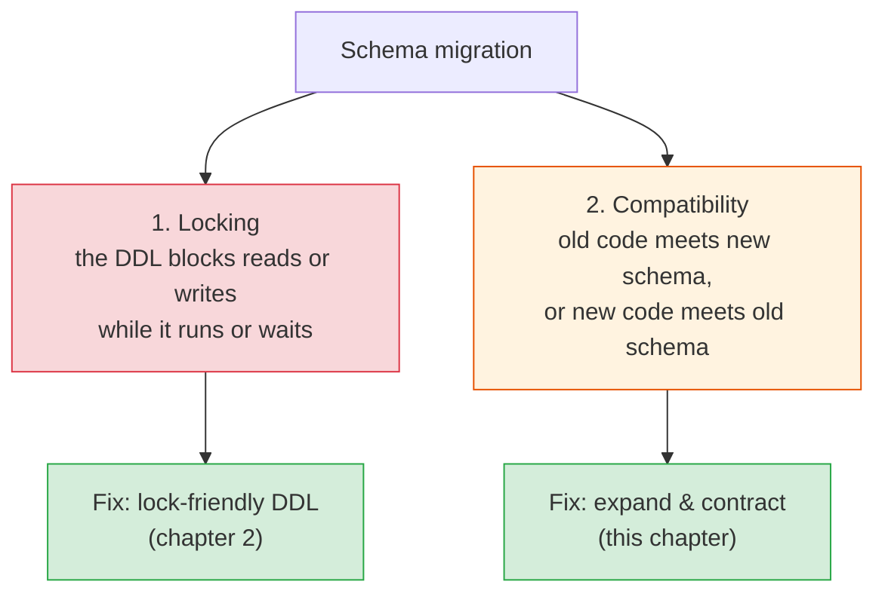
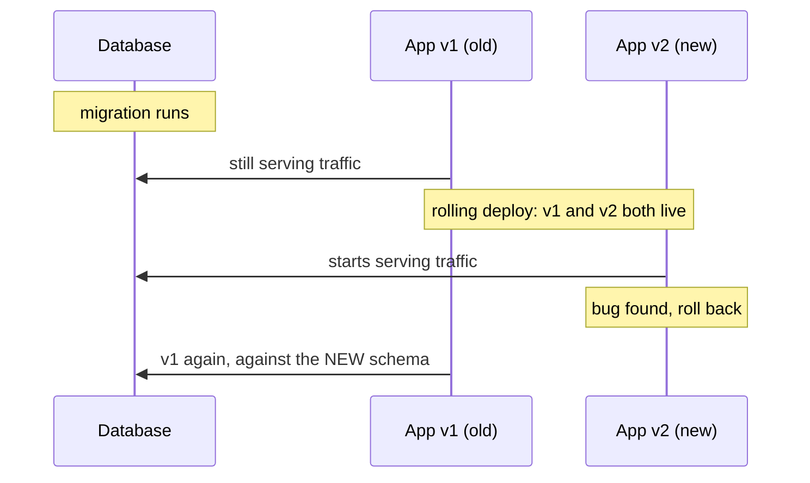
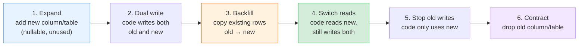
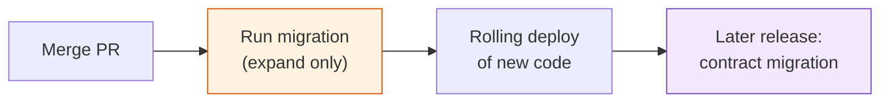

# Expand & Contract: Changing a Live Schema Without Downtime

[Index](./README.md) | [Next: Safe DDL in Practice >](./safe-ddl-in-practice.md)

---

Changing a database schema used to mean a maintenance window. Put up a banner, stop the app at
2am on a Sunday, run the migration, start the new version, hope. That doesn't work when the
product runs in five time zones, deploys twenty times a day, and has an SLO that counts every
minute of downtime against the error budget.

Zero-downtime migrations rest on one rule and one pattern. The rule: at every moment, the
schema has to work with every version of the code that's running. The pattern that follows
from it is expand and contract.

## Why migrations cause outages

Two separate things go wrong, and they need different fixes.

**Locking** is the database's problem. Some `ALTER TABLE` statements rewrite the whole table
while holding a lock that blocks every query. On a 2 TB table that's an hour of outage.
[Chapter 2](./safe-ddl-in-practice.md) covers which statements are safe.

**Compatibility** is the application's problem, and it exists even when every statement is
instant. During a rolling deploy, old and new versions of the app run side by side for minutes.
If something goes wrong, you roll back to the old version, which then runs against the new
schema. Any migration that only works with one version of the code breaks during that window.

## The compatibility window

So the migration has to satisfy three checks:

1. Old code works with the new schema (during the deploy and after a rollback).
2. New code works with the new schema (obviously).
3. The migration itself doesn't hold locks long enough to be noticed.

A column rename fails check 1 immediately. The moment `RENAME COLUMN email TO email_address`
commits, every running v1 instance starts throwing errors on `SELECT email`. That's why a
"simple rename" is one of the most common causes of deploy-time outages.

## Expand and contract

The pattern splits one breaking change into several non-breaking steps, each deployed
separately. You first **expand** the schema so it supports both old and new shapes, move the
code and data across, and only then **contract** by removing the old shape. It's also called
parallel change.

Each arrow is at least one deploy. Between any two steps you can stop, wait a week, or roll
back one step without breaking anything. That's the property you're paying for.

### Worked example: renaming `users.email` to `users.email_address`

| Step | Schema | Code | Safe to roll back to previous step? |
|------|--------|------|-------------------------------------|
| 1. Expand | `ADD COLUMN email_address TEXT` (nullable) | Unchanged | Yes, nothing uses the new column |
| 2. Dual write | Same | Writes go to `email` and `email_address` | Yes, old code ignores the new column |
| 3. Backfill | Same | Background job copies `email` into `email_address` where it's null | Yes |
| 4. Switch reads | Add `NOT NULL` and the unique index on `email_address` | Reads `email_address`, still writes both | Yes, `email` is still kept up to date |
| 5. Stop old writes | Same | Only touches `email_address` | Only to step 4 code, which is fine |
| 6. Contract | `DROP COLUMN email` | Unchanged | Rollback past here is no longer possible |

Six deploys for a rename feels absurd the first time. In practice steps 1-3 often ship in one
release and steps 5-6 in another, and the whole thing takes a few days of calendar time and an
hour or two of work. Compare that with a deploy that breaks every login for five minutes.

A frequent shortcut for step 2: if your ORM supports it, a database trigger can keep the two
columns in sync during the transition instead of application code. That works, but the trigger
is hidden logic. Remove it in the contract step, or someone will find it three years later.

## Common changes, mapped to the pattern

| Change | Breaking? | Safe sequence |
|--------|-----------|---------------|
| Add a nullable column | No | One step. Deploy schema first, then code that uses it |
| Add a `NOT NULL` column | Yes, old code's `INSERT`s fail | Add nullable (or with a default), backfill, then add the constraint |
| Remove a column | Yes, old code still selects it | Stop using it in code, deploy, then drop. Tell your ORM to ignore it first if it selects `*` |
| Rename a column | Yes | Full expand and contract, as above |
| Rename a table | Yes | New table plus dual writes, or a view with the old name during the transition |
| Change a column's type | Usually | New column of the new type, dual write, backfill, switch, drop |
| Split a table in two | Yes | New table, dual write, backfill, switch reads, stop old writes, drop old columns |
| Add a unique constraint | Can fail on existing duplicates | Find and fix duplicates, then build the index concurrently ([chapter 2](./safe-ddl-in-practice.md#indexes-and-unique-constraints)) |
| Add an enum value | Old code may not handle it | Deploy code that tolerates the new value before any code that writes it |

The last row generalises: **readers before writers.** Any new value, shape, or field must be
understood by every reader before any writer starts producing it. That holds for database
columns, JSON payloads, events on a queue, and API responses alike. It's the same rule as
[API versioning](../api-design/versioning-and-evolution.md) and
[event schema evolution](../event-sourcing-and-cqrs/event-schema-evolution.md).

## Deploy order: migrations first

The usual pipeline order is migrate, then deploy code:

This only works if every migration that runs before a deploy is an expand. A contract (drop,
rename, tighten) must ship in a later release than the code that stopped needing the old shape.
Some teams enforce this with a simple rule: destructive migrations go in their own pull
request, which can only merge once the previous release has been live for a set time.

## The takeaways

1. **Two problems, two fixes.** Locks are about which DDL you run; compatibility is about the
   order you change things in.
2. **Every schema must work with the old and new code at once,** because rolling deploys and
   rollbacks put both in production.
3. **Expand, migrate, contract.** Add the new shape, dual write, backfill, switch reads, stop
   old writes, then drop.
4. **Readers before writers.** Teach every reader the new shape before anything produces it.
5. **Migrations that run before a deploy must be expands.** Contracts ship in a later release.

---

[Index](./README.md) | [Next: Safe DDL in Practice >](./safe-ddl-in-practice.md)
