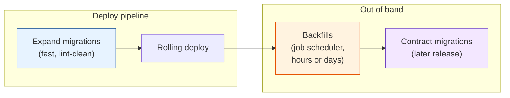

# Migrations at Scale: Tooling, Process, Rollbacks & Pitfalls

[< Back](./backfills-and-dual-writes.md) | [Index](./README.md)

---

One careful engineer can run a safe migration by hand. A company with 200 engineers merging
migrations every day needs the safety built into the process, because the person writing
today's migration may never have heard of the lock queue. This chapter covers the tooling and
team habits that make zero-downtime migrations the default: linting, where migrations run,
what "rollback" really means, very large tables, and the mistakes that keep turning up in
postmortems.

## Lint migrations in CI

Most dangerous DDL is recognisable from the statement alone. Let a tool reject it before a
human has to notice.

| Tool | Ecosystem | What it catches |
|------|-----------|-----------------|
| `squawk` | Any PostgreSQL SQL file | Non-concurrent index builds, `SET NOT NULL`, type changes, missing `lock_timeout`, adding constraints without `NOT VALID`, renames |
| `strong_migrations` | Ruby on Rails | Same family of checks, with suggested safe rewrites in the error message |
| `django-pg-zero-downtime-migrations`, `django-migration-linter` | Django | Unsafe operations and backward-incompatible changes |
| Atlas (`atlas migrate lint`) | Several databases | Destructive changes, data-dependent changes, backward incompatibility |
| Custom checks | Anything | Repo-specific rules: "drops must be in their own PR", "no migration without a ticket" |

A failing lint should explain the safe alternative, not just say no. And there needs to be an
escape hatch (a comment like `-- squawk-ignore` with a required reason) for the cases where a
blocking statement on a 50-row lookup table is perfectly fine.

## Where migrations run

- **Fast schema changes run in the pipeline,** before the code deploy, one at a time, with a
  `lock_timeout` and retries.
- **Anything slow runs out of band.** Backfills and concurrent index builds on huge tables go to
  a job runner with progress metrics, not into a deploy step with a 10-minute timeout.
- **Migrations don't run on app boot.** If every new pod tries to migrate on start-up, a
  rolling deploy of 40 pods races 40 migration runners against one advisory lock. Run them
  once, from the pipeline.
- **Record what ran.** The migrations table (Flyway, Liquibase, Rails, Django, and
  golang-migrate all keep one) is the source of truth for which version each database is on.

## Rollbacks: roll forward, mostly

Most migration frameworks let you write a `down` migration. In production, it's rarely what you
want:

| Situation | What actually works |
|-----------|---------------------|
| Bad code deploy, schema is an expand | Roll back the code. The expanded schema is compatible with the old code. That's the point of expand and contract |
| Expand migration itself causes a problem (slow, lock) | Cancel it; `lock_timeout` usually already did. Fix and re-run |
| Backfill has a bug | Stop the job, fix the transformation, re-run. Idempotent batches make this safe |
| Contract migration dropped something still needed | Restore from backup or the retained old table. This is why contracts wait, and why you keep `orders_old` for a few days |

`down` migrations that drop columns throw away data written since the `up` ran. Treat them as a
development convenience. In production the plan is: code rollback for code problems, forward
fixes for schema problems, and delayed contracts so there's always something to go back to.

## Very large tables

At hundreds of gigabytes, even safe operations become projects:

- **Concurrent index builds take hours** and slow everything while they run. Schedule them in
  quiet periods and watch replication lag.
- **Partition before you need to.** Time-partitioned tables (by month, for events and logs) turn
  "delete old data" from a massive `DELETE` into `DROP TABLE` on an old partition, and keep
  index builds per partition small. See
  [databases/data-modeling.md](../databases/data-modeling.md).
- **Replicas need attention.** Large writes produce WAL faster than replicas can apply it. A
  backfill throttled only on primary load can leave read replicas minutes behind, which shows
  up as users not seeing their own changes.
- **Sharded and multi-tenant fleets multiply everything.** A migration that runs once per shard
  or per tenant database needs waves (internal shards first, then 1%, then the rest),
  per-shard version tracking, and a plan for the one shard where it fails.

## Team process that keeps it boring

- **A migration guide in the repo.** One page listing the safe patterns from
  [chapter 2](./safe-ddl-in-practice.md) for your database and framework, with copy-paste
  examples. Link to it from the linter's error messages.
- **Production-sized staging data.** Test migrations against a recent anonymised snapshot, and
  record how long each took. "Instant on my laptop" tells you nothing.
- **Destructive changes in separate PRs,** merged only after the code that stopped using the old
  shape has been live for an agreed time (a week is common).
- **A named owner for long-running migrations.** Someone who watches the backfill dashboard and
  knows how to pause it.
- **Postmortems for migration incidents.** They're among the most preventable outages, and each
  one usually becomes a new lint rule.

## Pitfalls that show up in postmortems

| Pitfall | What happened | Prevention |
|---------|---------------|------------|
| Rename in one step | Every running instance started failing on the old column name | Expand and contract; lint renames |
| DDL stuck in the lock queue | A 2ms `ALTER` blocked the table for 4 minutes behind a report query | `lock_timeout` plus retries |
| Non-concurrent index on a hot table | Writes blocked for 25 minutes | `CONCURRENTLY`; lint |
| Backfill as one `UPDATE` | Replica lag, table bloat, rollback at 90% | Batched, checkpointed, throttled job |
| ORM caches the column list | Dropping a column broke inserts in old pods that still listed it | Mark the column ignored in the ORM, deploy, then drop |
| Backfill before dual writes | A gap of rows written during the backfill | Dual writes first |
| Integer primary key overflow | Inserts failed at 2,147,483,647 | Monitor sequence headroom; use `bigint` for new tables |
| Contract in the same release as the code change | Rollback put old code on a schema without its column | Contracts ship a release later |

## The takeaways

1. **Lint migrations in CI** with squawk, strong_migrations, or similar. Make safe the default
   and explain the fix in the error.
2. **Fast DDL in the pipeline, slow work out of band,** and never migrate on app boot.
3. **Roll forward.** Code rollback for code bugs, forward fixes for schema bugs, delayed
   contracts as the safety net.
4. **Large tables need planning:** partitioning, replica-aware throttling, and per-shard
   tracking.
5. **Make it boring with process.** A migration guide, realistic staging data, separate PRs for
   destructive changes, and a lint rule for every postmortem.

---

[< Back](./backfills-and-dual-writes.md) | [Index](./README.md)
