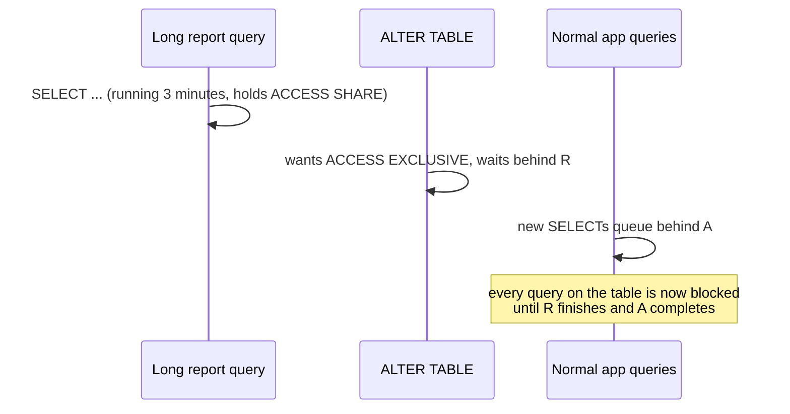

# Safe DDL in Practice: Locks, Rewrites & Online Schema Changes

[< Back](./expand-and-contract.md) | [Index](./README.md) | [Next: Backfills & Dual Writes >](./backfills-and-dual-writes.md)

---

[Expand and contract](./expand-and-contract.md) makes each step compatible with running code.
It doesn't stop an individual statement from locking a table for an hour. This chapter is about
the statements themselves: which ones are instant, which ones rewrite the table, and how to
run the dangerous ones safely. Most examples are PostgreSQL; MySQL gets its own section at the
end.

## The lock queue: why "instant" DDL can still cause an outage

Almost every `ALTER TABLE` in Postgres needs an `ACCESS EXCLUSIVE` lock, even if only for a
millisecond. That lock conflicts with everything, including plain `SELECT`s. The trouble is
what happens while it waits.



The `ALTER` itself would take 2ms. But it's stuck behind a slow query, and every new query
lines up behind the `ALTER`. For three minutes the table is unreachable. Connection pools fill,
health checks fail, and it looks like a full outage.

The fix is to never let DDL wait for long:

```sql
SET lock_timeout = '3s';
SET statement_timeout = '15min';   -- only if the statement itself may legitimately run long
ALTER TABLE orders ADD COLUMN gift_message TEXT;
```

If the lock isn't granted within 3 seconds, the statement fails instead of queueing everyone
behind it. Your migration tool should retry a few times with backoff. A failed migration is a
minor annoyance; a blocked table is an incident.

## Safe and unsafe operations in PostgreSQL

| Operation | Behaviour (PostgreSQL 12+) | Safe approach |
|-----------|-----------------------------|---------------|
| `ADD COLUMN` (nullable, no default) | Metadata only, instant | Just do it, with `lock_timeout` |
| `ADD COLUMN ... DEFAULT <constant>` | Metadata only since PG 11 | Fine. A volatile default like `gen_random_uuid()` rewrites the table |
| `ADD COLUMN ... NOT NULL DEFAULT <constant>` | Metadata only since PG 11 | Fine |
| `ALTER COLUMN ... SET NOT NULL` | Full table scan under `ACCESS EXCLUSIVE` | Add a `CHECK (col IS NOT NULL) NOT VALID`, validate it, then `SET NOT NULL` (skips the scan) |
| `ALTER COLUMN ... TYPE` | Usually rewrites the table and all indexes | New column + backfill. Exceptions: widening `varchar(n)` or `varchar` → `text` are instant |
| `CREATE INDEX` | Blocks writes for the whole build | `CREATE INDEX CONCURRENTLY` |
| `ADD FOREIGN KEY` | Scans both tables, blocks writes on both | `ADD CONSTRAINT ... NOT VALID`, then `VALIDATE CONSTRAINT` |
| `ADD CHECK` constraint | Full scan under `ACCESS EXCLUSIVE` | `NOT VALID`, then `VALIDATE` |
| `RENAME COLUMN` / `RENAME TABLE` | Instant, but breaks running code | [Expand and contract](./expand-and-contract.md#worked-example-renaming-usersemail-to-usersemail_address) |
| `DROP COLUMN` | Instant (marks the column dropped) | Stop reading it in code first |
| `VACUUM FULL`, `CLUSTER` | Rewrites under `ACCESS EXCLUSIVE` | `pg_repack` instead |

### Adding `NOT NULL` without a long lock

```sql
-- 1. Add the constraint without checking existing rows (brief lock)
ALTER TABLE users ADD CONSTRAINT users_email_address_not_null
    CHECK (email_address IS NOT NULL) NOT VALID;

-- 2. Check existing rows. Takes SHARE UPDATE EXCLUSIVE: reads and writes continue
ALTER TABLE users VALIDATE CONSTRAINT users_email_address_not_null;

-- 3. PG 12+ sees the valid CHECK and skips the full scan
ALTER TABLE users ALTER COLUMN email_address SET NOT NULL;

-- 4. The CHECK is now redundant
ALTER TABLE users DROP CONSTRAINT users_email_address_not_null;
```

The same two-step pattern (`NOT VALID`, then `VALIDATE`) works for foreign keys and other
`CHECK` constraints. New rows are checked from step 1 onwards; the slow part, checking old rows,
happens without blocking writes.

### Indexes and unique constraints

```sql
CREATE INDEX CONCURRENTLY idx_orders_customer ON orders (customer_id);

-- unique constraint, built without blocking writes
CREATE UNIQUE INDEX CONCURRENTLY idx_users_email_address ON users (email_address);
ALTER TABLE users ADD CONSTRAINT users_email_address_key UNIQUE USING INDEX idx_users_email_address;
```

Things to know about `CONCURRENTLY`:

- **It can't run inside a transaction block.** Many migration frameworks wrap each migration in
  a transaction by default. You'll need to turn that off for these migrations (Rails:
  `disable_ddl_transaction!`; Django: `atomic = False`; most others have an equivalent).
- **It's slower,** often 2-3x, because it scans the table twice and waits for existing
  transactions.
- **If it fails, it leaves an `INVALID` index behind.** That index is updated on every write but
  never used. Check for it and drop it before retrying:

```sql
SELECT indexrelid::regclass FROM pg_index WHERE NOT indisvalid;
DROP INDEX CONCURRENTLY idx_users_email_address;
```

- **A unique build fails on existing duplicates.** Find and fix them first, and make sure the
  application already prevents new ones.

### Changing a column's type

`ALTER COLUMN id TYPE bigint` on a large table is the most famous migration trap: the `int`
primary key is about to hit 2.1 billion, and the obvious fix rewrites the table and every index
under an exclusive lock. The safe version is a full expand and contract:

1. Add `id_new BIGINT`.
2. Trigger or application code sets `id_new = id` on every insert and update.
3. Backfill `id_new` in batches ([chapter 3](./backfills-and-dual-writes.md)).
4. Build a unique index on `id_new` concurrently.
5. In one short transaction: drop the old primary key, promote the new index to primary key,
   rename the columns. Foreign keys from other tables need the same treatment first.

Start this months before the counter runs out. A query on `pg_sequences` comparing
`last_value` with the type's maximum, wired to an alert at 50%, gives you the time.

## MySQL: online DDL and external tools

MySQL (InnoDB) handles many changes online, and you can ask it to fail rather than fall back to
a blocking copy:

```sql
ALTER TABLE orders ADD COLUMN gift_message TEXT, ALGORITHM=INSTANT;
ALTER TABLE orders ADD INDEX idx_customer (customer_id), ALGORITHM=INPLACE, LOCK=NONE;
```

| Algorithm | What it means | Examples |
|-----------|---------------|----------|
| `INSTANT` | Metadata change only (MySQL 8.0+) | Adding a column (anywhere in the table since 8.0.29), dropping a column (8.0.29+), changing a default |
| `INPLACE` | Rebuilds in place, concurrent DML allowed for most operations | Adding a secondary index, some column changes |
| `COPY` | Copies the table, blocks writes | Changing a column type, many charset changes |

Specifying `ALGORITHM` and `LOCK` explicitly makes the statement fail if MySQL can't honour
them, instead of quietly choosing the blocking path. For operations that would need `COPY` on
big tables, teams use an external tool:

- **gh-ost** (from GitHub) creates a shadow table with the new schema, copies rows in chunks,
  and follows the binary log to apply ongoing changes. No triggers, it can be throttled and
  paused, and you control the final cut-over.
- **pt-online-schema-change** (Percona Toolkit) does the same with triggers instead of the
  binlog. Simpler to set up, more load on the primary.

Postgres has no exact equivalent built in; `pg_repack` covers table and index rebuilds, and
large type changes usually go through the expand-and-contract route above.

## A checklist for every migration

Before merging any migration, check:

1. **Does it take `ACCESS EXCLUSIVE` (or a `COPY` in MySQL)?** If yes, is it metadata-only, or
   does it scan or rewrite?
2. **Is `lock_timeout` set,** with retries in the tool?
3. **Are indexes built concurrently,** outside a transaction?
4. **Are new constraints added `NOT VALID` and validated separately?**
5. **Does the old code still work after this runs?** ([chapter 1](./expand-and-contract.md#the-compatibility-window))
6. **How long did it take on a production-sized copy?** A migration that's instant on a 10,000
   row dev database can take 40 minutes on the real one.

Questions 1, 3, and 4 can be automated. [Chapter 4](./migrations-at-scale.md#lint-migrations-in-ci)
covers linters that reject unsafe statements in CI.

## The takeaways

1. **The lock queue is the real danger.** Even instant DDL blocks everything if it waits behind
   a slow query. Always set `lock_timeout` and retry.
2. **Know which statements rewrite.** Type changes, `SET NOT NULL`, and plain `CREATE INDEX` are
   the usual offenders.
3. **`NOT VALID` then `VALIDATE`** for constraints, `CONCURRENTLY` for indexes.
4. **Big type changes are expand and contract,** started long before the deadline.
5. **On MySQL, state `ALGORITHM` and `LOCK` explicitly,** and use gh-ost or pt-osc when it has to
   copy.

---

[< Back](./expand-and-contract.md) | [Index](./README.md) | [Next: Backfills & Dual Writes >](./backfills-and-dual-writes.md)
